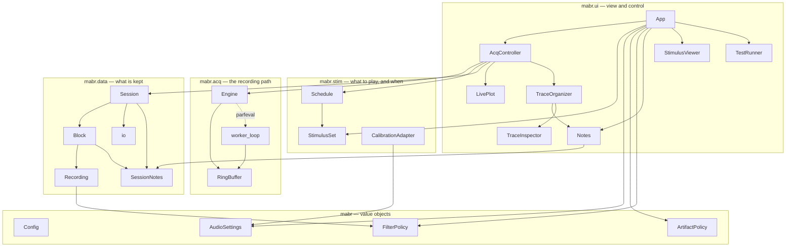

# 📘 Class Reference

Every class in MABR, grouped by package and alphabetical within a group. Each linked
name has its own **class-reference page**: a class diagram, its members, its contract,
and the defaults that are decisions rather than accidents.

> 🧭 **Where to start instead.** This is a *directory* — reach for it when you know
> which class you need and want its members. If you do not yet know where a class
> sits, read [[Acquisition Engine]] for the recording path, [[Presentation
> Strategies]] for the plan, and [[Data Format]] for what lands on disk; each of
> those names the classes that do the work.

Three layers, in order of authority — read down when you need more, not up:

| Layer | Answers |
|---|---|
| The class's own header comment in the source | Why it works this way, at length. **Authoritative** |
| This index and the class pages under it | What the members are, how they relate, what the defaults mean |
| The guide pages ([[Running a Session]], [[Acquisition Engine]], …) | How to get a job done |

> 🔀 **Source links point at the `refactor` branch.** The `+mabr` rewrite lives there;
> `master` still carries the retired `+abr` package. See [[Home]] § History.

> 📦 **stimgen classes are not listed here.** stimgen is a
> [separately released submodule](https://github.com/dstolz/stimgen) pinned to an exact
> commit, and its class inventory belongs to
> [its own wiki](https://github.com/dstolz/stimgen/wiki). Start at [[Using stimgen]]
> for the seam.

## Everything at a glance

<!-- BEGIN CLASS INDEX -->
## Policy and constants — `mabr`

Four plain **value** objects. None of them is a superclass of anything; the app and the
engine hold copies. Three of the four persist themselves in MATLAB prefs (group `MABR`)
and round-trip through `toStruct`/`fromStruct` into a `.mabrcfg` configuration file.

| Class | What it is |
|---|---|
| [[mabr.ArtifactPolicy\|mabr.ArtifactPolicy-Class-Reference]] | What counts as an artifact, and what to do about one. |
| [[mabr.AudioSettings\|mabr.AudioSettings-Class-Reference]] | ASIO device, channel mapping, and the Testing / Stimulation-only mode switches. |
| [[mabr.Config\|mabr.Config-Class-Reference]] | Fixed hardware constants, required toolboxes, and runtime paths. |
| [[mabr.FilterPolicy\|mabr.FilterPolicy-Class-Reference]] | The digital filter chain applied to *viewed* data — never to what is saved. |

## Acquisition engine — `mabr.acq`

The load-bearing subsystem: a warm parallel-pool worker, one memory-mapped ring buffer,
and commands/state as messages rather than shared memory.

| Class | What it is |
|---|---|
| [[mabr.acq.Cmd\|mabr.acq.Cmd-Class-Reference]] | Commands sent client → worker. |
| [[mabr.acq.Engine\|mabr.acq.Engine-Class-Reference]] | Client-side controller for the acquisition worker. |
| [[mabr.acq.RingBuffer\|mabr.acq.RingBuffer-Class-Reference]] | The memory-mapped circular sample buffer shared by worker and client. |
| [[mabr.acq.State\|mabr.acq.State-Class-Reference]] | Acquisition state reported worker → client. |
| [[mabr.acq.StateEventData\|mabr.acq.StateEventData-Class-Reference]] | Payload for the Engine's `StateChanged` / `WorkerError` events. |

| Function | What it is |
|---|---|
| `mabr.acq.worker_loop` — [source](https://github.com/dstolz/MABR/blob/refactor/%2Bmabr/%2Bacq/worker_loop.m) | The loop that runs **on** the worker: owns the audio device, streams the play matrix, writes the ring buffer. |

## Data model and I/O — `mabr.data`

| Class | What it is |
|---|---|
| [[mabr.data.Block\|mabr.data.Block-Class-Reference]] | One stimulus condition's acquired result. |
| [[mabr.data.io\|mabr.data.io-Class-Reference]] | Save/load: the `.abr` writer, the `.stimlog` writer, and the legacy importer. |
| [[mabr.data.Recording\|mabr.data.Recording-Class-Reference]] | One acquired channel plus segmentation and metric helpers. |
| [[mabr.data.Session\|mabr.data.Session-Class-Reference]] | Top-level session: subject, rates, schedule, and the completed blocks. |
| [[mabr.data.SessionNotes\|mabr.data.SessionNotes-Class-Reference]] | The rig notebook: timestamped free-text notes, saved into every file the session writes. |

## Stimulus adapter — `mabr.stim`

MABR does not generate or calibrate signals; it adapts what an external package supplies
and then owns presentation entirely.

| Class | What it is |
|---|---|
| [[mabr.stim.CalibrationAdapter\|mabr.stim.CalibrationAdapter-Class-Reference]] | Calibrate *this* rig through stimgen, over MABR's own audio path. |
| [[mabr.stim.Schedule\|mabr.stim.Schedule-Class-Reference]] | Turns a `StimulusSet` into an ordered presentation plan and renders each run. |
| [[mabr.stim.StimulusSet\|mabr.stim.StimulusSet-Class-Reference]] | A validated bank of single, pre-computed stimuli. |

| Function | What it is |
|---|---|
| `mabr.stim.demoStimuli` — [source](https://github.com/dstolz/MABR/blob/refactor/%2Bmabr/%2Bstim/demoStimuli.m) | Built-in tone-pip bank, for testing and demos only. |
| `mabr.stim.fromStimgen` — [source](https://github.com/dstolz/MABR/blob/refactor/%2Bmabr/%2Bstim/fromStimgen.m) | Convert a `.spl` bank, a live `StimPlayer`, a `StimPlay`, or a `StimType` into a `StimulusSet`. |
| `mabr.stim.stimgenAvailable` — [source](https://github.com/dstolz/MABR/blob/refactor/%2Bmabr/%2Bstim/stimgenAvailable.m) | Is the optional submodule on the path? Everything stimgen-dependent is gated on it. |
| `mabr.stim.advance.context` — [source](https://github.com/dstolz/MABR/blob/refactor/%2Bmabr/%2Bstim/%2Badvance/context.m) | The canonical field list handed to an advance criterion. |
| `mabr.stim.advance.corr_threshold` — [source](https://github.com/dstolz/MABR/blob/refactor/%2Bmabr/%2Bstim/%2Badvance/corr_threshold.m) | Stop a run early once the online correlation clears a threshold. |
| `mabr.stim.advance.num_sweeps` — [source](https://github.com/dstolz/MABR/blob/refactor/%2Bmabr/%2Bstim/%2Badvance/num_sweeps.m) | Stop at a target *clean* sweep count. The default. |
| `mabr.stim.advance.custom_template` — [source](https://github.com/dstolz/MABR/blob/refactor/%2Bmabr/%2Bstim/%2Badvance/custom_template.m) | Copy this to write your own. |
| `mabr.stim.advance.validate` — [source](https://github.com/dstolz/MABR/blob/refactor/%2Bmabr/%2Bstim/%2Badvance/validate.m) | Check a user-supplied function against the contract before accepting it. |

## Metrics — `mabr.metrics`

Small, separately tested pure functions. No classes: each is one job, callable on its own
arguments, which is what makes them testable without a rig.

| Function | What it is |
|---|---|
| `mabr.metrics.detect_artifacts` — [source](https://github.com/dstolz/MABR/blob/refactor/%2Bmabr/%2Bmetrics/detect_artifacts.m) | Flag sweeps contaminated by artifact (`voltage` / `rms`). |
| `mabr.metrics.extract_sweeps` — [source](https://github.com/dstolz/MABR/blob/refactor/%2Bmabr/%2Bmetrics/extract_sweeps.m) | Slice pre-/post-onset windows out of the ring buffer, with explicit cursor state. |
| `mabr.metrics.find_peaks` — [source](https://github.com/dstolz/MABR/blob/refactor/%2Bmabr/%2Bmetrics/find_peaks.m) | `findpeaks` wrapper for ABR wave marking, ranked by prominence. |
| `mabr.metrics.find_timing_onsets` — [source](https://github.com/dstolz/MABR/blob/refactor/%2Bmabr/%2Bmetrics/find_timing_onsets.m) | Locate sweep onsets in a timing channel. |
| `mabr.metrics.mean_pairwise_corr` — [source](https://github.com/dstolz/MABR/blob/refactor/%2Bmabr/%2Bmetrics/mean_pairwise_corr.m) | Fisher-z mean pairwise sweep correlation. |
| `mabr.metrics.partition_corr` — [source](https://github.com/dstolz/MABR/blob/refactor/%2Bmabr/%2Bmetrics/partition_corr.m) | Onset-contrast correlation — what the live bar shows and `corr_threshold` reads. |
| `mabr.metrics.rms_metric` — [source](https://github.com/dstolz/MABR/blob/refactor/%2Bmabr/%2Bmetrics/rms_metric.m) | Mean per-sweep RMS amplitude. |
| `mabr.metrics.snr` — [source](https://github.com/dstolz/MABR/blob/refactor/%2Bmabr/%2Bmetrics/snr.m) | SNR (dB) via plus/minus averaging. |

## Logging — `mabr.log`

| Class | What it is |
|---|---|
| [[mabr.log.StimgenLogSink\|mabr.log.StimgenLogSink-Class-Reference]] | Routes stimgen's log messages through MABR's logger, so a session writes one log. |

| Function | What it is |
|---|---|
| `mabr.log.vprintf` — [source](https://github.com/dstolz/MABR/blob/refactor/%2Bmabr/%2Blog/vprintf.m) | `vprintf(level,[red],fmt,...)`, gated on the global `GVerbosity`; also writes `.error_logs/`. |

## GUI — `mabr.ui`

| Class | What it is |
|---|---|
| [[mabr.ui.AcqController\|mabr.ui.AcqController-Class-Reference]] | Wires the UI to the engine; owns the Engine, Session, Schedule, and program state. |
| [[mabr.ui.App\|mabr.ui.App-Class-Reference]] | The main acquisition window. |
| [[mabr.ui.Icon\|mabr.ui.Icon-Class-Reference]] | Renders a 16×16 toolbar `CData` from ASCII art. |
| [[mabr.ui.LivePlot\|mabr.ui.LivePlot-Class-Reference]] | The live view: latest sweep, correlation bar, one running mean per stimulus. |
| [[mabr.ui.Marker\|mabr.ui.Marker-Class-Reference]] | A peak marker (point + label) on a trace axes. |
| [[mabr.ui.Notes\|mabr.ui.Notes-Class-Reference]] | The rig notebook as a reusable GUI component — window, panel, button, or toolbar entry. |
| [[mabr.ui.ProgState\|mabr.ui.ProgState-Class-Reference]] | Foreground program-flow state for the controller. |
| [[mabr.ui.ProgStateEventData\|mabr.ui.ProgStateEventData-Class-Reference]] | Payload for every `AcqController` event. |
| [[mabr.ui.StimulusViewer\|mabr.ui.StimulusViewer-Class-Reference]] | Read-only inspector for the loaded bank: waveform, spectrum, parameters. |
| [[mabr.ui.TestRunner\|mabr.ui.TestRunner-Class-Reference]] | The verification suite as a window; the list is discovered, not declared. |
| [[mabr.ui.Trace\|mabr.ui.Trace-Class-Reference]] | One waveform in the stacked view, with its display state and markers. |
| [[mabr.ui.TraceInspector\|mabr.ui.TraceInspector-Class-Reference]] | The measurement window: one trace, full size, with search windows and draggable picks. |
| [[mabr.ui.TraceOrganizer\|mabr.ui.TraceOrganizer-Class-Reference]] | Interactive stacked-waveform viewer, with `.torg` save/load. |
| [[mabr.ui.WindowPos\|mabr.ui.WindowPos-Class-Reference]] | Remember where a window was left, clamped back onto a display that still exists. |

| Function | What it is |
|---|---|
| `mabr.ui.AudioSettingsDialog` — [source](https://github.com/dstolz/MABR/blob/refactor/%2Bmabr/%2Bui/AudioSettingsDialog.m) | Modal editor over an `AudioSettings`; Commit applies without closing. |
| `mabr.ui.FilterDialog` — [source](https://github.com/dstolz/MABR/blob/refactor/%2Bmabr/%2Bui/FilterDialog.m) | Modal editor over a `FilterPolicy`, with a log-frequency response plot. |
| `mabr.ui.RepetitionsDialog` — [source](https://github.com/dstolz/MABR/blob/refactor/%2Bmabr/%2Bui/RepetitionsDialog.m) | Modal editor returning a repetition vector, with a live total and duration. |
<!-- END CLASS INDEX -->

## Not in the `+mabr` namespace

| Where | What |
|---|---|
| [`abr_analysis/`](https://github.com/dstolz/MABR/tree/refactor/abr_analysis) | The **offline** batch pipeline — function-based, separate, and untouched by the rewrite. See [[Offline Analysis]]. |
| [`tests/`](https://github.com/dstolz/MABR/tree/refactor/tests) | The hardware-free verification suite. See [[Verification and Testing]]. |
| [`MABR.m`](https://github.com/dstolz/MABR/blob/refactor/MABR.m) | The launcher: `genpath`-adds every subfolder and opens `mabr.ui.App`. |

## See also

- [[Home]] — start here
- [[Acquisition Engine]] — the worker, the ring buffer, and the command/state protocol
- [[Presentation Strategies]] — what `Schedule` decides and why
- [[Data Format]] — the `.abr`, `.stimlog`, `.torg` and `.mabrcfg` files
- [[Stimulus Package Contract]] — what a `StimulusSet` requires of its source
