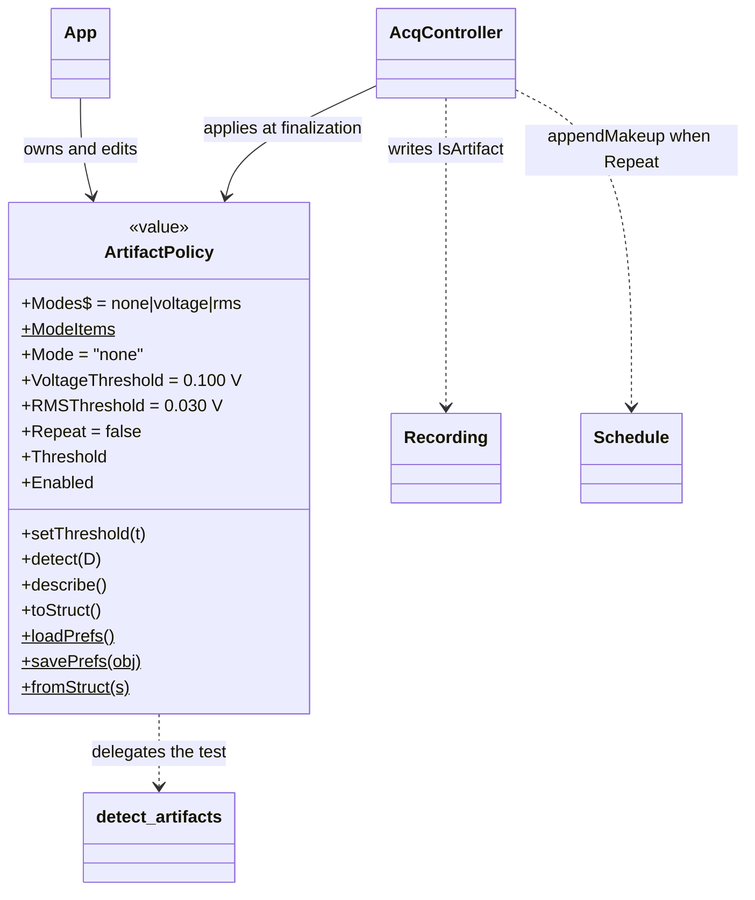
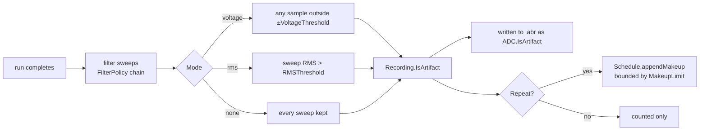

# `mabr.ArtifactPolicy` Class Reference

Member-by-member reference for the artifact criterion and what MABR does about a sweep
that fails it:
[+mabr/ArtifactPolicy.m](https://github.com/dstolz/MABR/blob/refactor/%2Bmabr/ArtifactPolicy.m).

For the operator's view of these controls, see [[Running a Session]].

## Table of contents

- [Class diagram](#class-diagram)
- [The rule that shapes everything](#the-rule-that-shapes-everything)
- [Constant properties](#constant-properties)
- [Properties](#properties)
- [Dependent properties](#dependent-properties)
- [Methods](#methods)
- [Static methods](#static-methods)
- [Where it is applied](#where-it-is-applied)
- [Usage](#usage)
- [See also](#see-also)

## Class diagram



The decision path, once a run ends:



## The rule that shapes everything

**Rejected sweeps are marked, never removed.** The samples stay in
`Recording.Data` and reach the `.abr` file untouched, so an offline reanalysis can
overrule the call. What rejection changes is what anything *descriptive* is computed
from — `SweepMean`, `noisePower`/`SNR`/`RMS`, and `Block.computeMetrics` are all built on
`Recording.CleanSweepData`.

The second consequence: because the verdict is only reached at **finalization**, this
policy is safe to change at any moment, including mid-acquisition. `mabr.ui.App` leaves
the artifact controls live while a schedule runs for exactly that reason.

## Constant properties

| Property | Value |
|---|---|
| `Modes` | `{'none','voltage','rms'}` — the canonical names, and what a `.mabrcfg` stores |
| `ModeItems` | Display strings in the same order; the GUI dropdown carries `Modes` as `ItemsData` |

## Properties

| Property | Type / default | Meaning |
|---|---|---|
| `Mode` | `char`, `'none'` | How a sweep is judged. Validated against `Modes` |
| `VoltageThreshold` | `double`, `0.100` V | Reject when **any sample** leaves ±this. 100 mV is where the electrode chain stops being linear — beyond it you are recording the amplifier, not biology |
| `RMSThreshold` | `double`, `0.030` V | Reject when the sweep's **RMS** exceeds this. 30 mV sits well under the ~50 mV RMS a sweep riding the ±100 mV peak limit would show, so it catches sustained muscle contamination that never trips the peak test — while leaving a quiet ABR sweep (hundreds of µV at most) an enormous margin |
| `Repeat` | `logical`, `false` | Re-present what was lost, or merely count it |

> 💡 **Two thresholds, one field in the GUI.** The criteria are alternatives, so the
> Acquisition panel shows a single threshold box and `App.syncArtifactFields` swaps the
> value and its caption on a mode change. Each criterion keeps its own number, which is
> why they are separate properties here.

**Thresholds are in volts** — the units of the recorded trace. The GUI shows millivolts
because that is the scale the numbers actually live at.

## Dependent properties

| Property | Value |
|---|---|
| `Threshold` | Whichever threshold the current `Mode` reads (V) |
| `Enabled` | `false` when `Mode` is `'none'` |

## Methods

| Method | What it does |
|---|---|
| `setThreshold(t)` | Sets whichever threshold the current `Mode` reads, leaving the other alone. Value class — reassign the result |
| `detect(D)` | Flag the artifact sweeps in a `[nSamples × nSweeps]` matrix. Returns `[tf, feature]`; delegates to `mabr.metrics.detect_artifacts` |
| `describe()` | One-line summary for the status line and logs |
| `toStruct()` | Plain-struct snapshot for the `.mabrcfg` configuration file |

## Static methods

| Method | What it does |
|---|---|
| `loadPrefs()` | Restore the last session's choices from MATLAB prefs (group `MABR`) |
| `savePrefs(obj)` | Persist them |
| `fromStruct(s)` | Inverse of `toStruct` |

`loadPrefs` and `fromStruct` follow the same rule: **restore whatever validates, fall
back to the property default for anything that does not.** A pref edited by hand, or a
configuration file written by an older MABR, should not stop the app from opening.

> 🔑 **Prefs and configurations are different concepts.** `loadPrefs`/`savePrefs` are
> "last used", per-rig, invisible. `toStruct`/`fromStruct` back `mabr.ui.App`'s
> **Save/Load Configuration…** — a deliberately named, shareable setup, for switching
> between protocols on one rig. Both travel through the same validated fields.

## Where it is applied

| Site | What happens |
|---|---|
| `AcqController.finalize_run` | The **verdict**. Judges each sweep on the *filtered* sweeps and writes `Recording.IsArtifact` |
| `AcqController.live_artifacts` | A **preview** only, on the sweeps `filter_sweeps` has already run the same chain over. Nothing there is recorded — re-pointing `Artifacts` just changes what the next 20 Hz tick previews |
| `AcqController.set.Artifacts` | Clearing `Repeat` mid-schedule calls `Schedule.dropPendingMakeup()`, withdrawing make-up runs not yet reached and refunding their budget |

With the high pass switched **off**, `live_artifacts` removes each sweep's own mean
first: nothing else would be taking out a baseline offset, and a sweep sitting on one
would trip a voltage threshold on the offset alone.

## Usage

```matlab
p = mabr.ArtifactPolicy;              % 'none'
p.Mode = 'voltage';
p = p.setThreshold(0.050);            % 50 mV — value class, reassign
p.Repeat = true;

disp(p.describe())

[bad,feat] = p.detect(sweeps);        % sweeps: [nSamples x nSweeps]
fprintf('%d of %d rejected\n', nnz(bad), numel(bad));

mabr.ArtifactPolicy.savePrefs(p);     % remember for next session
```

## See also

- [[Class-Reference]] — every other class, indexed by package
- [[mabr.FilterPolicy|mabr.FilterPolicy-Class-Reference]] — the chain the sweeps are judged *through*
- [[mabr.data.Recording|mabr.data.Recording-Class-Reference]] — `IsArtifact`, `CleanSweepData`, and the `ValidSweeps` mapping
- [[mabr.stim.Schedule|mabr.stim.Schedule-Class-Reference]] — `appendMakeup`, `MakeupLimit`, `dropPendingMakeup`
- [[mabr.ui.AcqController|mabr.ui.AcqController-Class-Reference]] — where the verdict is reached
- [[Running a Session]], [[Data Format]]
