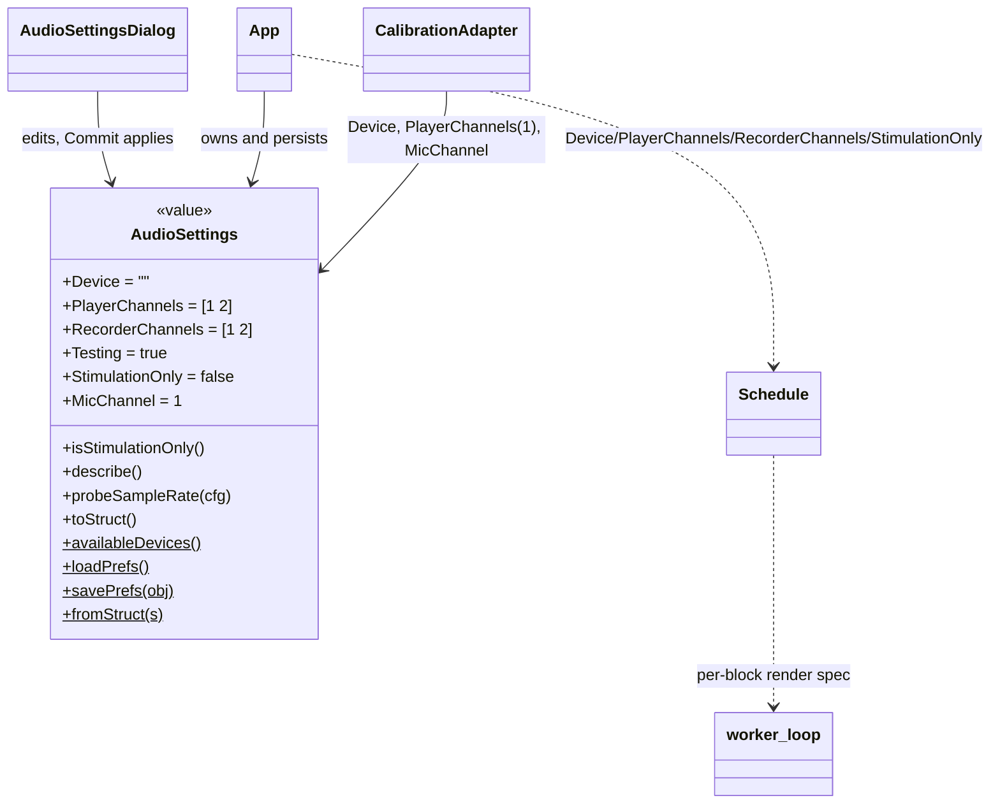
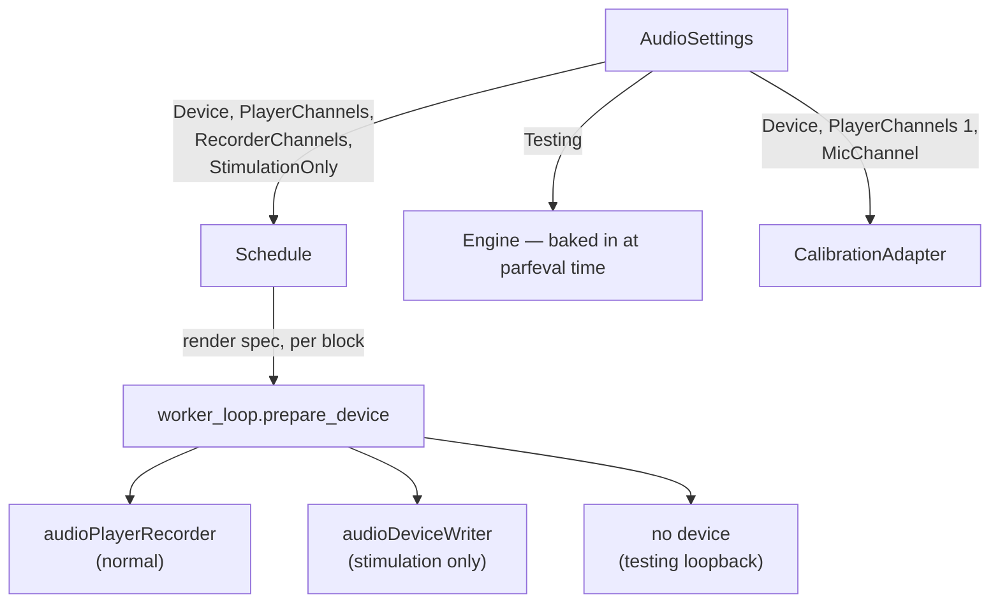

# `mabr.AudioSettings` Class Reference

Member-by-member reference for the ASIO device, the channel mapping, and the two mode
switches that decide whether a device is opened at all:
[+mabr/AudioSettings.m](https://github.com/dstolz/MABR/blob/refactor/%2Bmabr/AudioSettings.m).

For the dialog that edits one, see [[Running a Session]]; for the wiring itself, see
[[Installation and Requirements]].

## Table of contents

- [Class diagram](#class-diagram)
- [Three modes, and which wins](#three-modes-and-which-wins)
- [Properties](#properties)
- [Methods](#methods)
- [Static methods](#static-methods)
- [A config control, not a live one](#a-config-control-not-a-live-one)
- [Usage](#usage)
- [See also](#see-also)

## Class diagram



Where each setting lands:



## Three modes, and which wins

| Mode | Device opened | Recorded | Loop-back self-test |
|---|---|---|---|
| Normal | `audioPlayerRecorder`, full duplex | signal + timing | Yes, `AcqController.verifyTimingLoop` |
| `StimulationOnly` | `audioDeviceWriter`, output only | **nothing** | Skipped — there is no input to loop back to |
| `Testing` | none at all | synthesized loopback | Yes (the loopback branch passes the timing column straight through) |

**`Testing` wins wherever both are somehow set.** It opens no device, so there is nothing
for stimulation-only to be a mode *of*. `AudioSettingsDialog.readControls` forces
`StimulationOnly` false under `Testing`, and `isStimulationOnly()` is the backstop for a
hand-edited pref or an old configuration file holding both flags.

### Why `StimulationOnly` exists

Playback and the timing pulse go out; nothing is recorded. It is for rigs where another
system does the recording — or none does. Because `prepare_device` opens an
**output-only** `audioDeviceWriter` rather than a full-duplex device whose input is
discarded, the mode also runs on hardware with **no input channels at all**.

Both play columns are still emitted: a timing pulse is as much an output as the signal,
and something downstream is very likely reading it. What such a run saves in place of the
`.abr` files it cannot produce is a `.stimlog` — see
[[mabr.data.io|mabr.data.io-Class-Reference]] and [[Data Format]].

> 🔑 **`Testing` is baked into the worker at `parfeval` time; `StimulationOnly` rides
> per block in the render spec.** That is why changing `Testing` forces
> `App.ensureController` to rebuild the worker, while switching stimulation-only costs
> nothing — `prepare_device` rebuilds the device on every `Prep` anyway.

## Properties

| Property | Default | Meaning |
|---|---|---|
| `Device` | `''` | ASIO device name. `''` = whatever `audioPlayerRecorder` opens by default |
| `PlayerChannels` | `[1 2]` | `[DACsignal DACtiming]` output mapping |
| `RecorderChannels` | `[1 2]` | `[ADCsignal ADCtiming]` input mapping |
| `Testing` | `true` | Loopback, no hardware |
| `StimulationOnly` | `false` | Play only, record nothing |
| `MicChannel` | `1` | Input the calibration **microphone** is patched to |

> 💡 **`MicChannel` is deliberately not `RecorderChannels(1)`.** Acquisition records an
> electrode; calibration records a measurement microphone. They are two patchings of one
> device, so they are two settings. Only
> [[mabr.stim.CalibrationAdapter|mabr.stim.CalibrationAdapter-Class-Reference]] reads it,
> and nothing about it can reach a `.abr`.

**The sample rates are not here.** `mabr.Config` fixes them, because every stimulus must
already be rendered at `Config.DACSampleRate`. What this class offers instead is a
*determination*, not a setting — see `probeSampleRate`.

## Methods

| Method | What it does |
|---|---|
| `isStimulationOnly()` | Stimulation-only **as everything downstream should ask it** — `Testing` wins. Use this rather than reading the raw property |
| `describe()` | One-line summary for the status line and menu, mirroring `FilterPolicy.describe` |
| `probeSampleRate(cfg)` | `[achievedHz,ok,msg]` — briefly open a real device and report the rate it actually granted |
| `toStruct()` | Plain-struct snapshot for the `.mabrcfg` configuration file |

### `probeSampleRate` opens the class the worker would

An `audioDeviceWriter` under `StimulationOnly`, an `audioPlayerRecorder` otherwise.
Probing full-duplex in stimulation-only mode would fail on exactly the input-less
hardware that mode exists for. It is never called in `Testing` mode — there is no device
to probe.

This is what the **Test Device** button in the settings dialog runs, so a mismatched or
misconfigured ASIO driver is caught from a dialog rather than partway into a session.

## Static methods

| Method | What it does |
|---|---|
| `availableDevices()` | ASIO device names visible on this machine, or `{}`. **Never throws** — it feeds a settings dialog, not a start-up check |
| `loadPrefs()` | Restore the last session's settings from MATLAB prefs (group `MABR`) |
| `savePrefs(obj)` | Persist them |
| `fromStruct(s)` | Inverse of `toStruct`, forgiving of a missing or invalid field |

`{}` from `availableDevices` means any of: no driver installed, no device plugged in, or
no Audio Toolbox license — the dialog says so rather than the app failing to open.

## A config control, not a live one

Unlike [[mabr.ArtifactPolicy|mabr.ArtifactPolicy-Class-Reference]] and
[[mabr.FilterPolicy|mabr.FilterPolicy-Class-Reference]], which stay editable throughout a
schedule, this one **locks** for the duration (`App.configControls`). The worker's device
is already open on whatever `Start` handed it.

Between runs, though, it is editable again on the *same* controller — so
`AcqController.start` re-runs the timing loop-back self-test whenever `Device`,
`PlayerChannels`, or `RecorderChannels` have changed since the last pass
(`VerifiedAudioConfig`), and `App.ensureController` rebuilds the worker whenever
`Testing` differs from the running controller's.

## Usage

```matlab
a = mabr.AudioSettings.loadPrefs();

names = mabr.AudioSettings.availableDevices();
if ~isempty(names), a.Device = names{1}; end

a.Testing          = false;
a.PlayerChannels   = [1 2];     % [signal timing] out
a.RecorderChannels = [1 2];     % [signal timing] in
a.MicChannel       = 3;         % calibration mic

[hz,ok,msg] = a.probeSampleRate(mabr.Config);
fprintf('%s (%s)\n', msg, mabr.ui.App.onOff(ok));   %#ok — illustrative

mabr.AudioSettings.savePrefs(a);
```

Drive stimuli with nothing recorded:

```matlab
a.Testing         = false;
a.StimulationOnly = true;       % audioDeviceWriter; one .stimlog per run
```

## See also

- [[Class-Reference]] — every other class, indexed by package
- [[mabr.Config|mabr.Config-Class-Reference]] — the rates this class deliberately does not set
- [[mabr.stim.Schedule|mabr.stim.Schedule-Class-Reference]] — where the device and channels are carried
- [[mabr.stim.CalibrationAdapter|mabr.stim.CalibrationAdapter-Class-Reference]] — the only reader of `MicChannel`
- [[mabr.ui.AcqController|mabr.ui.AcqController-Class-Reference]] — `verifyTimingLoop`, and the stimulation-only path
- [[Running a Session]], [[Troubleshooting]]
