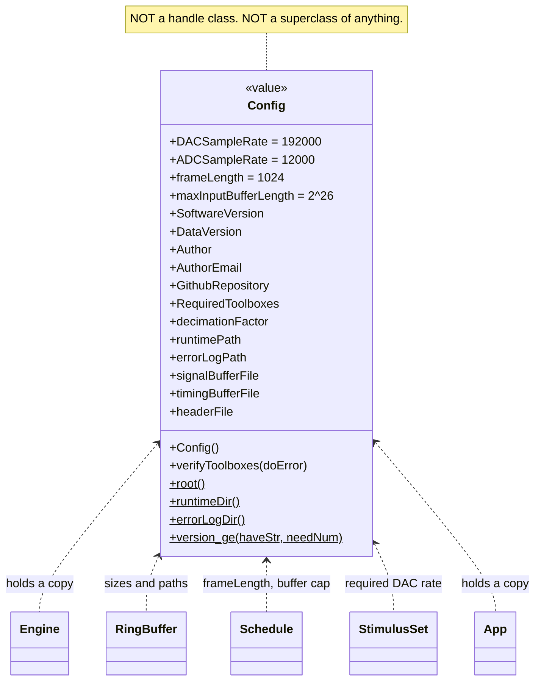

# `mabr.Config` Class Reference

Member-by-member reference for the constants and runtime paths every other part of MABR
reads: [+mabr/Config.m](https://github.com/dstolz/MABR/blob/refactor/%2Bmabr/Config.m).

This page is the class card. For what the numbers mean in practice, read
[[Installation and Requirements]] and [[Acquisition Engine]].

## Table of contents

- [Class diagram](#class-diagram)
- [The one thing to know](#the-one-thing-to-know)
- [Constant properties](#constant-properties)
- [Dependent properties](#dependent-properties)
- [Methods](#methods)
- [Static helpers](#static-helpers)
- [Usage](#usage)
- [See also](#see-also)

## Class diagram

`$` marks a static member.



## The one thing to know

`mabr.Config` is a plain **value** object, and deliberately **not** a superclass — unlike
the legacy `abr.Universal` that it replaced. Nothing inherits from it. The app and the
engine each hold a copy, and the worker builds its own from the same constants rather
than having one serialized across `parfeval`, so both processes derive identical paths
without a handshake.

Everything on it is either `Constant` or `Dependent`. There is no state to get out of
sync, which is why passing a copy around is safe.

## Constant properties

### Hardware and streaming

| Property | Value | Role |
|---|---|---|
| `DACSampleRate` | `192000` Hz | Playback **and** full-duplex record rate. Every stimulus must already be rendered at this rate — see [[Stimulus Package Contract]] |
| `ADCSampleRate` | `12000` Hz | Decimated storage/analysis rate. `mabr.data.io` decimates at save time |
| `frameLength` | `1024` samples | Samples per play/record frame. Also the command-poll granularity: the worker checks for `Pause`/`Stop`/`Kill` once per frame, so a command takes effect within ≈5.3 ms |
| `maxInputBufferLength` | `2^26` samples | Ring-buffer length — about 5.8 minutes at 192 kHz. `mabr.stim.Schedule.renderSpec` refuses a run longer than this *before* allocating |

> ⚠️ **The rates are fixed here on purpose.** [[mabr.AudioSettings|mabr.AudioSettings-Class-Reference]]
> lets you choose the device and the channel mapping but never a rate, because a
> `StimulusSet` is validated against `DACSampleRate` and `mabr.stim.fromStimgen`
> regenerates every stimulus at it. What *is* worth determining is whether the selected
> ASIO device honours the request — that is `AudioSettings.probeSampleRate`.

### Release metadata

| Property | Value |
|---|---|
| `SoftwareVersion` | `'23A'` |
| `DataVersion` | `'22A'` — keep matched to the `ABR_Data` struct the offline pipeline reads |
| `Author` / `AuthorEmail` | `'Daniel Stolzberg'` / `'dstolz@umd.edu'` |
| `GithubRepository` | `https://github.com/dstolz/MABR` |

### `RequiredToolboxes`

An *N*×2 cell of `{name, minimumVersion}`, checked by `verifyToolboxes`.

| Toolbox | Minimum | Why that floor |
|---|---|---|
| MATLAB | 9.11 (R2021b) | `mabr.ui.App` puts a `uitoolbar` on a `uifigure`, supported only from R2021b. Below it the GUI errors while building rather than degrading. (Everything outside `+ui` is constrained to 9.7/R2019b by `arguments` blocks) |
| Signal Processing Toolbox | 8.1 | `designfilt`, `filtfilt`, `findpeaks` |
| Audio Toolbox | 1.5 | `audioPlayerRecorder` / `audioDeviceWriter` (ASIO) |
| DSP System Toolbox | 9.1 | streaming support |
| Parallel Computing Toolbox | 6.13 | **New with the rewrite** — the acquisition engine runs on a parpool worker |

## Dependent properties

| Property | Value |
|---|---|
| `decimationFactor` | `DACSampleRate / ADCSampleRate` = 16 |
| `runtimePath` | the `.runtime_data/` folder (created if missing) |
| `errorLogPath` | the `.error_logs/` folder (created if missing) |
| `signalBufferFile` | `.runtime_data/ring_signal.dat` |
| `timingBufferFile` | `.runtime_data/ring_timing.dat` |
| `headerFile` | `.runtime_data/ring_header.dat` |

The three `*.dat` paths are the only memory-mapped surface in the system; see
[[mabr.acq.RingBuffer|mabr.acq.RingBuffer-Class-Reference]].

## Methods

| Method | What it does |
|---|---|
| `Config()` | Touches the runtime directories so they exist before the engine memory-maps files into them |
| `verifyToolboxes(doError)` | True when every required toolbox is installed at a sufficient version. With `doError` (default `true`) and something missing, throws an informative error instead |

## Static helpers

No object needed:

```matlab
r = mabr.Config.root();          % folder containing +mabr and MABR.m
p = mabr.Config.runtimeDir();    % .runtime_data, created if missing
p = mabr.Config.errorLogDir();   % .error_logs,   created if missing
tf = mabr.Config.version_ge('9.13', 9.1);   % true
```

`version_ge` treats the decimal as a **zero-padded minor component**, so `9.12 > 9.5`.
A plain numeric comparison would get that backwards and quietly report R2022a as older
than R2018b.

## Usage

```matlab
cfg = mabr.Config;
cfg.verifyToolboxes();                 % throws with a list if anything is missing

fprintf('%d Hz in, %d Hz stored (÷%d)\n', ...
    cfg.DACSampleRate, cfg.ADCSampleRate, cfg.decimationFactor);

secs = cfg.maxInputBufferLength / cfg.DACSampleRate;   % longest possible run
```

## See also

- [[Class-Reference]] — every other class, indexed by package
- [[mabr.AudioSettings|mabr.AudioSettings-Class-Reference]] — the device and wiring, which *are* settable
- [[mabr.acq.RingBuffer|mabr.acq.RingBuffer-Class-Reference]] — what `maxInputBufferLength` sizes
- [[Installation and Requirements]] — the toolbox list in context
- [[Acquisition Engine]] — where `frameLength` sets the command latency
