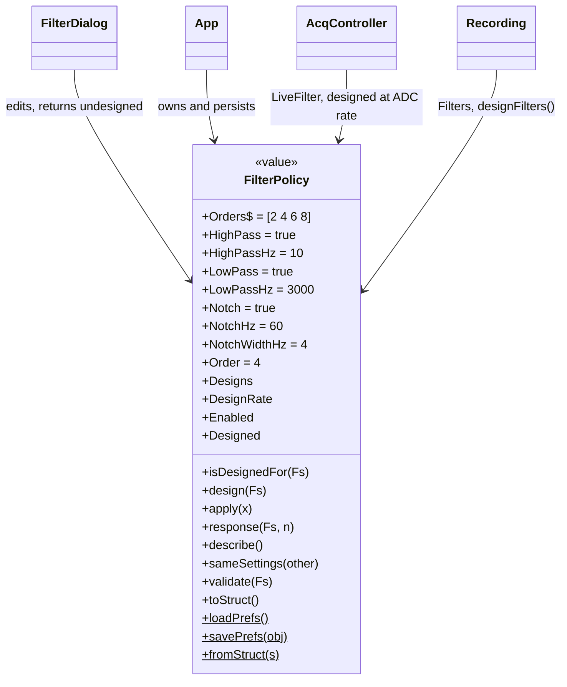
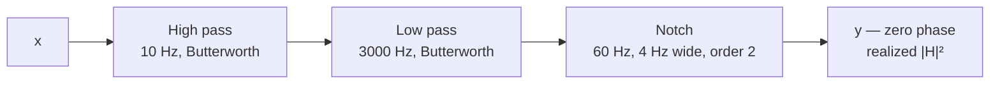

# `mabr.FilterPolicy` Class Reference

Member-by-member reference for the digital filter chain MABR applies to everything you
**look at**: [+mabr/FilterPolicy.m](https://github.com/dstolz/MABR/blob/refactor/%2Bmabr/FilterPolicy.m).

For the dialog that edits one, see [[Running a Session]]; for what the offline pipeline
does instead, see [[Offline Analysis]].

## Table of contents

- [Class diagram](#class-diagram)
- [Display only — the raw trace is what gets saved](#display-only--the-raw-trace-is-what-gets-saved)
- [Constant properties](#constant-properties)
- [Properties](#properties)
- [Dependent properties](#dependent-properties)
- [Methods](#methods)
- [Static methods](#static-methods)
- [Designing and applying](#designing-and-applying)
- [Usage](#usage)
- [See also](#see-also)

## Class diagram



Three independent sections, applied in order and then run backwards by `filtfilt`:



## Display only — the raw trace is what gets saved

Nothing here ever touches `mabr.data.Recording.Data`, and so nothing here can reach a
`.abr` file: `mabr.data.io` writes the trace exactly as it came off the ADC. Filtering
happens on the way to a plot or a metric — `Recording.ProcessedData → SweepData →
SweepMean`, and the live view's sweep matrices.

Two consequences worth stating plainly:

- **There is no wrong moment to change a filter.** `mabr.ui.App` leaves the Filters
  control live for the whole schedule.
- **The offline pipeline is free to disagree.** It re-filters from the same raw samples
  with its own choices.

## Constant properties

| Property | Value |
|---|---|
| `Orders` | `[2 4 6 8]` — the Butterworth orders allowed for the high- and low-pass sections |

The range is deliberately narrow and even-only: a high-order IIR with a 10 Hz corner at
12 kHz is numerically fragile, and there is nothing to gain from a steeper skirt on a
10 ms sweep.

## Properties

| Property | Default | Meaning |
|---|---|---|
| `HighPass` / `HighPassHz` | `true` / `10` Hz | Drift, DC offset, slow electrode noise |
| `LowPass` / `LowPassHz` | `true` / `3000` Hz | Hiss and everything above the response band |
| `Notch` / `NotchHz` | `true` / `60` Hz | Mains hum (50 Hz elsewhere) |
| `NotchWidthHz` | `4` Hz | −3 dB width of the notch |
| `Order` | `4` | Shared by the high- and low-pass sections. The notch is always order 2 — a wider skirt there would eat the response band |

Each section switches independently: they are three checkboxes, not one bandpass.

### Set privately by `design()`

| Property | Meaning |
|---|---|
| `Designs` | Cell of `digitalFilter`, applied in order |
| `DesignRate` | The rate the chain was designed at; `0` means undesigned |

## Dependent properties

| Property | Value |
|---|---|
| `Enabled` | `false` when no section is switched on |
| `Designed` | `true` once `design()` has built the chain |

## Methods

| Method | What it does |
|---|---|
| `design(Fs)` | Build the enabled sections at `Fs`. **Value class — reassign the result** |
| `apply(x)` | Run the designed chain zero-phase (`filtfilt`), column-wise |
| `isDesignedFor(Fs)` | Is the cached chain the one this policy asks for, at `Fs`? Lets a caller skip a redesign on every live tick |
| `response(Fs,n)` | Magnitude **as applied** — `|H|²` in dB — over log-spaced frequencies from 1 Hz to Nyquist |
| `describe()` | One-line caption. A passband reads as one range rather than two independent corners, which is how anyone says it out loud |
| `sameSettings(other)` | Do two policies ask for the same chain? The cached `Designs` are deliberately ignored — a consequence, not a setting |
| `validate(Fs)` | `[tf,msg]`: is this chain realizable at `Fs`, and does it leave a passband? |
| `toStruct()` | Plain-struct snapshot for the `.mabrcfg` file. Excludes `Designs`, same reason as `sameSettings` |

### Two behaviours that are opt-outs, not bugs

- **`apply` on an undesigned policy returns `x` untouched** — the same opt-in rule
  `mabr.data.Recording` follows. Design first, or nothing happens.
- **A column too short to `filtfilt` passes through** rather than throwing. A truncated
  sweep must not take the live view down with it.

> ⚠️ **`filtfilt` runs the chain in both directions, so the realized magnitude is
> `|H|²`** and the nominal corners sit at **−6 dB**, not −3. That is what `response()`
> reports and what `mabr.ui.FilterDialog` draws, so the plot is the truth about what you
> are seeing.

`validate` **reports** rather than throws — a high pass above the low pass, or a corner
past Nyquist — so the dialog can grey OK out instead of erroring at a user mid-edit.

## Static methods

| Method | What it does |
|---|---|
| `loadPrefs()` | Restore the last session's chain from MATLAB prefs (group `MABR`) |
| `savePrefs(obj)` | Persist it |
| `fromStruct(s)` | Inverse of `toStruct`, forgiving of a missing or invalid field |

## Designing and applying

`designfilt` costs milliseconds, and the live tick runs 20 times a second — so the design
is cached in the object and the caller keeps a designed copy:

| Holder | Designed at | When |
|---|---|---|
| `AcqController.LiveFilter` | ADC rate (12 kHz) | In `set.Filters`, i.e. once per policy change |
| `Recording.Filters` | the Recording's own `SampleRate` | On the explicit `designFilters()` call |
| `mabr.ui.FilterDialog` | — | Returns the edited policy **undesigned**, so no stale design travels with the object |

Both live and finalized paths therefore run the same chain at the same rate, which is why
what the operator watches and what a `Block` reports cannot disagree.

## Usage

```matlab
f = mabr.FilterPolicy;                 % 10–3000 Hz + 60 Hz notch, order 4
f.Notch = false;
[ok,msg] = f.validate(12000);
assert(ok, msg);

f = f.design(12000);                   % value class — reassign
y = f.apply(x);                        % zero-phase, column-wise

[magDB,hz] = f.response(12000);
semilogx(hz, magDB); ylabel('dB (|H|^2)')

disp(f.describe())                     % e.g. '10-3000 Hz'
mabr.FilterPolicy.savePrefs(f);
```

Shorthand constructor — pass a corner to enable a section, `[]` or `false` to switch it
off:

```matlab
f = mabr.FilterPolicy(30, 3000, []);   % 30 Hz HP, 3 kHz LP, no notch
```

## See also

- [[Class-Reference]] — every other class, indexed by package
- [[mabr.data.Recording|mabr.data.Recording-Class-Reference]] — `designFilters`, `ProcessedData`
- [[mabr.ui.AcqController|mabr.ui.AcqController-Class-Reference]] — `LiveFilter`, `filter_sweeps`
- [[mabr.ArtifactPolicy|mabr.ArtifactPolicy-Class-Reference]] — judged on the sweeps this chain produced
- [[Offline Analysis]] — the pipeline that filters the raw trace its own way
