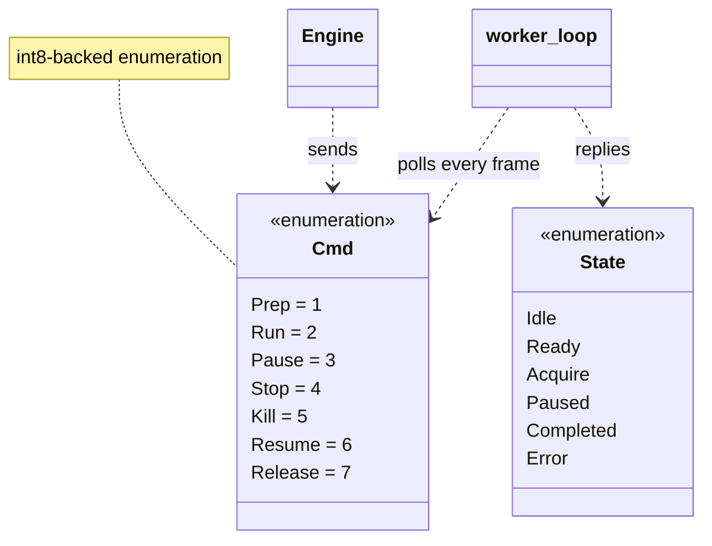
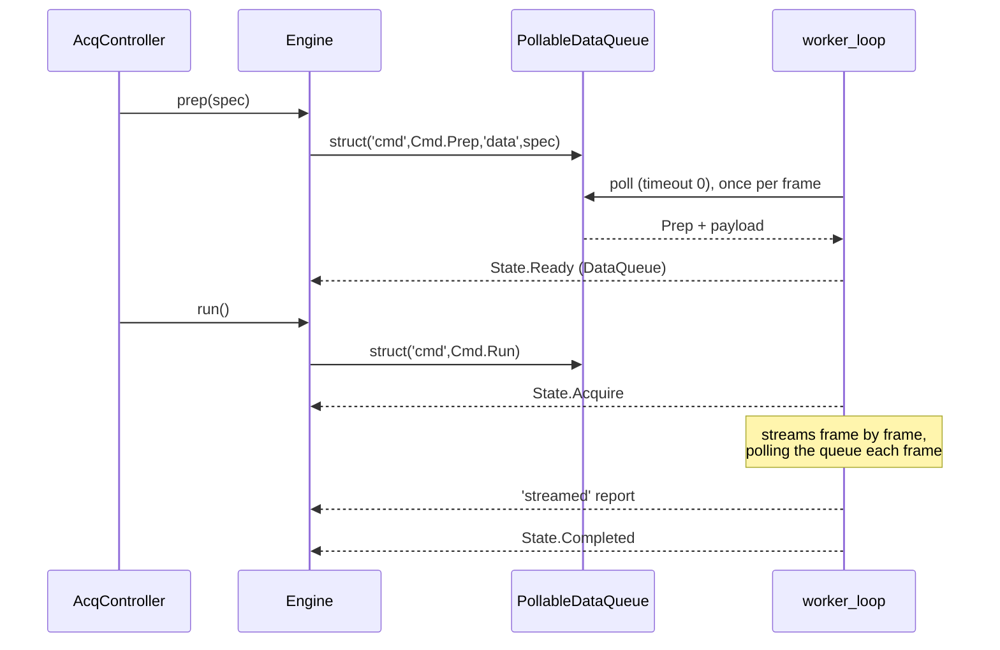

# `mabr.acq.Cmd` Class Reference

Member-by-member reference for the client → worker command enumeration:
[+mabr/+acq/Cmd.m](https://github.com/dstolz/MABR/blob/refactor/%2Bmabr/%2Bacq/Cmd.m).

For the protocol in prose, read [[Acquisition Engine]].

## Table of contents

- [Class diagram](#class-diagram)
- [Inheritance](#inheritance)
- [Enumeration members](#enumeration-members)
- [How a command travels](#how-a-command-travels)
- [Why `Release` exists](#why-release-exists)
- [Usage](#usage)
- [See also](#see-also)

## Class diagram



## Inheritance

```matlab
classdef Cmd < int8
```

Inheriting from `int8` makes the members comparable and castable, which is what lets them
ride in a plain message struct across a `parallel.pool.PollableDataQueue`.

## Enumeration members

| Member | Value | Meaning |
|---|---|---|
| `Prep` | 1 | Configure the worker for a new block. The payload carries the pre-rendered 2-channel play matrix plus block parameters |
| `Run` | 2 | Begin streaming the prepared block **from the start** |
| `Pause` | 3 | Pause streaming in place, keeping the audio device open |
| `Stop` | 4 | End the current block early and return to `Ready` |
| `Kill` | 5 | Release the device and terminate the worker loop |
| `Resume` | 6 | Continue a paused block |
| `Release` | 7 | Close the audio device but keep the worker — and the warm pool — alive |

> 💡 **`Resume` is ignored unless a block is paused.** That is deliberate: it means the
> command can never re-run an already-completed block, so a stray Resume is inert rather
> than destructive.

## How a command travels



Commands are **messages, not shared memory** — replacing the legacy `abr.Cmd` values that
were multiplexed through the `mabr_com.dat` memmap.

Because the queue is polled with a zero timeout **once per frame**, and a frame is
`Config.frameLength = 1024` samples (≈5.3 ms at 192 kHz), `Pause`/`Stop`/`Kill` take
effect within one frame. That responsiveness is also what makes an online advance
criterion possible: `mabr.stim.advance.corr_threshold` can stop a run the moment a
response is detected — the capability the legacy design documented it could not provide.

## Why `Release` exists

The worker opens its `audioPlayerRecorder` on the **first** `Prep` and holds it until
`Kill`. That is what keeps block-to-block latency down — but an ASIO device has exactly
one owner, so **"controller idle" does not mean "device free"**.

Without `Release`, anything else needing the device —
[[mabr.stim.CalibrationAdapter|mabr.stim.CalibrationAdapter-Class-Reference]] — would be
locked out for the rest of the session, and the only remedy would be restarting MABR. The
next `Prep` reopens the device from scratch.

## Usage

You normally send these through `mabr.acq.Engine`'s named methods rather than by hand:

```matlab
eng.prep(spec);        % Cmd.Prep
eng.run();             % Cmd.Run
eng.pause();           % Cmd.Pause
eng.resume();          % Cmd.Resume
eng.stop();            % Cmd.Stop
eng.releaseDevice();   % Cmd.Release
eng.kill();            % Cmd.Kill
```

The enumeration itself behaves like any MATLAB enum:

```matlab
c = mabr.acq.Cmd.Stop;
disp(int8(c))                 % 4
disp(c == mabr.acq.Cmd.Stop)  % 1
disp(enumeration('mabr.acq.Cmd'))
```

## See also

- [[Class-Reference]] — every other class, indexed by package
- [[mabr.acq.State|mabr.acq.State-Class-Reference]] — the reply half of the protocol
- [[mabr.acq.Engine|mabr.acq.Engine-Class-Reference]] — the only sender
- [[Acquisition Engine]] — the subsystem in prose
