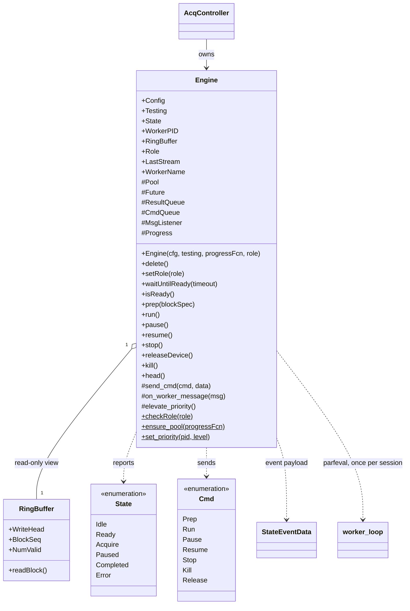
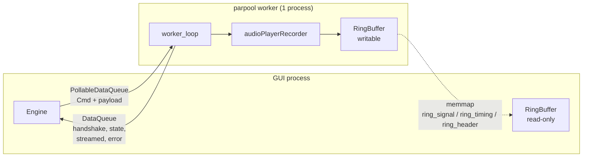
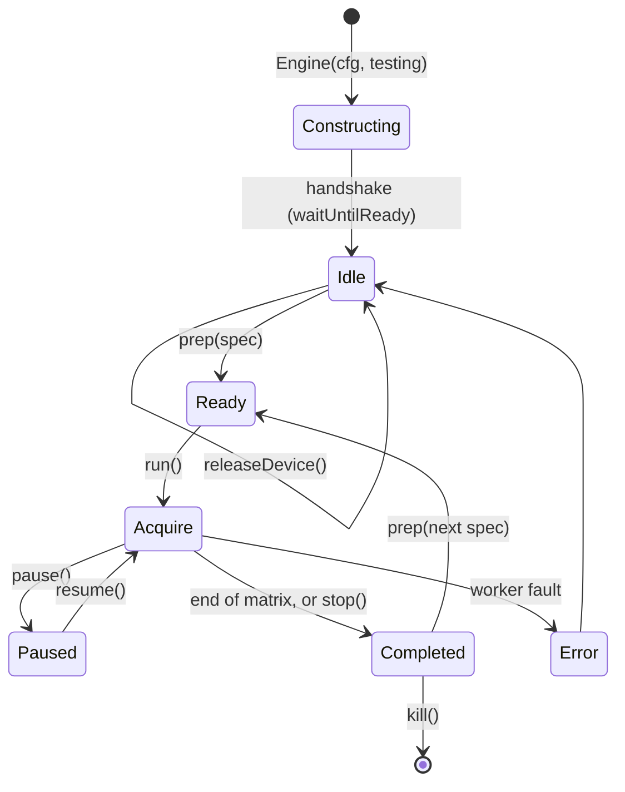

# `mabr.acq.Engine` Class Reference

Member-by-member reference for the client half of the acquisition engine:
[+mabr/+acq/Engine.m](https://github.com/dstolz/MABR/blob/refactor/%2Bmabr/%2Bacq/Engine.m).

This page is the class card. For how the two halves fit together, read
[[Acquisition Engine]] first.

## Table of contents

- [Class diagram](#class-diagram)
- [What it replaced](#what-it-replaced)
- [Properties](#properties)
- [Events](#events)
- [Methods](#methods)
- [Static helpers](#static-helpers)
- [Lifecycle](#lifecycle)
- [The block spec](#the-block-spec)
- [Roles: why the worker has a name](#roles-why-the-worker-has-a-name)
- [Usage](#usage)
- [See also](#see-also)

## Class diagram

`$` marks a static member, `#` a private one.



The two processes, and the three channels between them:



## What it replaced

The Engine is the whole of the legacy `abr.Runtime` client machinery, gone:
`launch_bg_process` (`system('matlab.exe ...')`), the WMIC PID liveness checks,
`info.mat`, the `dac.wav` handoff, and the `mabr_com.dat` command/state memmap.

Most importantly it removes **every `while … pause(0.01)` busy-wait**. Worker messages
arrive on a `parallel.pool.DataQueue` and are dispatched by an `afterEach` callback, so
the Engine is event-driven throughout. The one bounded wait that remains is
`waitUntilReady`, and it is a one-time startup handshake, not a poll.

## Properties

### `SetAccess = private`

| Property | Type | Role |
|---|---|---|
| `Config` | `mabr.Config` | The copy this engine was built with |
| `Testing` | `(1,1) logical` | Loopback mode; baked in at construction, so changing it means a new worker |
| `State` | `mabr.acq.State` | Last state the worker reported |
| `WorkerPID` | `double` | The worker process, from the handshake. `-1` until it arrives |
| `RingBuffer` | `mabr.acq.RingBuffer` | **Read-only** view of the shared buffer |
| `Role` | `char` | `'acquisition'` or `'stimulus'` — see [below](#roles-why-the-worker-has-a-name) |
| `LastStream` | `struct` | What the worker reported about the last block it streamed |

`LastStream` carries `.samples` (play-matrix samples actually emitted) and `.reason`
(`'completed'` \| `'stopped'` \| `'killed'`), and is **cleared at each `prep`** so a stale
count cannot be mistaken for this block's. In stimulation-only mode nothing comes back
through the ring buffer, which makes this the only record of how far a run that was
stopped early actually got — see `AcqController.log_stim_run`.

### `Dependent`

| Property | Value |
|---|---|
| `WorkerName` | `'acquisition worker'` / `'stimulus worker'` |

### Private

`Pool`, `Future`, `ResultQueue` (worker → client `DataQueue`), `CmdQueue` (client →
worker `PollableDataQueue`), `MsgListener`, and `Progress` — the startup status sink,
`@(~) []` by default.

## Events

Listen to these to drive a UI.

| Event | Payload | Fires when |
|---|---|---|
| `StateChanged` | `mabr.acq.StateEventData` (`.State`) | The worker reports a new state |
| `BlockCompleted` | — | The current block finished, or was stopped |
| `WorkerError` | `mabr.acq.StateEventData` (`.Identifier`, `.Message`) | The worker reported an error |

> 🔑 **The `'streamed'` report arrives *before* the `Completed` state**, so a
> `BlockCompleted` listener already has `LastStream` filled in. That ordering is what
> lets a stimulation-only run write an honest `.stimlog` for a run cut short.

## Methods

| Method | What it does |
|---|---|
| `Engine(cfg,testing,progressFcn,role)` | Ensure a warm 1-process pool, launch `worker_loop` via `parfeval`, open the read-only ring buffer, wire the `afterEach` dispatcher |
| `waitUntilReady(timeout)` | Bounded wait for the worker handshake. One-time startup wait, not a per-frame poll |
| `isReady()` | Has the handshake arrived? |
| `prep(blockSpec)` | Arm the worker with a pre-rendered block, and clear `LastStream` |
| `run()` / `pause()` / `resume()` / `stop()` | Send the corresponding `mabr.acq.Cmd` |
| `releaseDevice()` | Close the audio device, keeping the worker and warm pool alive |
| `kill()` | Release the device and terminate the worker loop |
| `setRole(role)` | Re-label a running worker. Logged on change |
| `head()` | `RingBuffer.WriteHead` — the monotonic sample count for this block |
| `delete()` | Tear down worker, listener, and pool references |

`progressFcn` (optional) is called with a `char` status message at each startup
milestone, so a UI can show what is happening while the pool spins up — which can take
tens of seconds on first use.

### `releaseDevice` is not optional plumbing

The worker opens its `audioPlayerRecorder` on the **first** `prep` and holds it until
`kill`. That is what keeps block-to-block latency down — but an ASIO device has exactly
one owner, so **"controller idle" does not mean "device free"**. Without this call, the
first calibration after any acquisition could not open the device, and the only remedy
would be restarting MATLAB. The next `prep` reopens it.

`mabr.stim.CalibrationAdapter.borrowDevice` is the caller.

## Static helpers

| Method | What it does |
|---|---|
| `checkRole(role)` | Validates against the only two the worker can be doing. A typo would otherwise reach the log and a status line as though it meant something |
| `ensure_pool(progressFcn)` | Reuse an existing 1-process pool or create one |
| `set_priority(pid,level)` | Raise the worker's process priority (ported from `abr.Tools.set_priority`) |

## Lifecycle



`Resume` is ignored unless a block is paused, so it can never re-run an already-completed
block. Because commands are polled **every frame** (1024 samples ≈ 5.3 ms at 192 kHz),
`Pause`/`Stop`/`Kill` take effect within one frame — which is also what makes an online
advance criterion possible at all.

## The block spec

Whatever `mabr.stim.Schedule.renderSpec` returns. `worker_loop` reads these fields, with
a forgiving `getdef` so a caller may omit anything it has no opinion about:

| Field | Meaning |
|---|---|
| `PlayMatrix` | `[N × 2] single` — column 1 signal, column 2 timing |
| `SampleRate` | Hz |
| `PlayerChannels` | `[1×2]` output channels (default `[1 2]`) |
| `RecorderChannels` | `[1×2]` input channels (default `[1 2]`) |
| `StimulationOnly` | Open an output-only `audioDeviceWriter` and record nothing |
| `Device` | ASIO device name |
| `TestingFrameDelay` | s/frame; loopback pacing, tests only |

`Schedule` also puts `ExpectedOnsets`, `StimulusIndex`, `Polarity` and `Meta` on the
spec. The worker ignores those — they are for the controller, which de-interleaves the
recording with them.

## Roles: why the worker has a name

A worker that records nothing is not an acquisition worker, and a log saying otherwise is
misleading in exactly the mode where the user most needs to be sure. `Role` is therefore
carried in every startup message and log line the worker appears in.

It is **purely a label** — it changes no behaviour, and the mode itself rides per block in
the render spec. `AcqController.workerRole(stimOnly)` is the one place the mapping lives;
`App.ensureController` passes it at construction and `AcqController.start` calls
`setRole` for each run, since one worker is reused across runs that may switch modes
between them.

## Usage

```matlab
cfg = mabr.Config;
eng = mabr.acq.Engine(cfg, true, @(s) disp(s));   % TESTING loopback

eng.waitUntilReady(60);

lh = event.listener(eng,'StateChanged', @(~,e) fprintf('%s\n', string(e.State)));

sch  = mabr.stim.Schedule(mabr.stim.StimulusSet(mabr.stim.demoStimuli(), cfg), cfg);
sch.build();
spec = sch.renderSpec(1);

eng.prep(spec);
eng.run();
% ... eng.head() advances; read samples through eng.RingBuffer ...

eng.kill();
delete(eng);
```

## See also

- [[Class-Reference]] — every other class, indexed by package
- [[Acquisition Engine]] — the subsystem in prose
- [[mabr.acq.RingBuffer|mabr.acq.RingBuffer-Class-Reference]] — where the samples travel
- [[mabr.acq.Cmd|mabr.acq.Cmd-Class-Reference]], [[mabr.acq.State|mabr.acq.State-Class-Reference]] — the protocol
- [[mabr.ui.AcqController|mabr.ui.AcqController-Class-Reference]] — the only thing that normally owns one
- [[mabr.stim.Schedule|mabr.stim.Schedule-Class-Reference]] — what builds a block spec
- [[Verification and Testing]] — `verify_engine_loopback` drives all of this with no hardware
