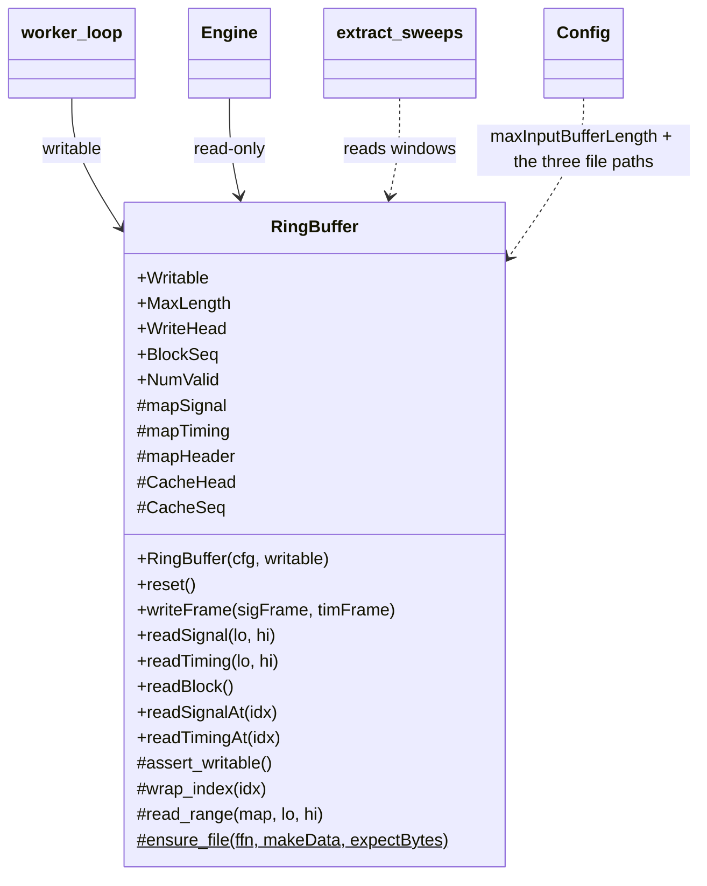
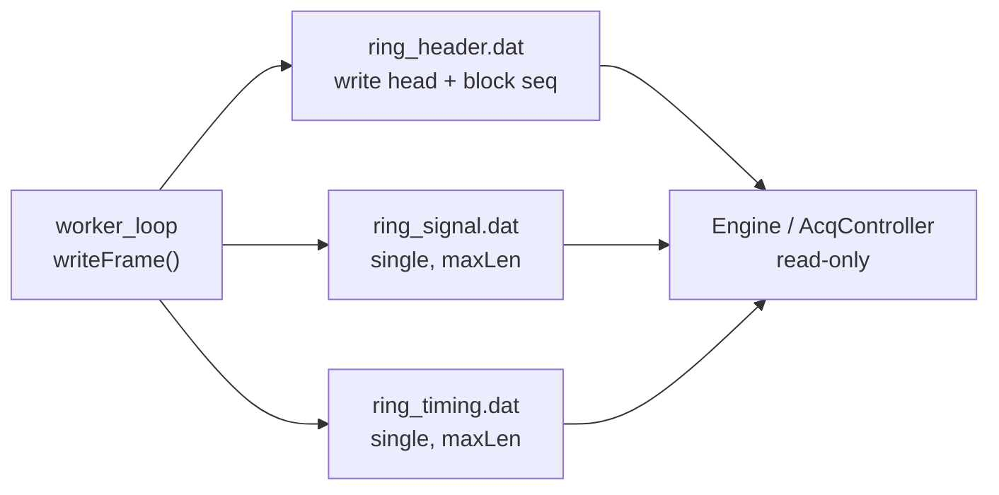
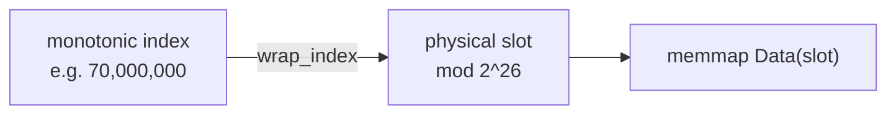

# `mabr.acq.RingBuffer` Class Reference

Member-by-member reference for the one memory-mapped surface in MABR:
[+mabr/+acq/RingBuffer.m](https://github.com/dstolz/MABR/blob/refactor/%2Bmabr/%2Bacq/RingBuffer.m).

For the subsystem it belongs to, read [[Acquisition Engine]].

## Table of contents

- [Class diagram](#class-diagram)
- [Monotonic indices, physical storage](#monotonic-indices-physical-storage)
- [Properties](#properties)
- [Dependent properties](#dependent-properties)
- [Methods](#methods)
- [Private helpers](#private-helpers)
- [Usage](#usage)
- [See also](#see-also)

## Class diagram

`#` marks a private member, `$` a static one.



Three files, one surface:



## Monotonic indices, physical storage

This is a **true circular buffer**, and the distinction that matters is:

- **`WriteHead` is a monotonic count**, not a physical index — samples written since the
  last `reset()`.
- **Physical position is `WriteHead mod MaxLength`**, and a write that straddles the end
  is split across the wrap.

Readers address samples by their **monotonic absolute index** and the buffer maps them
back. So a block longer than one lap is still read in chronological order; only the
oldest `MaxLength` samples survive.



**Commands and state do not travel through here.** They are messages on parallel queues —
see [[mabr.acq.Cmd|mabr.acq.Cmd-Class-Reference]]. This is the *single* memory-mapped
surface retained from the legacy two-process design, and it replaces
`input_buffer.dat` / `input_timing.dat` plus the `BufferIndex` fields of `mabr_com.dat`.

## Properties

### `SetAccess = immutable`

| Property | Type | Role |
|---|---|---|
| `Writable` | `logical` | Worker (`true`) or client (`false`). Every mutator asserts on it |
| `MaxLength` | `double` | `Config.maxInputBufferLength` — 2²⁶ samples, ≈5.8 min at 192 kHz |

### Private

`mapSignal`, `mapTiming`, `mapHeader` — the three `memmapfile` handles — plus a
**writer-side cache** of the header, `CacheHead` and `CacheSeq`.

> 💡 **The cache is why `writeFrame` is cheap.** The hot path performs exactly one header
> write per frame and never reads the header back. At 192 kHz with `frameLength = 1024`
> that path runs about 190 times a second, and a read-modify-write on a memory-mapped
> file per frame would be felt.

## Dependent properties

| Property | Meaning |
|---|---|
| `WriteHead` | Monotonic count of samples written this block (`0` = empty) |
| `BlockSeq` | Increments on every `reset()` — a block boundary the client can detect |
| `NumValid` | Samples currently retained, `min(WriteHead, MaxLength)` |

## Methods

| Method | Access | What it does |
|---|---|---|
| `RingBuffer(cfg,writable)` | — | Create or open the three files and map them |
| `reset()` | writer | Mark a new block: clear the write head, bump `BlockSeq` |
| `writeFrame(sigFrame,timFrame)` | writer | Append one frame to both channels, wrapping within the buffer. One header write per call |
| `readSignal(lo,hi)` / `readTiming(lo,hi)` | either | Slice a contiguous **monotonic** range, as a column vector |
| `readBlock()` | either | `[sig,tim]` — the whole retained block in chronological order (oldest surviving sample first). Used at finalization |
| `readSignalAt(idx)` / `readTimingAt(idx)` | either | Read at arbitrary, possibly matrix, monotonic indices, **preserving the shape of `idx`** |

`readSignalAt` with a matrix index is what turns sweep extraction into a single vectorized
read: `mabr.metrics.extract_sweeps` builds a `[sweepLength × nSweeps]` index matrix and
gets the windows back in one call.

## Private helpers

| Method | Role |
|---|---|
| `assert_writable()` | Guard on every mutator |
| `wrap_index(idx)` | Map monotonic absolute indices to physical 1-based storage |
| `read_range(map,lo,hi)` | Read a contiguous monotonic range spanning at most one physical wrap |
| `ensure_file(ffn,makeData,expectBytes)` (static) | Create a binary file of the correct size and type if it is missing **or the wrong size** |

> ⚠️ **`ensure_file` checks the size, not just existence.** A stale file — left by a
> different `maxInputBufferLength`, or truncated by a crash or a full disk — would
> otherwise be memory-mapped as-is and produce out-of-range writes on the acquisition hot
> path. The client typically creates the files before the worker opens them.

## Usage

```matlab
cfg = mabr.Config;

rb = mabr.acq.RingBuffer(cfg, true);      % worker side
rb.reset();
rb.writeFrame(sigFrame, timFrame);        % once per audio frame

rbc = mabr.acq.RingBuffer(cfg, false);    % client side, read-only
n   = rbc.WriteHead;
tim = rbc.readTiming(max(1,n-12000), n);  % the last second at 12 kHz-worth of index

[sig,tim] = rbc.readBlock();              % everything retained, in order
```

Normally you never construct one: `mabr.acq.Engine` owns the read-only view
(`eng.RingBuffer`, and `eng.head()` for the write head), and `worker_loop` owns the
writable one.

## See also

- [[Class-Reference]] — every other class, indexed by package
- [[Acquisition Engine]] — the subsystem in prose
- [[mabr.acq.Engine|mabr.acq.Engine-Class-Reference]] — who owns the read-only view
- [[mabr.Config|mabr.Config-Class-Reference]] — `maxInputBufferLength` and the three file paths
- `mabr.metrics.extract_sweeps` — [source](https://github.com/dstolz/MABR/blob/refactor/%2Bmabr/%2Bmetrics/extract_sweeps.m)
