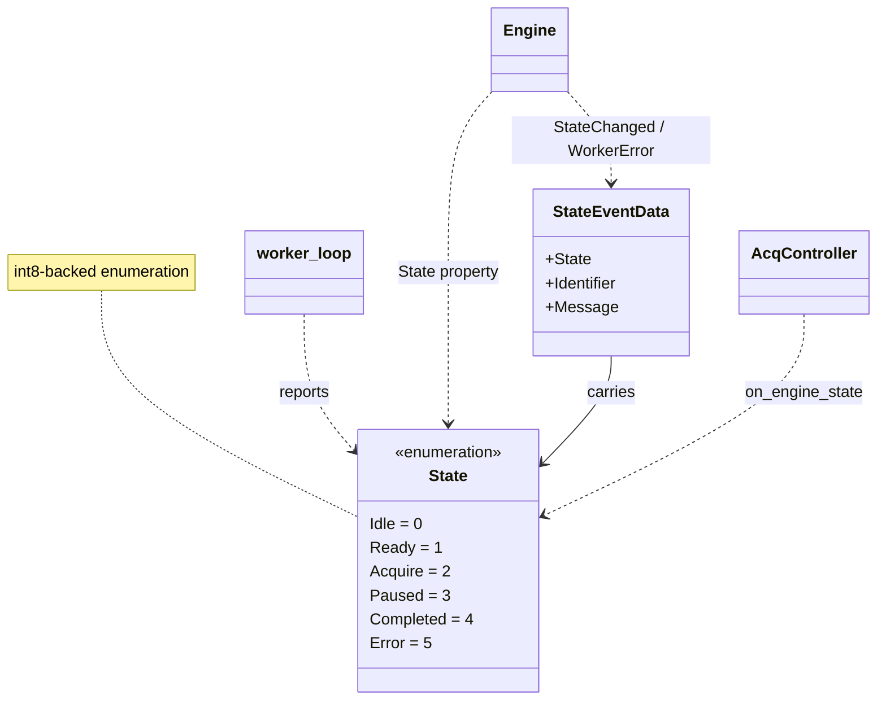
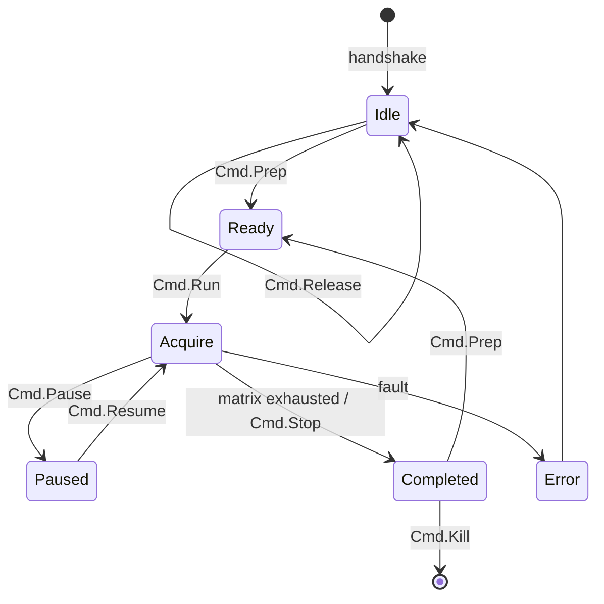

# `mabr.acq.State` Class Reference

Member-by-member reference for the worker → client state enumeration:
[+mabr/+acq/State.m](https://github.com/dstolz/MABR/blob/refactor/%2Bmabr/%2Bacq/State.m).

For the protocol in prose, read [[Acquisition Engine]].

## Table of contents

- [Class diagram](#class-diagram)
- [Inheritance](#inheritance)
- [Enumeration members](#enumeration-members)
- [State machine](#state-machine)
- [Not the same thing as `ProgState`](#not-the-same-thing-as-progstate)
- [Usage](#usage)
- [See also](#see-also)

## Class diagram



## Inheritance

```matlab
classdef State < int8
```

Same reason as [[mabr.acq.Cmd|mabr.acq.Cmd-Class-Reference]]: an `int8` member travels
cleanly in a plain message struct over a `parallel.pool.DataQueue`.

## Enumeration members

| Member | Value | Meaning |
|---|---|---|
| `Idle` | 0 | Worker alive, no block prepared |
| `Ready` | 1 | A block is prepared and armed, waiting for `Run` |
| `Acquire` | 2 | Actively streaming/recording the current block |
| `Paused` | 3 | Streaming suspended in place — the device stays open |
| `Completed` | 4 | Current block finished (end of stimulus, or `Stop`) |
| `Error` | 5 | Worker hit an error; details follow on the error channel |

## State machine



State **propagates as events, not polled shared memory** — replacing the legacy
`abr.stateAcq` values that lived in the `mabr_com.dat` memmap. The Engine turns each
report into a `StateChanged` notification carrying a
[[mabr.acq.StateEventData|mabr.acq.StateEventData-Class-Reference]].

> 🔑 **The `'streamed'` report arrives before `Completed`.** By the time a
> `BlockCompleted` listener runs, `Engine.LastStream` already says how many play-matrix
> samples actually went out and why the block ended.

## Not the same thing as `ProgState`

Two state machines exist and they answer different questions:

| | [[mabr.acq.State|mabr.acq.State-Class-Reference]] | [[mabr.ui.ProgState|mabr.ui.ProgState-Class-Reference]] |
|---|---|---|
| Whose | the **worker's** | the **controller's** |
| Scope | one block | the whole schedule |
| Knows about | the audio device and the play matrix | runs, finalization, advancing, completion |
| Set by | `worker_loop` | `AcqController.set_state` |

`AcqController.on_engine_state` is the one place the first is translated into the second.
A worker `Completed` becomes a controller `BlockComplete`, then `AdvanceBlock`, then
either `PrepBlock` for the next run or `SchedComplete`.

## Usage

```matlab
lh = event.listener(eng,'StateChanged', @(~,e) fprintf('%s\n', string(e.State)));

if eng.State == mabr.acq.State.Acquire
    eng.stop();
end

disp(enumeration('mabr.acq.State'))
```

## See also

- [[Class-Reference]] — every other class, indexed by package
- [[mabr.acq.Cmd|mabr.acq.Cmd-Class-Reference]] — the command half of the protocol
- [[mabr.acq.StateEventData|mabr.acq.StateEventData-Class-Reference]] — the event payload
- [[mabr.ui.ProgState|mabr.ui.ProgState-Class-Reference]] — the other state machine
- [[Acquisition Engine]] — the subsystem in prose
