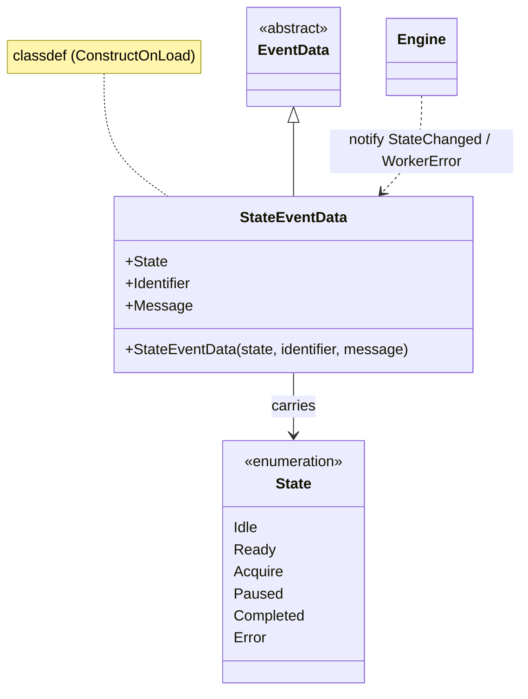

# `mabr.acq.StateEventData` Class Reference

Member-by-member reference for the payload every `mabr.acq.Engine` event carries:
[+mabr/+acq/StateEventData.m](https://github.com/dstolz/MABR/blob/refactor/%2Bmabr/%2Bacq/StateEventData.m).

## Table of contents

- [Class diagram](#class-diagram)
- [Inheritance](#inheritance)
- [Properties](#properties)
- [Which event fills which field](#which-event-fills-which-field)
- [Usage](#usage)
- [See also](#see-also)

## Class diagram



## Inheritance

```matlab
classdef (ConstructOnLoad) StateEventData < event.EventData
```

`ConstructOnLoad` is what MATLAB requires of an `event.EventData` subclass so that a
listener can be attached to an object that is later loaded from a MAT-file. Nothing in
MABR saves an Engine, but the attribute is the documented contract for the class and
costs nothing.

## Properties

| Property | Type | Default | Role |
|---|---|---|---|
| `State` | `mabr.acq.State` | `Idle` | The new acquisition state |
| `Identifier` | `(1,:) char` | `''` | MException identifier, for errors |
| `Message` | `(1,:) char` | `''` | Human-readable detail, for errors |

The constructor takes them in that order; the last two are optional.

## Which event fills which field

| Engine event | `State` | `Identifier` / `Message` |
|---|---|---|
| `StateChanged` | the new state | empty |
| `WorkerError` | `State.Error` | the worker's identifier and message |
| `BlockCompleted` | — | notified with no payload of this type |

So a single listener can serve both channels: check `Identifier` for emptiness rather
than subscribing twice.

## Usage

```matlab
lh = [ ...
    event.listener(eng,'StateChanged', @(~,e) onState(e)); ...
    event.listener(eng,'WorkerError',  @(~,e) onError(e))];

function onState(e)
    fprintf('worker -> %s\n', string(e.State));
end

function onError(e)
    warning(e.Identifier, '%s', e.Message);
end
```

Constructing one directly is only ever needed if you are driving the pattern yourself:

```matlab
d = mabr.acq.StateEventData(mabr.acq.State.Error, ...
        'mabr:acq:worker:deviceOpen', 'ASIO device is already in use');
```

## See also

- [[Class-Reference]] — every other class, indexed by package
- [[mabr.acq.State|mabr.acq.State-Class-Reference]] — the enumeration it carries
- [[mabr.acq.Engine|mabr.acq.Engine-Class-Reference]] — the only notifier
- [[mabr.ui.ProgStateEventData|mabr.ui.ProgStateEventData-Class-Reference]] — the same pattern one layer up
