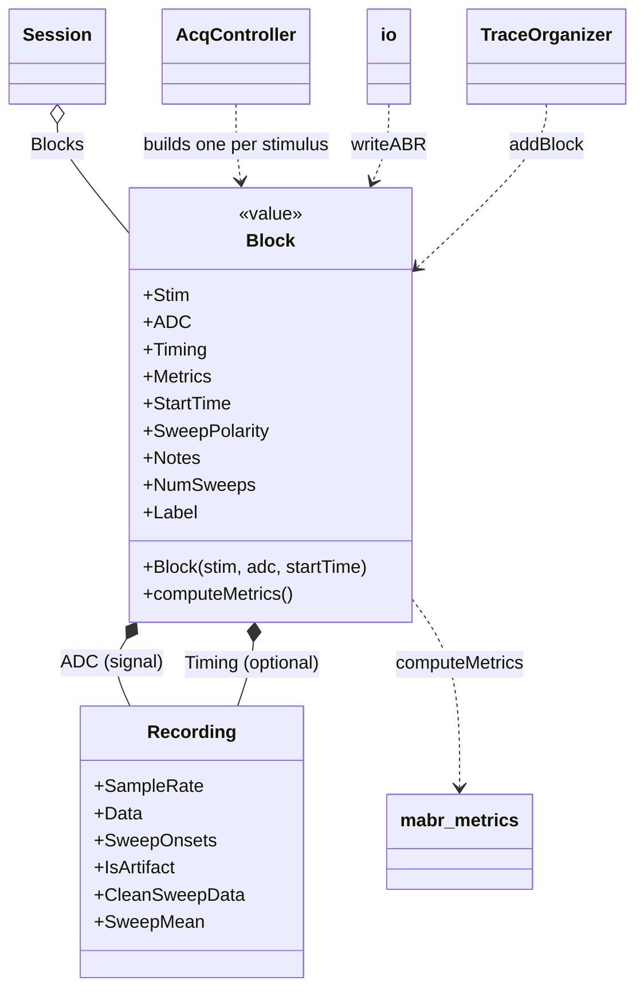
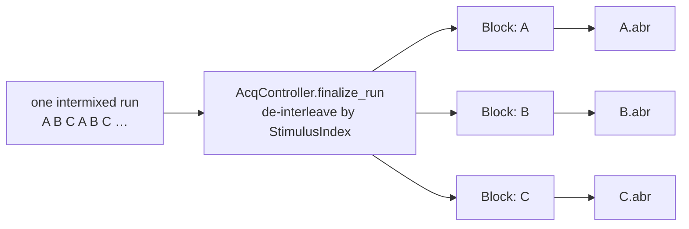

# `mabr.data.Block` Class Reference

Member-by-member reference for one stimulus condition's acquired result:
[+mabr/+data/Block.m](https://github.com/dstolz/MABR/blob/refactor/%2Bmabr/%2Bdata/Block.m).

For what a Block becomes on disk, read [[Data Format]].

## Table of contents

- [Class diagram](#class-diagram)
- [One run is not one block](#one-run-is-not-one-block)
- [Properties](#properties)
- [Dependent properties](#dependent-properties)
- [Methods](#methods)
- [The `Stim` struct](#the-stim-struct)
- [Usage](#usage)
- [See also](#see-also)

## Class diagram



## One run is not one block

A **run** is one continuous acquisition. A **block** is one stimulus condition's result.
Under a blocked strategy those coincide; under an intermixed one they do not.



So the on-disk unit stays **one file per condition** however the run was ordered.
A homogeneous run saves the continuous trace; an intermixed one saves each stimulus's
sweep windows concatenated (`AcqController.compact_sweeps`) rather than *N* copies of a
shared trace.

## Properties

| Property | Type / default | Meaning |
|---|---|---|
| `Stim` | `struct` | External stimulus metadata — see [below](#the-stim-struct) |
| `ADC` | `mabr.data.Recording` | The recorded signal channel |
| `Timing` | `mabr.data.Recording` | The recorded timing channel (optional) |
| `Metrics` | `struct` | Computed metrics, filled by `computeMetrics` |
| `StartTime` | `(1,:) char` | ISO-ish timestamp of the run this came from |
| `Notes` | `struct` | The session's rig notebook **as it stood when this block was finalized** |
| `SweepPolarity` | `(1,:) double` | +1 / −1 per sweep, aligned element-for-element with `ADC.SweepOnsets` |

`SweepPolarity` is all `+1` unless the entry set `alternatePolarity`. It is written to
the `.abr` as `ADC.SweepPolarity` so offline analysis can separate the two polarities —
which is the whole point of alternating them.

## Dependent properties

| Property | Meaning |
|---|---|
| `NumSweeps` | `ADC.NumSweeps` |
| `Label` | Display label, from `Stim.Meta` |

## Methods

| Method | What it does |
|---|---|
| `Block(stim,adc,startTime)` | Construct from stimulus metadata, the recording, and a timestamp |
| `computeMetrics()` | Compute the standard metrics over the ADC sweeps. Value class — reassign |

`computeMetrics` uses the tested `mabr.metrics` functions as the single source of truth,
and computes over `CleanSweepData` — **artifact sweeps are excluded**. They stay in the
Recording and in the saved file, but a metric meant to describe the response should not
be dominated by sweeps already judged not to hold one. Doing the mapping in one place is
why this and `Recording`'s own `SweepMean`/`SNR` cannot disagree about which sweeps
count.

## The `Stim` struct

`Stim` is `struct('Meta',…,'SampleRate',…)`, where `Meta` comes from
`mabr.stim.StimulusSet.meta(i)`:

| Inside `Meta` | Role |
|---|---|
| the stimulus `ID` | names the condition |
| every passthrough field the external package supplied | carried through untouched |
| `informativeParams` | which of those identify the condition — becomes a **grouping dimension** offline |
| `Label` | drives display and the filename |

Nothing here is interpreted by MABR beyond those three names, which is what lets a
stimulus package add parameters without MABR changing. See
[[Stimulus Package Contract]].

## Usage

```matlab
blk = mabr.data.Block(stimuli.meta(3), rec, datestr(now,'yyyy-mm-ddTHH:MM:SS'));
blk.SweepPolarity = pol;
blk = blk.computeMetrics();          % value class — reassign

fprintf('%s: %d sweeps (%d rejected)\n', ...
    blk.Label, blk.NumSweeps, blk.ADC.NumArtifacts);

plot(blk.ADC.TimeVector*1e3, blk.ADC.SweepMean*1e6);

ffn = mabr.data.io.writeABR(blk, outputPath);
```

Blocks arrive at a viewer through `AcqController`'s `BlockReady` event:

```matlab
lh = event.listener(controller,'BlockReady', @(~,e) org.addBlock(e.Info.block));
```

## See also

- [[Class-Reference]] — every other class, indexed by package
- [[mabr.data.Recording|mabr.data.Recording-Class-Reference]] — what `ADC` and `Timing` are
- [[mabr.data.SessionNotes|mabr.data.SessionNotes-Class-Reference]] — the notebook `Notes` is a snapshot of
- [[mabr.data.Session|mabr.data.Session-Class-Reference]] — what collects them
- [[mabr.data.io|mabr.data.io-Class-Reference]] — how one becomes a `.abr`
- [[mabr.ui.AcqController|mabr.ui.AcqController-Class-Reference]] — `finalize_run`, which builds them
- [[Data Format]], [[Presentation Strategies]]
