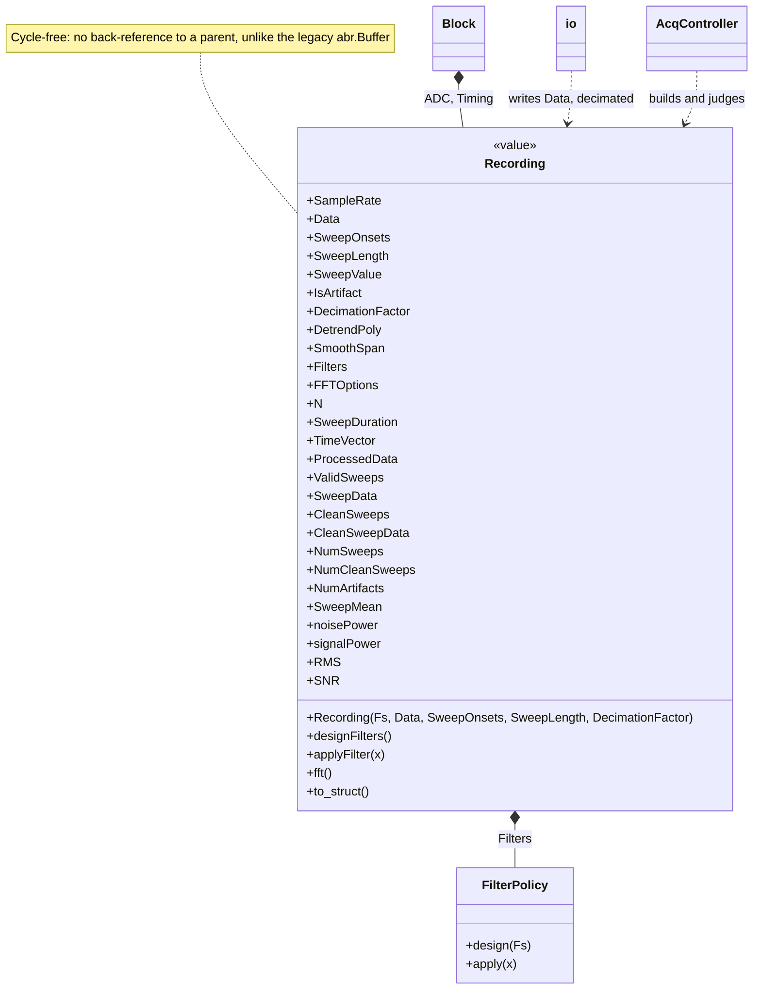
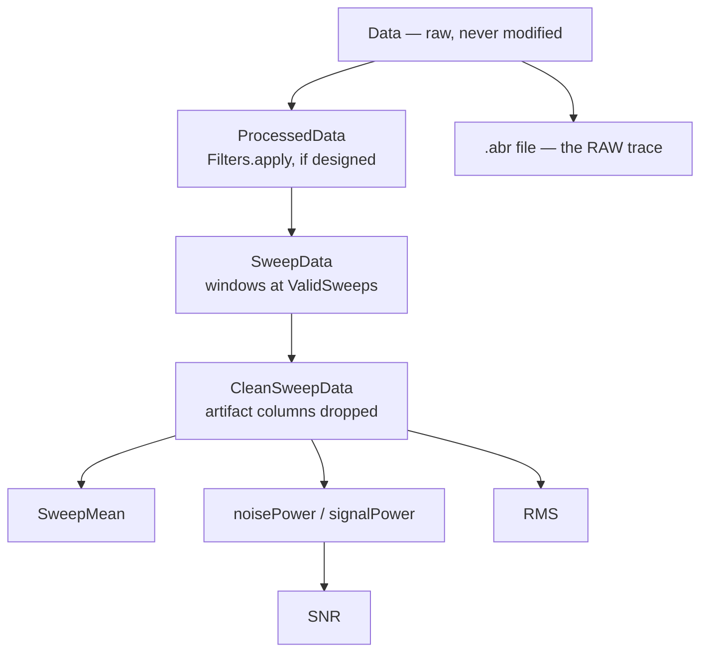
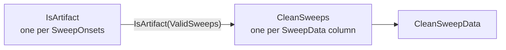

# `mabr.data.Recording` Class Reference

Member-by-member reference for one acquired channel and everything derived from it:
[+mabr/+data/Recording.m](https://github.com/dstolz/MABR/blob/refactor/%2Bmabr/%2Bdata/Recording.m).

For what reaches disk, read [[Data Format]].

## Table of contents

- [Class diagram](#class-diagram)
- [Three rules that explain the whole class](#three-rules-that-explain-the-whole-class)
- [Properties](#properties)
- [Dependent properties](#dependent-properties)
- [Methods](#methods)
- [The artifact index problem](#the-artifact-index-problem)
- [Usage](#usage)
- [See also](#see-also)

## Class diagram



The derivation chain — everything descriptive hangs off `CleanSweepData`:



## Three rules that explain the whole class

1. **It is cycle-free.** Unlike the `abr.Buffer` it replaces, it holds **no**
   back-reference to a parent object — the old `ABRobj` handle cycle that `to_struct`
   had to strip. The decimation factor is passed explicitly instead.

2. **Filtering is explicit and opt-in.** `Data` is never filtered in place, and
   `mabr.data.io` saves `Data`, so **a `.abr` file always carries the raw trace**.
   Before `designFilters()` is called, `ProcessedData` returns raw `Data`. This resolves
   the legacy ambiguity where a bandpass/notch was designed in the live path but never
   applied.

3. **Artifacts are marked, never removed.** Flagged samples stay in `Data` and reach the
   file untouched; what changes is that everything *descriptive* is computed from
   `CleanSweepData`. Use `SweepData` when you want every sweep regardless of verdict.

## Properties

| Property | Type / default | Meaning |
|---|---|---|
| `SampleRate` | `double`, `1` Hz | The rate `Data` is stored at |
| `Data` | `(:,1) single` | The samples. **Never filtered in place** |
| `SweepOnsets` | `(:,1) double` | Indices into `Data`, non-negative integers |
| `SweepLength` | `double`, `1` | Sweep window, in samples |
| `SweepValue` | — | Free-form per-sweep value (unused by the core path) |
| `IsArtifact` | `(:,1) logical` | Aligned with **`SweepOnsets`** — see [below](#the-artifact-index-problem) |
| `DecimationFactor` | `double`, `1` | DAC/ADC ratio, so `io` can decimate at save time |
| `DetrendPoly` | `double`, `-1` | Polynomial order applied to `SweepMean`; `-1` = off |
| `SmoothSpan` | `double`, `0` | Smoothing span applied to `SweepMean`; `0` = off |
| `Filters` | `mabr.FilterPolicy` | The display chain — the **same object** the GUI edits and the live view applies |
| `FFTOptions` | `struct` | `windowFcn` (`@flattop`), `inDecibels` (`true`) |

**Rate/decimation convention:** `Data` is stored at its acquisition `SampleRate`;
`DecimationFactor` records the ratio so `mabr.data.io` can `resample(Data,1,df)` and
`round(SweepOnsets/df)` at save time — exactly what the legacy `save_abr_data` did.

## Dependent properties

| Property | Meaning |
|---|---|
| `N` | `numel(Data)` |
| `SweepDuration` | `SweepLength / SampleRate` (s) |
| `TimeVector` | `(0:SweepLength-1)'/SampleRate` — starts **at the onset**, which is why `TraceInspector`'s search windows are "ms re stimulus onset" with no offset |
| `ProcessedData` | `Data` with the designed chain applied |
| `ValidSweeps` | Logical per `SweepOnsets`: does the whole window lie inside `Data`? |
| `SweepData` | `[SweepLength × nValid]` — every sweep whose window fits |
| `CleanSweeps` | Logical per **`SweepData` column**: not flagged artifact |
| `CleanSweepData` | `SweepData` with the flagged columns removed |
| `NumSweeps` / `NumCleanSweeps` / `NumArtifacts` | Counts |
| `SweepMean` | Mean of `CleanSweepData`, then `DetrendPoly` / `SmoothSpan` |
| `noisePower` | ± averaging over the clean sweeps only |
| `signalPower` | — |
| `RMS` | Mean per-sweep RMS, clean sweeps |
| `SNR` | dB, from `noisePower` / `signalPower` |

> ⚠️ **With every sweep flagged, `SweepMean` is all-NaN.** There is no mean to report,
> and an all-NaN result says so rather than returning a misleading zero. Viewers skip it.

## Methods

| Method | What it does |
|---|---|
| `Recording(Fs,Data,SweepOnsets,SweepLength,DecimationFactor)` | Construct. All arguments optional |
| `designFilters()` | Design the enabled sections **at this Recording's own `SampleRate`**. Value class — reassign |
| `applyFilter(x)` | Apply the designed chain zero-phase to a vector |
| `fft()` | `[M,f]` magnitude spectrum, per `FFTOptions` |
| `to_struct()` | Plain-struct snapshot |

### Why `designFilters` builds IIR, not FIR

An FIR of any practical order **cannot** realize a 10 Hz corner at a 12 kHz sample rate.
The previous order-10 `bandpassfir`/`bandstopfir` pair measured **0.0 dB at both DC and
60 Hz** — it removed neither baseline drift nor line noise. Butterworth IIR designs do
the job, and because `FilterPolicy.apply` runs them through `filtfilt`, the response is
zero-phase: the phase distortion that normally motivates FIR here does not apply.

## The artifact index problem

`IsArtifact` is indexed by **`SweepOnsets`**. `SweepData` is indexed by the **subset whose
window fits inside `Data`**. Those are not the same list: a run cut short leaves the last
onset's window running off the end, and that sweep is absent from `SweepData`.

So anything per-sweep must map through `ValidSweeps`:



`CleanSweeps` does exactly that mapping, once, so `SweepMean`, `SNR`, and
`Block.computeMetrics` cannot disagree about which sweeps count.

> 🔑 **`ADC.IsArtifact` is written to the `.abr` file** alongside `ADC.SweepPolarity`, so
> offline analysis can override the call — or ignore it and use
> `abr_analysis/rejectArtifacts`, which rejects by `isoutlier` across a whole session
> instead. A fixed threshold is what the *live* path needs, because it has to be decidable
> for one sweep as it arrives.

## Usage

```matlab
rec = mabr.data.Recording(12000, data, onsets, 120, 16);

rec.Filters = mabr.FilterPolicy;      % 10–3000 Hz + 60 Hz notch
rec = rec.designFilters();            % value class — reassign

fprintf('%d sweeps, %d rejected, SNR %.1f dB\n', ...
    rec.NumSweeps, rec.NumArtifacts, rec.SNR);

plot(rec.TimeVector*1e3, rec.SweepMean*1e6);
xlabel('ms re onset'); ylabel('\muV')
```

Every sweep, verdict included:

```matlab
all   = rec.SweepData;                    % [SweepLength x nValid]
kept  = rec.CleanSweepData;               % artifact columns dropped
flags = rec.IsArtifact(rec.ValidSweeps);  % aligned with `all`
```

## See also

- [[Class-Reference]] — every other class, indexed by package
- [[mabr.data.Block|mabr.data.Block-Class-Reference]] — what holds one of these
- [[mabr.data.io|mabr.data.io-Class-Reference]] — the save-time decimation and the `.abr` fields
- [[mabr.FilterPolicy|mabr.FilterPolicy-Class-Reference]] — the chain in `Filters`
- [[mabr.ArtifactPolicy|mabr.ArtifactPolicy-Class-Reference]] — what sets `IsArtifact`
- [[Data Format]], [[Offline Analysis]]
