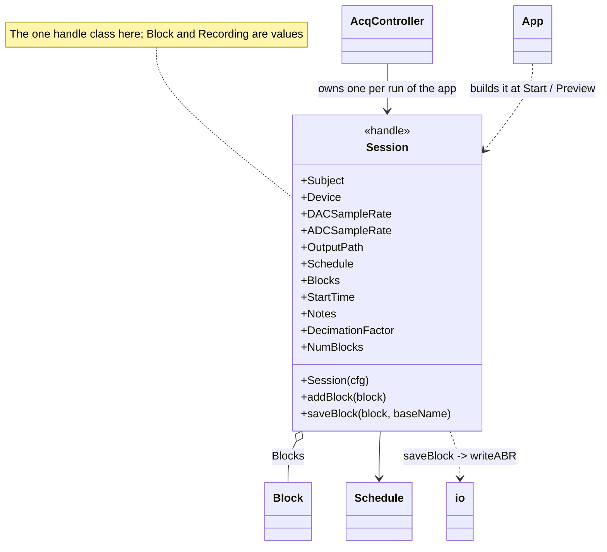
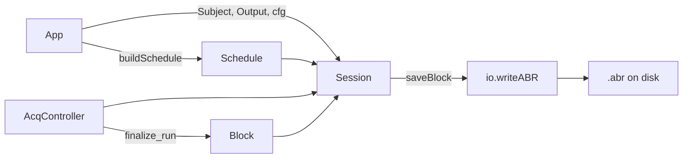

# `mabr.data.Session` Class Reference

Member-by-member reference for the top-level acquisition session:
[+mabr/+data/Session.m](https://github.com/dstolz/MABR/blob/refactor/%2Bmabr/%2Bdata/Session.m).

## Table of contents

- [Class diagram](#class-diagram)
- [The empty-`OutputPath` convention](#the-empty-outputpath-convention)
- [Properties](#properties)
- [Dependent properties](#dependent-properties)
- [Methods](#methods)
- [Usage](#usage)
- [See also](#see-also)

## Class diagram



Where it sits:



## The empty-`OutputPath` convention

`saveBlock` returns `''` and writes nothing when `OutputPath` is empty. That is not a
degenerate case — it is a **feature the GUI is built on**:

- **Preview** is the same code path as Start. `mabr.ui.App.onStart(true)` hands the
  controller a Session with an empty `OutputPath`, so blocks are still acquired,
  finalized, counted for artifacts, and pushed to the viewers through `BlockReady` — and
  nothing reaches disk.
- The output folder does not join the remembered history, and the Run panel carries a
  `PREVIEW (nothing is saved)` banner for as long as one is in flight.

`mabr.data.io.writeStimLog` follows the same rule for stimulation-only runs.

## Properties

| Property | Type / default | Meaning |
|---|---|---|
| `Subject` | `struct('ID','')` | Subject metadata. `ID` drives the filename stem |
| `Device` | `(1,:) char` | ASIO device name, recorded for provenance |
| `DACSampleRate` | `double`, `192000` | From `mabr.Config` |
| `ADCSampleRate` | `double`, `12000` | From `mabr.Config` |
| `OutputPath` | `(1,:) char` | Folder for `.abr` / `.stimlog` files. **Empty = record without saving** |
| `Schedule` | `mabr.stim.Schedule` | The plan driving acquisition |
| `Blocks` | `(1,:) mabr.data.Block` | Completed results, in the order they finished |
| `StartTime` | `(1,:) char` | When the session began |
| `Notes` | `mabr.data.SessionNotes` | The rig notebook — a **handle**, shared with whoever is displaying it |

## Dependent properties

| Property | Value |
|---|---|
| `DecimationFactor` | `DACSampleRate / ADCSampleRate` |
| `NumBlocks` | `numel(Blocks)` |

## Methods

| Method | What it does |
|---|---|
| `Session(cfg)` | Construct from a `mabr.Config`, adopting its rates |
| `addBlock(block)` | Append a completed `mabr.data.Block` |
| `saveBlock(block,baseName)` | Write one block to an offline-compatible `.abr` and return the full path — or `''` when `OutputPath` is empty |

It is a **handle** class, deliberately: it is the one long-lived object a run mutates, and
the controller, the app, and the viewers all need to see the same one. `Block` and
`Recording` are values for the opposite reason — a finalized result should not change
under anyone.

This replaces the session-level role `abr.ABR` played, minus the tangled
Buffer/back-reference model that went with it.

## Usage

```matlab
cfg = mabr.Config;

s = mabr.data.Session(cfg);
s.Subject.ID = 'M42';
s.Device     = 'ASIO Fireface';
s.OutputPath = 'D:\data\M42';
s.Schedule   = sch;
s.StartTime  = datestr(now,'yyyy-mm-ddTHH:MM:SS');

s.addBlock(blk);
ffn = s.saveBlock(blk);          % '' if OutputPath is empty

fprintf('%d blocks so far\n', s.NumBlocks);
```

Record without saving — what Preview does:

```matlab
s.Notes      = notesStore;       % a shared mabr.data.SessionNotes handle
s.OutputPath = '';               % blocks still built, nothing written
```

## The notebook is a handle, deliberately without a default

`Notes` holds a [[mabr.data.SessionNotes|mabr.data.SessionNotes-Class-Reference]] — the
**same** store whoever is displaying it holds, so the notes the operator has already taken
follow the session rather than starting over. `mabr.ui.App` hands its own store in here at
Start.

> ⚠️ **It is deliberately given no property default.** A handle default is evaluated once at
> class load, and would then be the *same* store in every `Session` ever constructed.

Every file the session writes carries the whole log as of the moment it was written — see
[[mabr.data.io|mabr.data.io-Class-Reference]].

## See also

- [[Class-Reference]] — every other class, indexed by package
- [[mabr.data.Block|mabr.data.Block-Class-Reference]] — what fills `Blocks`
- [[mabr.data.SessionNotes|mabr.data.SessionNotes-Class-Reference]] — the rig notebook in `Notes`
- [[mabr.data.io|mabr.data.io-Class-Reference]] — what `saveBlock` calls
- [[mabr.stim.Schedule|mabr.stim.Schedule-Class-Reference]] — the plan it carries
- [[mabr.ui.AcqController|mabr.ui.AcqController-Class-Reference]] — the owner
- [[Running a Session]], [[Data Format]]
