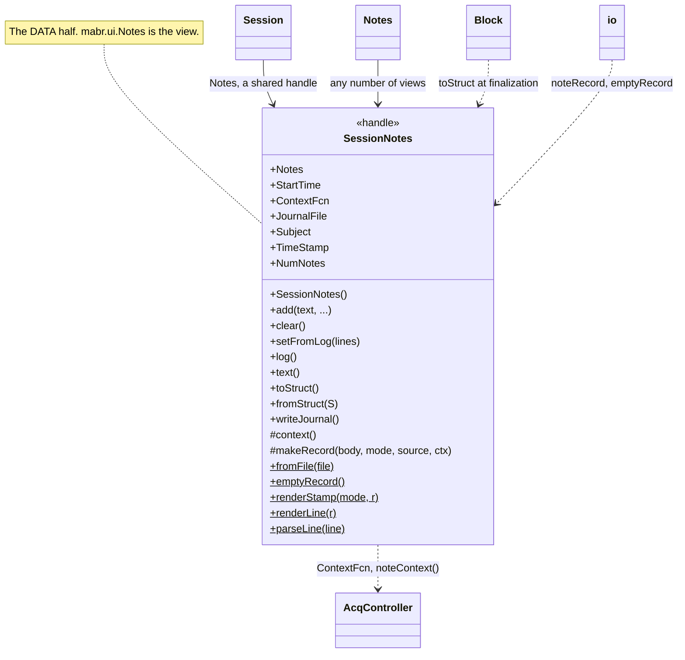
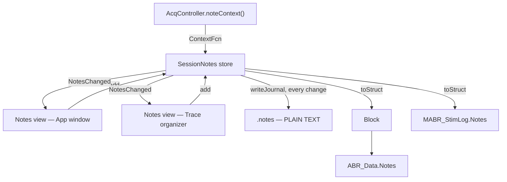

# `mabr.data.SessionNotes` Class Reference

Member-by-member reference for the rig notebook:
[+mabr/+data/SessionNotes.m](https://github.com/dstolz/MABR/blob/refactor/%2Bmabr/%2Bdata/SessionNotes.m).

The view over it is [[mabr.ui.Notes|mabr.ui.Notes-Class-Reference]].

## Table of contents

- [Class diagram](#class-diagram)
- [What a note is stamped with](#what-a-note-is-stamped-with)
- [Properties](#properties)
- [Events](#events)
- [Methods](#methods)
- [Static methods](#static-methods)
- [Saved with the data, always in full](#saved-with-the-data-always-in-full)
- [The journal](#the-journal)
- [Usage](#usage)
- [See also](#see-also)

## Class diagram

`$` marks a static member, `#` a private one.



One store, many views, and everything it reaches:



## What a note is stamped with

This is the point of the class.

A wall clock alone does not say *where in an experiment* something happened — the operator
would have to reconstruct that from file timestamps afterwards. So a note committed while a
schedule is running carries the **run and the sweep count** as well:

```
[R02 S0128 09:17:05] ear plug slipped
[09:03:11] impedance 3.2k on both electrodes
```

The second form is a note taken while nothing is acquiring, which is **the honest thing to
show**: there is no run to name, and inventing one would be worse than saying the time.

The acquisition context comes from `ContextFcn`, a niladic function the owner sets
(`mabr.ui.App` points it at `mabr.ui.AcqController.noteContext`). With none set, every note
is a clock note. **Sweep is the count within the current run** — what the Run panel's
readout shows, and what "it happened partway through this average" means.

## Properties

### `SetAccess = private`

| Property | Meaning |
|---|---|
| `Notes` | One element per note, in commit order. Fields: `Stamp`, `Text`, `Time`, `Elapsed`, `Run`, `NumRuns`, `Sweep`, `Source`, `Edited` |
| `StartTime` | When this store began — what an `'elapsed'` stamp is relative to |

> 💡 **`StartTime` is set at construction and never moved.** A note log spans a *session*,
> and a session starts when the operator sits down, not when the first schedule does.

### Public

| Property | Default | Meaning |
|---|---|---|
| `ContextFcn` | `[]` | Niladic function returning the acquisition context, or `[]` |
| `JournalFile` | `''` | Plain-text crash journal, rewritten whole on every change. `''` writes nothing |
| `Subject` | `''` | Named in the journal header, so a stray `.notes` file on a rig says whose session it was |
| `TimeStamp` | `'auto'` | Default stamp format: `'auto'` / `'clock'` / `'elapsed'` / `'none'` |

`ContextFcn` may return **any subset** of the fields `noteContext` supplies (`Run`,
`NumRuns`, `Sweep`, `Running`); anything missing is simply not stamped. It is wrapped in a
`try` at every call — **a notebook must not become un-writable because a controller was
deleted mid-note**. A stale `ContextFcn` costs a note its run number, not the note.

`JournalFile = ''` is also what a **preview** run wants: it deliberately writes no files at
all.

### Dependent

`NumNotes`.

## Events

| Event | Fires on |
|---|---|
| `NotesChanged` | Every add, clear, replacement, or edit |

Every open view redraws **from the store** rather than from its own copy, so views never
mutate each other and any number can be open at once.

## Methods

| Method | What it does |
|---|---|
| `add(text,...)` | Commit one note — or one per line of a multi-line entry — and return what was recorded |
| `clear()` | Discard the log |
| `setFromLog(lines)` | Replace the log with edited text, one note per line, **keeping the stamp each line already carries** |
| `log()` | The log as a cellstr, one rendered line per note |
| `text()` | The whole log as one char array with newlines |
| `toStruct()` | The log as a plain struct array, for saving into a data file |
| `fromStruct(S)` | Replace the log with one read back out of a file |
| `writeJournal()` | Rewrite the **entire** log to `JournalFile` |

```matlab
n.add('ear plug slipped')
n.add(txt, 'Source','TraceOrganizer', 'TimeStamp','clock')
```

**Blank lines are dropped rather than committed**: an empty note is a stray Enter, never
something the operator meant to record.

`toStruct` is always `1×N` (or `1×0`), so a caller can concatenate or iterate it without
testing its orientation first. `fromStruct` tolerates a record written by a version with
more or fewer fields — the same forgiving rule
[[mabr.ArtifactPolicy|mabr.ArtifactPolicy-Class-Reference]]`.fromStruct` follows.

### `setFromLog` — why the log is editable at all

A typo in a note taken one-handed at the bench is worth being able to fix, and the only
place a user can fix one is the log they can see. So:

| The line | What happens |
|---|---|
| Keeps its `[stamp] text` shape | Keeps the record behind it (time, run, sweep) intact, **not** marked edited |
| Text has changed | Keeps the stamp, flagged `Edited` |
| Typed fresh | Stamped now, like any other commit |

`matchNote` decides which old note an edited line came from: the one that was on this line
if it still fits, otherwise any note with the same stamp.

## Static methods

| Method | What it does |
|---|---|
| `fromFile(file)` | Read a plain-text `.notes` journal back into a store |
| `emptyRecord()` | A `0×0` struct carrying the note fields |
| `blankRecord()` | |
| `renderStamp(mode,r)` | What goes between the brackets |
| `renderLine(r)` / `parseLine(line)` | Inverses of each other |
| `hhmmss(secs)` | |

> 💡 **`emptyRecord` exists so an empty log still has a schema.** Code reading
> `Notes(k).Text` off an empty log gets an empty index rather than *"no such field"*.

`fromFile` recovers the **stamps as text**; the structured fields behind them (run, sweep,
elapsed) do not survive, since the journal is a *log* rather than a record. For those, read
`Notes` out of the `.abr` the session wrote.

`clockOf` renders `HH:mm:ss` out of an ISO stamp **without re-reading the clock**: the
rendered time must be the time the note was taken, not the time it was rendered.

## Saved with the data, always in full

Every file a session writes carries the **whole log** as of the moment it was written:

| File | Field |
|---|---|
| `.abr` | `ABR_Data.Notes` (via `mabr.data.Block.Notes`) |
| `.stimlog` | `MABR_StimLog.Notes` |
| `.torg` | `View.Notes` (`mabr.ui.TraceOrganizer`) |

> 🔑 **Whole, not "since the last file".** No file then depends on another to be read, and
> a session recovered from a single surviving `.abr` still has its notebook.

`mabr.data.io.noteRecord` normalizes it on the way out — accepting either the handle store
or the struct array it produces — and **never throws**: a notebook that cannot be
serialized must not cost the file the data in it. It is always written, as a `1×0` struct
with the right fields when nothing was noted, so offline code can read `ABR_Data.Notes`
unconditionally the same way it reads `ADC.IsArtifact`.

It sits at the **top level rather than under `SIG`**: a note describes the session, not the
stimulus, and anything under `SIG` risks being read as a parameter.

For a **stimulation-only** session the `.stimlog` is the *only* place notes are saved,
which makes it the more important of the two, not the lesser.

## The journal

Set `JournalFile` and every commit rewrites the entire log to it as **plain text** —
deliberately *not* a MAT-file like the rest of MABR's outputs, because the whole reason the
journal exists is to survive a crash, and a format that needs MATLAB to read is the wrong
one for that.

Two design consequences:

- **Whole-file rewrite, not append.** The log is editable; an appended journal would keep
  the typo the operator just fixed.
- **Fail-soft.** A full disk or a folder that has gone away must not stop the operator
  writing notes, so `writeJournal` reports and returns `false` rather than throwing into a
  keystroke callback.

## Usage

```matlab
notes = mabr.data.SessionNotes();
notes.Subject     = 'M42';
notes.JournalFile = 'D:\data\M42\M42.notes';
notes.ContextFcn  = @() controller.noteContext();

notes.add('impedance 3.2k on both electrodes');
% ... a schedule starts ...
notes.add('ear plug slipped');          % stamped [R02 S0128 09:17:05]

disp(notes.text())
S = notes.toStruct();                   % what a .abr carries
```

Read one back:

```matlab
n = mabr.data.SessionNotes.fromFile('D:\data\M42\M42.notes');

D = load('...abr','-mat');
struct2table(D.ABR_Data.Notes)          % the structured record
```

## See also

- [[Class-Reference]] — every other class, indexed by package
- [[mabr.ui.Notes|mabr.ui.Notes-Class-Reference]] — the view over this store
- [[mabr.data.Session|mabr.data.Session-Class-Reference]] — who owns one
- [[mabr.data.Block|mabr.data.Block-Class-Reference]] — the snapshot taken at finalization
- [[mabr.data.io|mabr.data.io-Class-Reference]] — `noteRecord`, and where it is written
- [[Data Format]]
