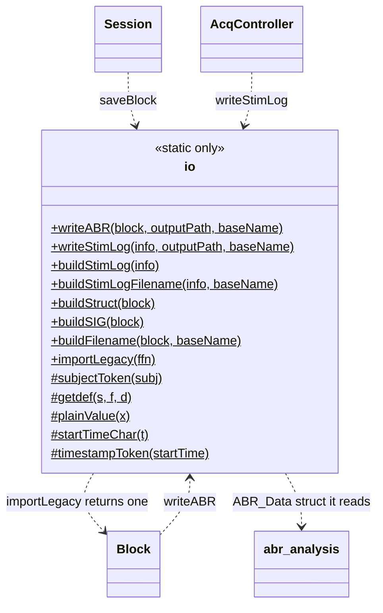
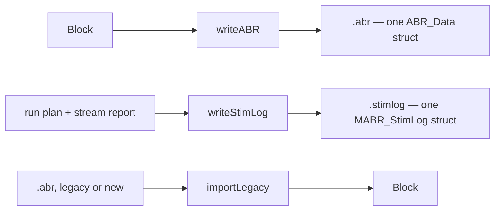

# `mabr.data.io` Class Reference

Member-by-member reference for every file MABR writes and reads:
[+mabr/+data/io.m](https://github.com/dstolz/MABR/blob/refactor/%2Bmabr/%2Bdata/io.m).

For the file contents in prose, read [[Data Format]]; for what consumes them,
[[Offline Analysis]].

## Table of contents

- [Class diagram](#class-diagram)
- [A static-only class](#a-static-only-class)
- [Public static methods](#public-static-methods)
- [The `.abr` contract](#the-abr-contract)
- [Filenames](#filenames)
- [The `.stimlog`](#the-stimlog)
- [Private static helpers](#private-static-helpers)
- [Usage](#usage)
- [See also](#see-also)

## Class diagram

`$` marks a static member, `#` a private one.



What each entry point produces:



## A static-only class

`mabr.data.io` is never instantiated. It is a namespace with a `classdef` around it, so
every entry point is `mabr.data.io.something(...)`. There is no state to carry: each call
takes what it needs and returns a path or a struct.

All output files are **MATLAB v5 MAT-files with a distinctive extension**, and all are
loaded the same way:

```matlab
S = load(file,'-mat');
```

| Extension | Holds | Written by |
|---|---|---|
| `.abr` | one `ABR_Data` struct | `writeABR` |
| `.stimlog` | one `MABR_StimLog` struct (`Notes` included) | `writeStimLog` |
| `.torg` | a trace-organizer view | `mabr.ui.TraceOrganizer.saveView` |
| `.mabrcfg` | one `MABRConfig` struct | `mabr.ui.App` File ▸ Save Configuration… |

## Public static methods

| Method | Returns | What it does |
|---|---|---|
| `writeABR(block,outputPath,baseName)` | full path, or `''` | Write one `Block` to an offline-compatible `.abr` |
| `writeStimLog(info,outputPath,baseName)` | full path, or `''` | Write one run's stimulation sequence to a `.stimlog` |
| `buildStimLog(info)` | `MABR_StimLog` struct | Assemble the log from a run's plan and what the worker reported |
| `buildStimLogFilename(info,baseName)` | filename | `<SUBJ_ID_n>_StimLog_Run<k>_<yyMMdd'T'HHmmss>.stimlog` |
| `buildStruct(block)` | `ABR_Data` struct | The offline-compatible struct |
| `buildSIG(block)` | `SIG` substruct | Flatten stimulus metadata into plain-numeric params |
| `buildFilename(block,baseName)` | filename | Matches the offline pipeline's default regex |
| `importLegacy(ffn)` | `Block` | Load a legacy **or new** `ABR_Data` file into the new model |

An empty `outputPath` means "record without saving" — both writers return `''`. That is
what [[mabr.data.Session|mabr.data.Session-Class-Reference]]'s Preview path relies on.

## The `.abr` contract

The **unchanged** `abr_analysis/` pipeline reads exactly these fields
(see `parseABRFiles.m` and `extractABRResponses.m`):

| Field | Meaning |
|---|---|
| `ABR_Data.ADC.SampleRate` | Hz, **post-decimation** |
| `ABR_Data.ADC.Data` | `single` vector |
| `ABR_Data.ADC.SweepOnsets` | indices into `ADC.Data` |
| `ABR_Data.StartTime` | datetime-parseable |
| `ABR_Data.SIG.informativeParams` | cellstr of parameter names |
| `ABR_Data.SIG.(param)` | numeric, one per informative param |
| `ABR_Data.SIG.Label` | cellstr; also drives the filename |

Three further fields are **always written**, and deliberately kept **out of**
`informativeParams` so they never become grouping dimensions:

| Field | Meaning |
|---|---|
| `ABR_Data.ADC.SweepPolarity` | +1 / −1, one per `SweepOnsets` entry |
| `ABR_Data.ADC.IsArtifact` | logical per sweep — which sweeps acquisition rejected |
| `ABR_Data.SIG.alternatePolarity` | 0/1, whether the condition alternated |

The rig notebook rides at the **top level**, not under `SIG` — a note describes the session,
not the stimulus, and anything under `SIG` risks being read as a parameter:

| Field | Meaning |
|---|---|
| `ABR_Data.Notes` | The whole log as of finalization, always written (a `1x0` struct with the right fields when nothing was noted) — see [[mabr.data.SessionNotes\|mabr.data.SessionNotes-Class-Reference]] |

`verify_data_roundtrip` in the [[suite|Verification and Testing]] confirms all of it.

### Save-time decimation

Preserved exactly as the legacy `save_abr_data` did it:

```
ADC.Data        = resample(Data, 1, df)
ADC.SweepOnsets = round(SweepOnsets / df)
ADC.SampleRate  = SampleRate / df
```

where `df` is `Recording.DecimationFactor`.

> 🔑 **`Data` is written raw.** `mabr.FilterPolicy` never touches
> `Recording.Data`, so no display filter setting can reach a `.abr` file. The offline
> pipeline filters the same raw samples with its own choices.

## Filenames

Built to match the pipeline's default regex when `Frequency`/`Level` are present:

```
SUBJ_ID_<id>_Frequency_<f>kHz_Level_<L>dB_<yyMMdd'T'HHmmss>.abr
```

Frequency is formatted in **kHz** with `.` → `_`; otherwise a label-based fallback is
used. This is why `mabr.stim.fromStimgen` renames stimgen's `SoundLevel` → `Level` and
converts `Frequency` Hz → kHz at import: the offline regex reads both by name **and
unit**.

Both filename builders share one `subjectToken`, so a session's files sort together
whatever it wrote.

## The `.stimlog`

The other output this class produces, and the **only** one a stimulation-only session
writes (`mabr.AudioSettings.StimulationOnly`). There is no recording to put in a `.abr`,
but what was played, in what order, with what polarity, and at what time is still the
experimental record — and on a rig where something else does the recording it is the only
thing that can align the two.

`Sequence` is **parallel arrays, one element per presentation in play order**, so it reads
as a log on the spot:

```matlab
S = load('...stimlog','-mat');
struct2table(S.MABR_StimLog.Sequence)
```

| Field | Meaning |
|---|---|
| `Order` | position in the run |
| `StimulusIndex`, `ID` | which stimulus |
| `Polarity` | +1 / −1 applied there |
| `OnsetSample` | index into the run's play matrix (**silence pad included**) |
| `OnsetTime` | that, in seconds from the first sample of the run |
| `Presented` | did it actually go out? |

`MABR_StimLog.Notes` carries the rig notebook on the same terms as a `.abr`'s. A
stimulation-only session writes no `.abr` at all, so this is the **only** place its notes
are saved — which makes it the more important of the two, not the lesser.

`OnsetTime` is also the moment the timing pulse for that presentation went out on the
timing output channel — so a system recording elsewhere aligns on the pulse and reads the
label here.

> ⚠️ **`Presented` is the honest part.** A run stopped early (Advance, Abort, or a Kill)
> emits only part of its matrix. The plan is written **whole and flagged** rather than
> truncated, so the file records both what was intended and what occurred. The count comes
> from `mabr.acq.Engine.LastStream`.

The filename carries the **run index** rather than a condition, because a stimulation-only
run is not split per stimulus — there is nothing recorded to split.

## Private static helpers

| Method | Role |
|---|---|
| `subjectToken(subj)` | The `SUBJ_ID_<n>` filename stem, shared by `.abr` and `.stimlog` |
| `noteRecord(notes)` | Normalize the notebook for writing — a `1xN` struct array, or a `1x0` one with the same fields. Accepts the handle store **or** the struct array it produces, and **never throws**: a notebook that cannot be serialized must not cost the file the data in it |
| `getdef(s,f,d)` | Field `f` of `s`, or the default — the same forgiving contract `worker_loop`'s `getdef` uses on a render spec |
| `plainValue(x)` | Extract a plain numeric/char value, unwrapping a legacy `sigProp` struct (value in a `.Value` field) |
| `startTimeChar(t)` / `timestampToken(startTime)` | Timestamp formatting |

## Usage

```matlab
ffn = mabr.data.io.writeABR(blk, 'D:\data\M42');

S   = load(ffn,'-mat');
disp(S.ABR_Data.SIG.informativeParams)
plot(S.ABR_Data.ADC.Data)

blk2 = mabr.data.io.importLegacy('old_session_file.abr');
```

Read a stimulation log:

```matlab
S = load(logfile,'-mat');
T = struct2table(S.MABR_StimLog.Sequence);
head(T(~T.Presented,:))          % what the early stop cost
```

## See also

- [[Class-Reference]] — every other class, indexed by package
- [[Data Format]] — every file MABR writes, in prose
- [[mabr.data.Block|mabr.data.Block-Class-Reference]] — the input to `writeABR`
- [[mabr.data.SessionNotes|mabr.data.SessionNotes-Class-Reference]] — what `noteRecord` normalizes
- [[mabr.data.Recording|mabr.data.Recording-Class-Reference]] — `DecimationFactor`, `IsArtifact`
- [[mabr.ui.AcqController|mabr.ui.AcqController-Class-Reference]] — `finalize_run` and `log_stim_run`
- [[Offline Analysis]] — the pipeline this contract exists for
