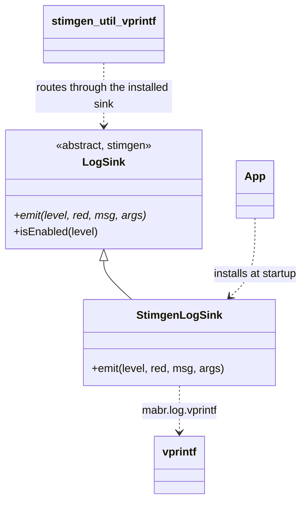
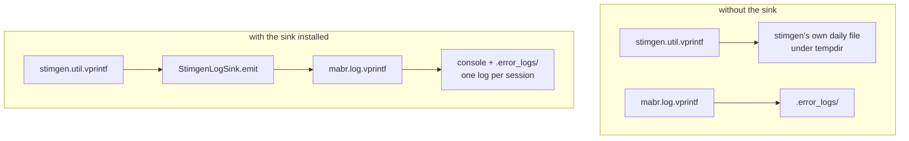

# `mabr.log.StimgenLogSink` Class Reference

Member-by-member reference for the one-line class that makes a MABR session write **one**
log:
[+mabr/+log/StimgenLogSink.m](https://github.com/dstolz/MABR/blob/refactor/%2Bmabr/%2Blog/StimgenLogSink.m).

## Table of contents

- [Class diagram](#class-diagram)
- [Inheritance](#inheritance)
- [What problem it solves](#what-problem-it-solves)
- [Methods](#methods)
- [The `emit` contract](#the-emit-contract)
- [Verbosity stays one setting](#verbosity-stays-one-setting)
- [Usage](#usage)
- [See also](#see-also)

## Class diagram



Before and after:



## Inheritance

```matlab
classdef StimgenLogSink < stimgen.LogSink
```

> ⚠️ **This class can only load where the optional submodule is on the path**, because its
> superclass is stimgen's. `mabr.ui.App` guards the installation on
> `mabr.stim.stimgenAvailable`.

## What problem it solves

stimgen ships its own logger — console plus a daily file under `tempdir` — which left a
MABR session writing **two log files describing one experiment**, in two places, at two
verbosities.

stimgen's `LogSink` seam exists for exactly this. `mabr.ui.App` installs one of these at
startup through `stimgen.util.logSink`, after which every `stimgen.util.vprintf` call
lands in `mabr.log.vprintf` — same console, same `.error_logs/` file — and stimgen writes
nothing of its own.

## Methods

| Method | What it does |
|---|---|
| `emit(~,level,red,msg,args)` | Forward one stimgen log message to `mabr.log.vprintf` |

That is the whole class.

## The `emit` contract

stimgen's side of the seam has two properties worth knowing, because both shape the
implementation:

**`msg` arrives raw.** It may be a `char`, a `string`, an `MException`, or a struct
carrying `.message`. `args` is a cell, and **`{}` means `msg` is literal text, not a
format string** — a message containing a stray `%` must not be passed through `sprintf`.

**`emit` must never throw.** stimgen logs from inside `catch` blocks, and an exception
raised while reporting an exception destroys the report — stimgen would fall back to its
own logger, defeating the sink entirely.

## Verbosity stays one setting

No work is needed here for it. Both packages gate on the same global `GVerbosity`, and
stimgen's default `LogSink.isEnabled` reads it — so a message suppressed for one logger is
suppressed for the other.

| Level | Meaning in `mabr.log.vprintf` |
|---|---|
| `-1` … `3` | The `GVerbosity` range |
| `vprintf(0,1,…)` | Critical, printed in red |

## Usage

Normally automatic — `mabr.ui.App`'s constructor does it:

```matlab
if mabr.stim.stimgenAvailable()
    stimgen.util.logSink(mabr.log.StimgenLogSink());
end
```

Afterwards, anything stimgen logs appears in MABR's console output and in
`.error_logs/`:

```matlab
global GVerbosity; GVerbosity = 2;
stimgen.util.vprintf(1,'building bank');   % -> mabr.log.vprintf
```

## See also

- [[Class-Reference]] — every other class, indexed by package
- `mabr.log.vprintf` — [source](https://github.com/dstolz/MABR/blob/refactor/%2Bmabr/%2Blog/vprintf.m)
- [[Using stimgen]] — the rest of the seam
- [[mabr.ui.App|mabr.ui.App-Class-Reference]] — where it is installed
- [stimgen wiki: Serialization and Conventions](https://github.com/dstolz/stimgen/wiki/Serialization-and-Conventions) — the `LogSink` contract
