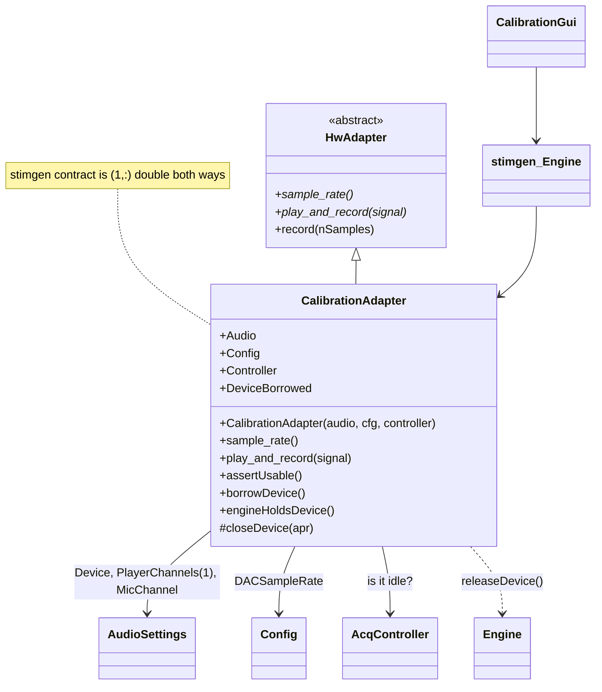
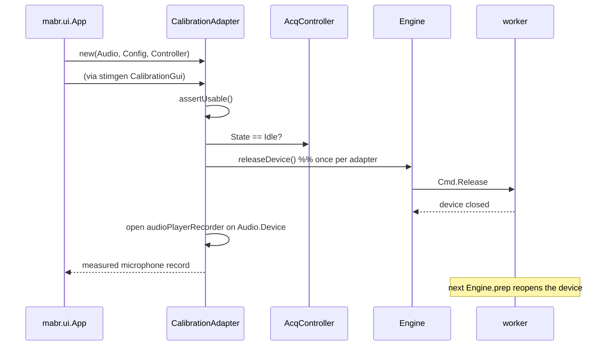

# `mabr.stim.CalibrationAdapter` Class Reference

Member-by-member reference for the seam that lets stimgen calibrate **this** rig:
[+mabr/+stim/CalibrationAdapter.m](https://github.com/dstolz/MABR/blob/refactor/%2Bmabr/%2Bstim/CalibrationAdapter.m).

For the calibration workflow, read [[Using stimgen]].

## Table of contents

- [Class diagram](#class-diagram)
- [Inheritance](#inheritance)
- [Why not stimgen's own adapter](#why-not-stimgens-own-adapter)
- [Properties](#properties)
- [Methods](#methods)
- [Two channels, two jobs](#two-channels-two-jobs)
- [Refuses rather than fights](#refuses-rather-than-fights)
- [Usage](#usage)
- [See also](#see-also)

## Class diagram

`*` marks an abstract member of the superclass, `#` a private one.



Where the device goes:



## Inheritance

```matlab
classdef CalibrationAdapter < stimgen.calibration.HwAdapter
```

stimgen's hardware contract is two methods — `sample_rate()` and
`play_and_record(signal)`. `record(nSamples)` is concrete on the superclass (a silent
`play_and_record`) and is what the reference measurement uses.

> ⚠️ **This class can only load where the optional submodule is on the path**, because its
> superclass is stimgen's. Callers guard on `mabr.stim.stimgenAvailable`, and
> `mabr.ui.App` greys **Settings ▸ Calibration…** with an explanatory tooltip otherwise.

MABR does **not** implement `stimgen.HardwareHost` — that is a TDT/RPvds buffer protocol,
and MABR owns playback through its own worker.

## Why not stimgen's own adapter

`stimgen.calibration.WindowsSoundCardAdapter` opens whatever Windows offers by default. A
calibration measured through a different device, at a different rate, on a different
output than the one that will present the stimuli describes a signal chain the experiment
never uses.

**The whole point of calibrating is that the number is about this rig.**

### Rate is not bookkeeping either

`sample_rate()` reports `Config.DACSampleRate` (192 kHz), and the device is opened at it.
`mabr.stim.fromStimgen` regenerates every stimulus at the DAC rate, and stimgen's
`design_filter` produces a **rate-specific FIR** equalization — so a calibration measured
at any other rate would be applied to signals it does not describe.

This is also why `fromStimgen` translates stimgen's filter-rate assertion into
`mabr:stim:fromStimgen:calibrationRate` with a remedy: recalibrate through
**Settings ▸ Calibration…**, or redesign the filter with
`design_filter(...,SampleRate=192000)`.

## Properties

All `SetAccess = private`.

| Property | Type | Role |
|---|---|---|
| `Audio` | `mabr.AudioSettings` | Device, output channel, and mic channel |
| `Config` | `mabr.Config` | Supplies `DACSampleRate` |
| `Controller` | `mabr.ui.AcqController` | The controller to check before opening the device, when there is one |
| `DeviceBorrowed` | `logical` | Has the worker already been asked to hand the device back? |

`Controller` is **held rather than searched for**: a calibration launched from
`mabr.ui.App` knows its own controller, and scanning every open figure to rediscover it
would be both fragile and a way to find somebody else's.

`DeviceBorrowed` makes `borrowDevice` **one request per adapter**, not one per
measurement — a calibration sweep is hundreds of `play_and_record` calls.

## Methods

| Method | What it does |
|---|---|
| `CalibrationAdapter(audio,cfg,controller)` | Construct. `controller` optional |
| `sample_rate()` | `Config.DACSampleRate` |
| `play_and_record(signal)` | Play on the rig's output channel, return what the microphone heard — sample-aligned and the same length |
| `assertUsable()` | Everything that must be true before a device is opened |
| `borrowDevice()` | Take the ASIO device off the idle worker, once per adapter |
| `engineHoldsDevice()` | True when the acquisition worker is streaming |

> 💡 **stimgen's contract is `(1,:) double` both ways**, so `play_and_record` transposes
> on the way out. MABR's own audio path works in columns.

## Two channels, two jobs

| Direction | Setting | Carries |
|---|---|---|
| Out | `AudioSettings.PlayerChannels(1)` | The signal channel — the same one `Schedule.renderSpec` puts stimuli on |
| In | `AudioSettings.MicChannel` | The measurement microphone |

`MicChannel` is deliberately **not** `RecorderChannels(1)`: during acquisition that input
carries an electrode, during calibration it carries a microphone. They are two patchings
of one device, so they are two settings. Set it in **Settings ▸ Audio Device (ASIO)…**.

## Refuses rather than fights

`assertUsable` blocks two situations outright:

| Situation | Why |
|---|---|
| `Testing` mode | Loopback synthesizes its own input, so a "calibration" measured there would be a number about nothing |
| Controller not `Idle` | Only one process can hold an ASIO device; the worker owns it for the duration of a schedule, and a second open fails — or worse, half-succeeds |

And one it handles rather than blocks:

**The device is not free just because nothing is running.** The worker opens its
`audioPlayerRecorder` on the first `prep` and keeps it until `kill` — that is what keeps
block-to-block latency down — so *idle* does **not** mean *device free*.
`borrowDevice` calls `mabr.acq.Engine.releaseDevice()` once. Without it, the first
calibration measurement after any acquisition would fail to open the device and the only
remedy would be restarting MABR. The worker reopens on its next `prep`, so nothing is lost
but the first block's device-open latency.

## Usage

```matlab
if ~mabr.stim.stimgenAvailable()
    error('stimgen submodule is not on the path');
end

adapter = mabr.stim.CalibrationAdapter(app.Audio, app.Config, app.Controller);
eng     = stimgen.calibration.Engine(adapter);
stimgen.calibration.CalibrationGui(eng);
```

That is exactly what **Settings ▸ Calibration…** does — stimgen owns calibration, MABR
owns the rig.

Headless:

```matlab
adapter = mabr.stim.CalibrationAdapter(mabr.AudioSettings.loadPrefs(), mabr.Config);
adapter.assertUsable();
rec = adapter.play_and_record(excitation);      % (1,:) double in and out
```

## See also

- [[Class-Reference]] — every other class, indexed by package
- [[Using stimgen]] — the calibration workflow, and what a bank without one means
- [[mabr.AudioSettings|mabr.AudioSettings-Class-Reference]] — `Device`, `PlayerChannels`, `MicChannel`
- [[mabr.acq.Cmd|mabr.acq.Cmd-Class-Reference]] — `Release`, and why it exists
- [[mabr.acq.Engine|mabr.acq.Engine-Class-Reference]] — `releaseDevice`
- [stimgen wiki: Calibrating Your Rig](https://github.com/dstolz/stimgen/wiki/Calibrating-Your-Rig)
