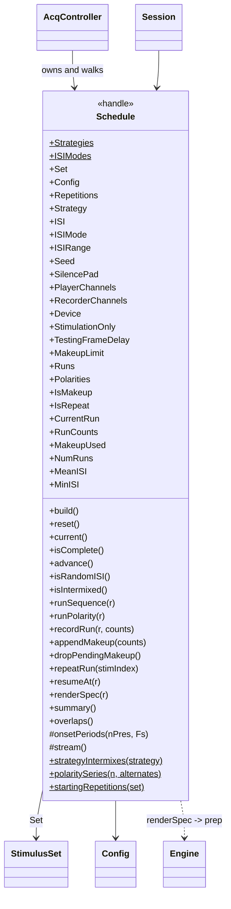
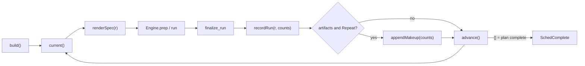
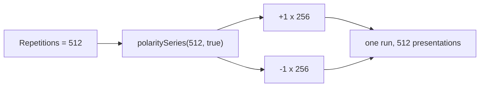

# `mabr.stim.Schedule` Class Reference

Member-by-member reference for the object that decides *how* a bank is presented:
[+mabr/+stim/Schedule.m](https://github.com/dstolz/MABR/blob/refactor/%2Bmabr/%2Bstim/Schedule.m).

For the strategies in prose, read [[Presentation Strategies]].

## Table of contents

- [Class diagram](#class-diagram)
- [MABR owns presentation](#mabr-owns-presentation)
- [Constant properties](#constant-properties)
- [Properties](#properties)
- [Read-only properties](#read-only-properties)
- [Dependent properties](#dependent-properties)
- [Methods](#methods)
- [Static methods](#static-methods)
- [Strategies](#strategies)
- [Fixed and randomized ISI](#fixed-and-randomized-isi)
- [Alternating polarity](#alternating-polarity)
- [Make-up and repeat runs](#make-up-and-repeat-runs)
- [The render spec](#the-render-spec)
- [Usage](#usage)
- [See also](#see-also)

## Class diagram

`$` marks a static member, `#` a private one.



The walk a controller performs:



## MABR owns presentation

The external stimulus package supplies single waveforms. This class owns all three
presentation decisions, driven from the GUI:

| Decision | Property |
|---|---|
| Spacing between successive onsets | `ISI` / `ISIRange` (+ `ISIMode`) |
| How many times each entry is presented | `Repetitions` |
| How entries are combined across the array | `Strategy` |

That is why `mabr.stim.fromStimgen` deliberately drops stimgen's `StimPlay.ISI`,
`StimPlayer.ISI`, `SelectionType`, and `StimOrder`.

## Constant properties

| Property | Value |
|---|---|
| `Strategies` | `{'blocked','shuffled-blocks','interleaved','shuffled-cycles','shuffled'}` |
| `ISIModes` | `{'fixed','random'}` |

## Properties

| Property | Default | Meaning |
|---|---|---|
| `Set` | — | The `mabr.stim.StimulusSet` |
| `Config` | — | The `mabr.Config` |
| `Repetitions` | `[]` | Per stimulus entry |
| `Strategy` | `'blocked'` | One of `Strategies` |
| `ISI` | `1/21.1` s | Onset-to-onset, used under `'fixed'` |
| `ISIMode` | `'fixed'` | Which of `ISI` / `ISIRange` decides the spacing |
| `ISIRange` | `[1 1]/21.1` s | `[min max]`, drawn uniformly per interval under `'random'` |
| `Seed` | `[]` | `[]` = nondeterministic shuffle |
| `SilencePad` | `0.25` s | Silence bracketing a run |
| `PlayerChannels` | `[1 2]` | `[DACsignal DACtiming]` |
| `RecorderChannels` | `[1 2]` | `[ADCsignal ADCtiming]` |
| `Device` | `''` | ASIO device name |
| `StimulationOnly` | `false` | Playback + timing pulse, nothing recorded |
| `TestingFrameDelay` | `0` | s/frame; loopback pacing, tests only |
| `MakeupLimit` | `1` | Ceiling on artifact make-up, as a multiple of scheduled repetitions |

`ISIMode` is a **separate switch** rather than inferred from a degenerate range, so
turning randomization off and on again cannot lose the range it was set to. The GUI's
Random checkbox *is* this property.

`set.ISIRange` requires ascending order and **never silently sorts**: `[50 20]` is a
mistake about which bound is which, and quietly swapping it would hide that.

## Read-only properties

| Property | Meaning |
|---|---|
| `Runs` | Cell array; each cell is a run's stimulus indices, in play order |
| `Polarities` | Cell array; each cell is +1/−1 per onset, same size |
| `IsMakeup` | Parallel to `Runs` — appended as artifact make-up? |
| `IsRepeat` | Parallel to `Runs` — user-requested repeat? |
| `CurrentRun` | `0` = not started, or complete |
| `RunCounts` | Presentations actually recorded, per stimulus |
| `MakeupUsed` | Make-up presentations appended, per stimulus |

## Dependent properties

| Property | Meaning |
|---|---|
| `NumRuns` | `numel(Runs)` |
| `MeanISI` | The interval a **duration estimate** should be built on |
| `MinISI` | The **shortest interval that can occur** — the worst case |

> 🔑 **Two numbers, two questions.** `MinISI` is what `overlaps()` and the GUI's overlap
> warning judge against: one short draw is enough to collide. `MeanISI` is what
> `summary().duration` estimates from, which makes a randomized plan's duration an
> *expectation* rather than a promise. `mabr.ui.App.isiSeconds` returns both, so the two
> questions cannot be confused.

## Methods

| Method | What it does |
|---|---|
| `build()` | (Re)build the run list from `Repetitions` + `Strategy`. Call after changing either — `reset()` alone does not rebuild |
| `reset()` | Return to exactly the state `build()` left, dropping make-up **and** repeat runs and restarting the make-up budget |
| `current()` / `isComplete()` / `advance()` | Walk the plan; `advance()` returns `[]` when complete |
| `isRandomISI()` / `isIntermixed()` | Mode queries |
| `runSequence(r)` / `runPolarity(r)` | Stimulus index / polarity at each onset of run *r*, in order |
| `recordRun(r,counts)` | Record presentations actually acquired, indexed by stimulus |
| `appendMakeup(counts)` | Append make-up run(s); returns how many were actually appended |
| `dropPendingMakeup()` | Discard make-up runs not yet started; returns how many were removed |
| `repeatRun(stimIndex)` | Append one more full run of `stimIndex` at its scheduled repetition count |
| `resumeAt(r)` | Point the plan at run *r* so `advance()` continues from there |
| `renderSpec(r)` | Build the acquisition play-matrix spec — see [below](#the-render-spec) |
| `summary()` | Plan overview for the GUI |
| `overlaps()` | True when the longest stimulus does not fit inside `MinISI` |

`summary()` returns `numStimuli`, `numRuns`, `repetitions`, `presentations`,
`intermixed`, `isiMode`, `isi` (the mean), and `duration`.

## Static methods

| Method | What it does |
|---|---|
| `strategyIntermixes(strategy)` | Does this strategy mix stimuli inside one run? |
| `polaritySeries(n,alternates)` | +1/−1 for *n* successive presentations of one entry |
| `startingRepetitions(set)` | Per-entry `Repetitions` where the source supplied one, else **512** |

## Strategies

| Strategy | Runs | Intermixed | Behaviour |
|---|---|---|---|
| `blocked` | one per stimulus | ✗ | Each the full repetition train, entries in array order |
| `shuffled-blocks` | one per stimulus | ✗ | As blocked, with the run **order** shuffled |
| `interleaved` | **one** | ✓ | Cycles A B C A B C …; an entry drops out once it has hit its count |
| `shuffled-cycles` | **one** | ✓ | As interleaved, each cycle's order shuffled independently |
| `shuffled` | **one** | ✓ | The whole multiset of presentations shuffled uniformly |

> 🔑 **Every strategy is a permutation of a fixed multiset**, never probabilistic
> sampling: each entry is presented exactly its repetition count in all five. That is why
> the names say "shuffled" rather than "random".

Two consequences of intermixing:

- **The run always plays to completion.** Stopping it early would truncate whichever
  stimuli happened to fall last, unbalancing the design — so an online advance criterion
  is unavailable and the GUI greys the control out.
- **The recording is de-interleaved at save time**, by the per-onset `StimulusIndex`, so
  each stimulus ID still lands in its own `.abr`.

## Fixed and randomized ISI

`ISIMode` picks which setting decides the spacing:

| Mode | Behaviour |
|---|---|
| `'fixed'` | Every interval is `ISI`. Onsets land on a strict grid |
| `'random'` | Each interval is drawn independently and uniformly from `ISIRange` |

Randomizing decorrelates the presentation rate from line noise and from any periodicity in
the response itself, which a strict grid can otherwise average up alongside the signal.

The draw happens in `renderSpec`, once per run, **from the schedule's own `RandStream`** —
so rendering never perturbs the global `rng`, and a `Seed` fixes a plan's timing along
with its order. `renderSpec` accumulates one interval per presentation rather than
multiplying a period, which is what lets no two gaps be the same.

**Nothing downstream knows or cares.** The timing channel still marks every onset, so
sweep extraction and every metric are indifferent to the spacing, and the realized
intervals survive in each file's `ADC.SweepOnsets`. Covered by
`tests/verify_isi_jitter.m`.

## Alternating polarity

An entry flagged `alternatePolarity` has its successive presentations multiplied by
`+1, −1, +1, …`.



**This splits the count; it never doubles it** — `ceil(n/2)` normal, `floor(n/2)`
inverted. Polarity is assigned per presentation and travels with it through shuffling, so
under a shuffled strategy the inverted presentations land in shuffled positions too.
`renderSpec` reports the sign used at each onset.

## Make-up and repeat runs

Two ways a run gets appended, deliberately tracked separately:

| | `appendMakeup(counts)` | `repeatRun(stimIndex)` |
|---|---|---|
| Triggered by | `ArtifactPolicy.Repeat`, at finalization | The user's Repeat button |
| Bounded by | `MakeupLimit` | nothing |
| Flag | `IsMakeup` | `IsRepeat` |
| Withdrawn by `dropPendingMakeup` | ✅ | ❌ |
| Dropped by `reset()` | ✅ | ✅ |

Both are **appended to the end of the plan** rather than splicing into the run that lost
the sweeps: a run's play matrix is rendered in full before the worker starts streaming and
cannot grow mid-flight. Appending also keeps every condition's first pass ahead of any
second, so a session cut short still covers the whole design rather than over-sampling its
early conditions.

One make-up run holds **one stimulus**, even under an intermixed strategy: it exists to
recover a specific condition's losses, and one stimulus per run keeps that accounting
exact.

`MakeupLimit = 1` means a condition can at most be presented twice over — enough to
recover a realistic artifact rate, while a permanently noisy electrode (where every
make-up sweep is rejected too, asking for yet more) still terminates.

`repeatRun` is only sensible when a run holds a single stimulus;
`AcqController.canRepeat` gates the GUI button on `isIntermixed()`. After it appends onto
a plan that had already reached completion, `resumeAt` is what restarts automatic
advancement — appending alone does not, since nothing calls `advance()` again on its own
once the plan was walked to its end.

## The render spec

`renderSpec(r)` builds the 2-channel play matrix and everything about it:

| Field | Meaning |
|---|---|
| `PlayMatrix` | `[N × 2] single` — column 1 signal, column 2 the synthesized timing pulses |
| `SampleRate` | Hz |
| `ExpectedOnsets` | Sample index of each presentation, **silence pad included** |
| `StimulusIndex` | Which stimulus fired at each onset |
| `Polarity` | The sign applied there |
| `PlayerChannels` / `RecorderChannels` / `Device` | Passed through |
| `StimulationOnly` / `TestingFrameDelay` | Passed through |
| `Meta` | `Set.meta(seq(1))` |

It **builds the timing channel** it synthesizes — one pulse per onset — because sweep
extraction depends on it. An entry with an explicit `Timing` channel supplies its own.

Two safety behaviours:

- **The buffer check runs before allocation.** A run exceeding
  `Config.maxInputBufferLength` raises `mabr:stim:Schedule:tooLong` with the numbers and
  the three ways to fix it, rather than an out-of-memory error many gigabytes later.
- **Overlapping presentations are summed, not clipped** — and both the GUI (via
  `overlaps()`) and the log say so up front.

## Usage

```matlab
cfg = mabr.Config;
set = mabr.stim.StimulusSet(mabr.stim.demoStimuli(), cfg);

sch = mabr.stim.Schedule(set, cfg);
sch.Strategy    = 'shuffled-cycles';
sch.Repetitions = mabr.stim.Schedule.startingRepetitions(set);   % 512 each
sch.ISIMode     = 'random';
sch.ISIRange    = [40 60]/1000;
sch.Seed        = 7;                 % reproducible order AND timing
sch.build();

s = sch.summary();
fprintf('%d runs, %d presentations, ~%.1f min\n', ...
    s.numRuns, s.presentations, s.duration/60);

if sch.overlaps(), warning('stimulus is longer than the shortest ISI'); end

r = sch.current();
while ~isempty(r)
    spec = sch.renderSpec(r);
    % ... eng.prep(spec); eng.run(); ...
    sch.recordRun(r, counts);
    r = sch.advance();
end
```

## See also

- [[Class-Reference]] — every other class, indexed by package
- [[Presentation Strategies]] — the five strategies in prose, with pictures
- [[mabr.stim.StimulusSet|mabr.stim.StimulusSet-Class-Reference]] — what it schedules
- [[mabr.ArtifactPolicy|mabr.ArtifactPolicy-Class-Reference]] — what triggers `appendMakeup`
- [[mabr.ui.AcqController|mabr.ui.AcqController-Class-Reference]] — what walks the plan
- [[mabr.acq.Engine|mabr.acq.Engine-Class-Reference]] — what consumes a render spec
