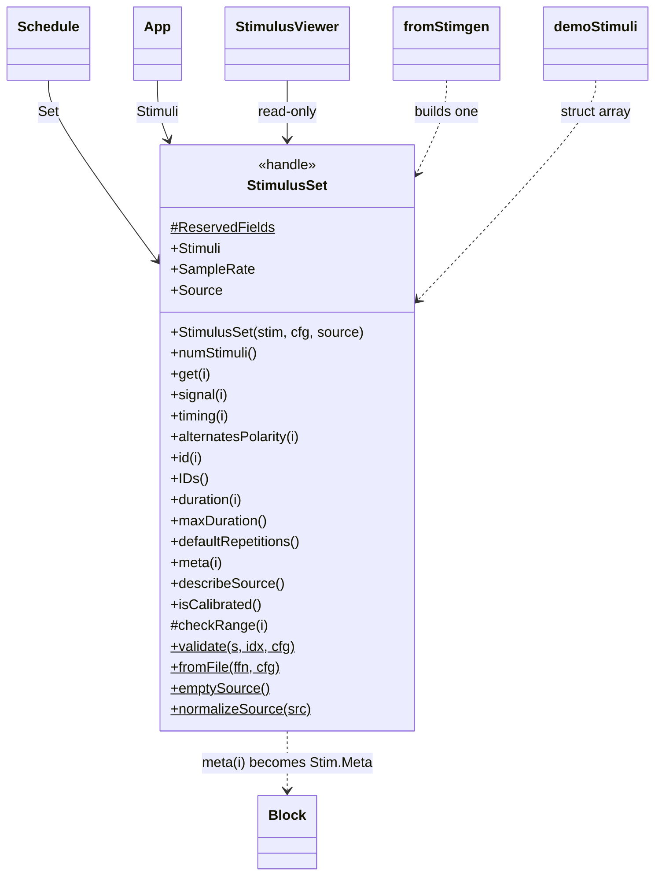
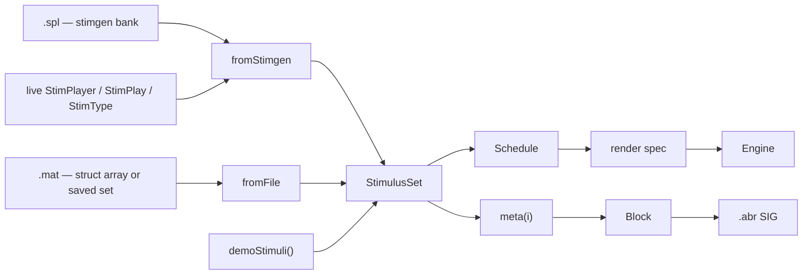

# `mabr.stim.StimulusSet` Class Reference

Member-by-member reference for the bank of pre-computed stimuli MABR plays:
[+mabr/+stim/StimulusSet.m](https://github.com/dstolz/MABR/blob/refactor/%2Bmabr/%2Bstim/StimulusSet.m).

The contract itself is written out in full in [[Stimulus Package Contract]]; this page is
the class card for the object that enforces it.

## Table of contents

- [Class diagram](#class-diagram)
- [A StimulusSet is inert](#a-stimulusset-is-inert)
- [The entry contract](#the-entry-contract)
- [Properties](#properties)
- [Instance methods](#instance-methods)
- [Static methods](#static-methods)
- [Provenance, not contract](#provenance-not-contract)
- [Usage](#usage)
- [See also](#see-also)

## Class diagram

`$` marks a static member, `#` a private one.



Where a bank comes from, and where it goes:



## A StimulusSet is inert

**MABR does not generate signals and does not calibrate.** An external package supplies
precomputed, calibrated waveforms; this class wraps and validates them and does nothing
else with them.

In particular it holds **no opinion about presentation**. The spacing between stimuli,
how entries are combined across the array, and how many times each is repeated are all
decided by [[mabr.stim.Schedule|mabr.stim.Schedule-Class-Reference]] from settings the
operator chooses in the GUI. A `StimulusSet` is a bank of waveforms and nothing more.

## The entry contract

Each element of the struct array describes **one presentation** of one stimulus — not a
repeated train.

| Field | Required | Meaning |
|---|---|---|
| `signal` | ✅ | `[N × 1]` precomputed, calibrated waveform for a **single** presentation. No repetition, no ISI padding, no timing channel |
| `ID` | ✅ | Name identifying the stimulus condition |
| `SampleRate` | | Defaults to `Config.DACSampleRate`. Every entry must agree |
| `Repetitions` | | Per-entry starting repetition count, used as the GUI's initial value |
| `Timing` | | `[N × 1]` explicit timing channel for this stimulus; otherwise MABR synthesizes one pulse at each onset |
| `alternatePolarity` | | Present this entry with alternating polarity |
| `informativeParams` | | The passthrough fields that identify this condition, declared explicitly |

**Any other field is carried through untouched** into the block metadata that reaches the
saved `.abr` file, so an external package can add parameters without MABR changing.

> ⚠️ **`alternatePolarity` does not add presentations.** The repetition count is
> unchanged; it is *split* between the two polarities. See
> [[mabr.stim.Schedule|mabr.stim.Schedule-Class-Reference]] § Alternating polarity.

### Why `informativeParams` is worth declaring

Left absent, MABR infers the list — **every numeric scalar extra** — which is exactly
right for a hand-built bank whose only extras *are* its parameters.

A generator emits far more than that. A stimgen `Tone` variant carries `Duration`,
`WindowDuration`, `OnsetPhase` and more; every name on this list becomes a **grouping
dimension** in the offline pipeline. A source that knows which of its parameters actually
vary should say so rather than let MABR guess from types.

## Properties

### `Constant, Access = private`

`ReservedFields` — the seven names above that MABR interprets itself. Everything else is
passthrough metadata.

### `SetAccess = private`

| Property | Type | Meaning |
|---|---|---|
| `Stimuli` | `(1,:) struct` | The validated, normalized struct array |
| `SampleRate` | `double` | The common DAC rate for every entry |
| `Source` | `struct` | Provenance — see [below](#provenance-not-contract) |

## Instance methods

| Method | Returns | Notes |
|---|---|---|
| `numStimuli()` | count | |
| `get(i)` | the entry struct | |
| `signal(i)` | `[N × 1]` | |
| `timing(i)` | `[N × 1]` or `[]` | `[]` means "synthesize a pulse at the onset" |
| `alternatesPolarity(i)` | logical | With no argument, the flag for the whole bank |
| `id(i)` / `IDs()` | char / cellstr | |
| `duration(i)` | s | The **full** signal length, not a trailing-zero-trimmed estimate |
| `maxDuration()` | s | Longest single presentation — the worst case for ISI overlap |
| `defaultRepetitions()` | `[1×n]` | The entry's own `Repetitions` where supplied, else `0` meaning "no preference" |
| `meta(i)` | struct | Metadata handed to `mabr.data.Block` and on to the `.abr` writer |
| `describeSource()` | char | One-line provenance for the status line / bank label |
| `isCalibrated()` | `[tf,known]` | See below |

> 💡 **`duration` is not trimmed on purpose.** The whole waveform is written into the play
> matrix at each onset, so the whole waveform is what can collide with the next
> presentation. Trimming trailing zeros would make the overlap warning optimistic.

### `isCalibrated` returns two things

| Output | Meaning |
|---|---|
| `tf` | Every entry says it was built against a measurement |
| `known` | The bank said **anything** about calibration at all |

A bank is a unit here: half-calibrated is not a state worth reporting as calibrated, since
the levels across it are then not comparable.

The second output is what keeps the first honest. A bank that never carried the field —
any `.mat` from an external package, anything written before this existed — is
**unknown**, not uncalibrated, and callers must not label it either way. Treating silence
as "uncalibrated" would put a warning on a properly calibrated bank, which teaches people
to ignore the warning that matters.

## Static methods

| Method | What it does |
|---|---|
| `validate(s,idx,cfg)` | Validate and normalize one entry against the contract |
| `fromFile(ffn,cfg)` | Load a bank from file, dispatching on extension |
| `emptySource()` | The empty provenance struct |
| `normalizeSource(src)` | Fill a partial source description out to the full field set |

`fromFile` dispatches: a **`.spl`** is a stimgen bank (parameters, regenerated at the DAC
rate — see `mabr.stim.fromStimgen`); anything else is read as a `.mat` holding either a
saved `StimulusSet` or a struct array with `signal` + `ID`.

## Provenance, not contract

`Source` is a struct — `Kind` / `File` / `Calibration` / `Generated` — that no entry
carries and nothing in acquisition reads.

| Field | Meaning |
|---|---|
| `Kind` | `'stimgen'` \| `'file'` \| `'demo'` \| `''` (unknown) |
| `File` | Source path, where there was one |
| `Calibration` | The `.esgc` file the waveforms were built against, if any |
| `Generated` | `datetime` the bank was materialized |

It exists because a calibrated stimgen bank and the uncalibrated demo bank are otherwise
**indistinguishable once they are struct arrays** — which is exactly the confusion worth
being unable to have. `mabr.ui.App` shows it beside the entry count (amber, not green,
when uncalibrated), and it is what `App.applyConfigStimuli` uses to reload the bank a
`.mabrcfg` was saved with.

## Usage

```matlab
cfg = mabr.Config;

set = mabr.stim.StimulusSet(mabr.stim.demoStimuli(), cfg);
fprintf('%d entries, %g Hz — %s\n', ...
    set.numStimuli(), set.SampleRate, set.describeSource());

for i = 1:set.numStimuli()
    fprintf('%-20s %6.2f ms  alt=%d\n', ...
        set.id(i), 1e3*set.duration(i), set.alternatesPolarity(i));
end

[cal,known] = set.isCalibrated();
if ~known, disp('bank says nothing about calibration'); end
```

Build one by hand — the whole contract in five lines:

```matlab
s(1).signal = pip;   s(1).ID = 'pip_8k_60';  s(1).Frequency = 8;  s(1).Level = 60;
s(2).signal = pip2;  s(2).ID = 'pip_8k_40';  s(2).Frequency = 8;  s(2).Level = 40;
[s.informativeParams] = deal({'Frequency','Level'});
[s.alternatePolarity] = deal(true);
set = mabr.stim.StimulusSet(s, cfg);
```

From a file:

```matlab
set = mabr.stim.StimulusSet.fromFile('C:\banks\session.spl', cfg);
```

## See also

- [[Class-Reference]] — every other class, indexed by package
- [[Stimulus Package Contract]] — the contract in full, with worked examples
- [[mabr.stim.Schedule|mabr.stim.Schedule-Class-Reference]] — what decides presentation
- [[Using stimgen]] — the suggested source, and what `fromStimgen` does to a bank
- [[mabr.ui.StimulusViewer|mabr.ui.StimulusViewer-Class-Reference]] — looking at one before you commit a subject to it
- [[Data Format]] — where `meta(i)` ends up
