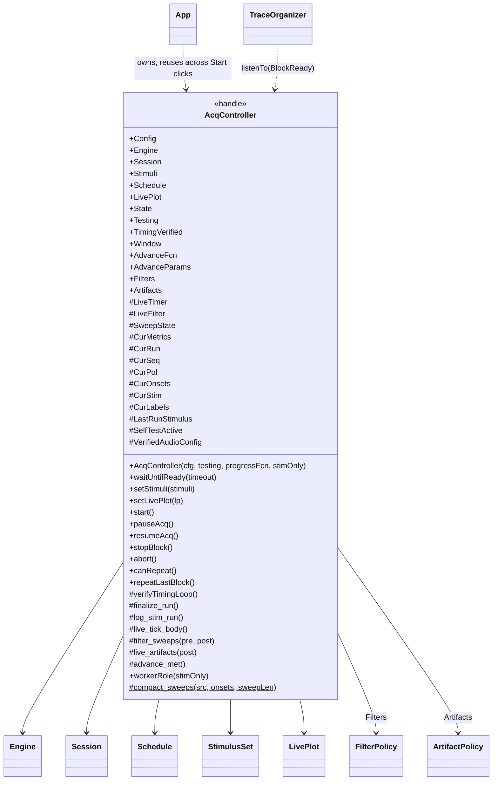
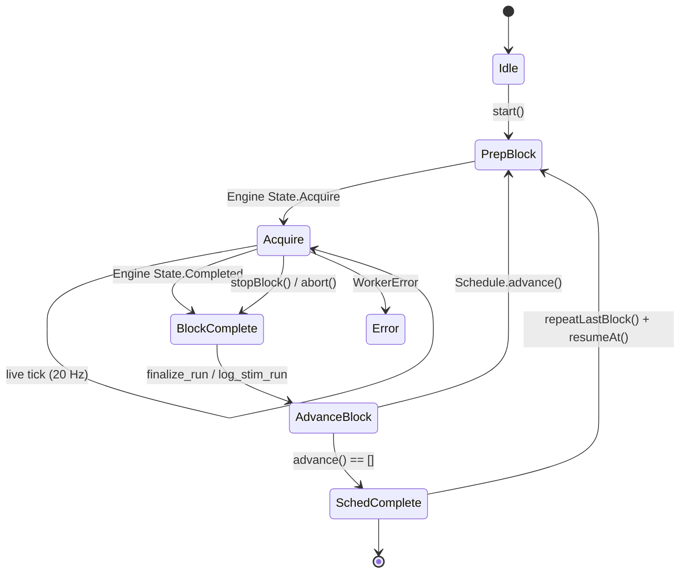
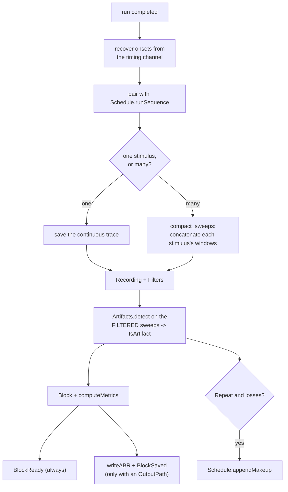
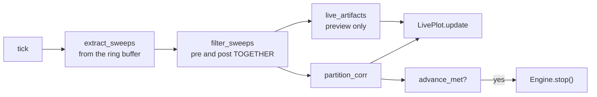

# `mabr.ui.AcqController` Class Reference

Member-by-member reference for the object that turns user actions into engine commands and
engine events into program flow:
[+mabr/+ui/AcqController.m](https://github.com/dstolz/MABR/blob/refactor/%2Bmabr/%2Bui/AcqController.m).

For the run in prose, read [[Running a Session]]; for the engine below it,
[[Acquisition Engine]].

## Table of contents

- [Class diagram](#class-diagram)
- [No global state, no busy-wait](#no-global-state-no-busy-wait)
- [Properties](#properties)
- [Events](#events)
- [Public methods](#public-methods)
- [The run cycle](#the-run-cycle)
- [`verifyTimingLoop` — the pre-flight check](#verifytimingloop--the-pre-flight-check)
- [`finalize_run` — where everything is decided](#finalize_run--where-everything-is-decided)
- [The live path](#the-live-path)
- [Stimulation-only](#stimulation-only)
- [Usage](#usage)
- [See also](#see-also)

## Class diagram

`$` marks a static member, `#` a private one.



## No global state, no busy-wait

Engine `State` transitions arrive as **events**; a single **~20 Hz timer** refreshes the
live view from the ring buffer and does nothing else. A single explicit
[[mabr.ui.ProgState|mabr.ui.ProgState-Class-Reference]] drives program flow, replacing the
legacy `abr.stateProgram` global-driven state machine.

Because the worker polls commands every frame, an online advance criterion can stop a run
the moment a response is detected — **for blocked strategies only**. An intermixed run
always plays to completion: stopping it early would truncate whichever stimuli fell last,
unbalancing the design.

## Properties

### `SetAccess = private`

| Property | Type | Role |
|---|---|---|
| `Config` | `mabr.Config` | |
| `Engine` | `mabr.acq.Engine` | The worker |
| `Session` | `mabr.data.Session` | Blocks and output path |
| `Stimuli` | `mabr.stim.StimulusSet` | The bank |
| `Schedule` | `mabr.stim.Schedule` | The plan |
| `LivePlot` | `mabr.ui.LivePlot` | Empty in stimulation-only mode |
| `State` | `mabr.ui.ProgState` | Program flow |
| `Testing` | `logical` | Loopback |
| `TimingVerified` | `logical` | Has the loop-back been confirmed for the **current** audio config? |

### Public, and **settable while acquiring**

| Property | Default | Role |
|---|---|---|
| `Window` | `[0 0.01]` s | ADC window relative to onset |
| `AdvanceFcn` | `@mabr.stim.advance.num_sweeps` | The criterion |
| `AdvanceParams` | `targetSweeps 512`, `corrThreshold 0.5`, `minSweeps 32`, `maxSweeps Inf` | |
| `Filters` | `mabr.FilterPolicy` | Display filtering of everything **viewed** |
| `Artifacts` | `mabr.ArtifactPolicy` | How sweeps are judged, and whether losses are made up |

> 🔑 **`Filters` and `Artifacts` may be reassigned mid-acquisition** — `mabr.ui.App`'s
> dialogs do exactly that. The live path re-reads them every tick and finalization re-reads
> them per run, so a change is visible on the next refresh and costs nothing. Runs already
> finalized keep the verdict they were judged under.

Two set methods do real work:

| Setter | What it does |
|---|---|
| `set.Filters` | Redesigns the cached `LiveFilter` at the ADC rate on assignment — `designfilt` costs milliseconds and the tick runs 20×/s, so the chain is never built inside the tick |
| `set.Artifacts` | Clearing `Repeat` mid-schedule calls `Schedule.dropPendingMakeup()`. The queued make-up runs were appended on the old policy's authority; presenting them anyway would ignore the instruction just given. The run in progress is kept |

## Events

| Event | Payload | Fires |
|---|---|---|
| `StateChanged` | `ProgStateEventData` | Program flow changed |
| `MetricsUpdated` | `.Info` = live metrics | Every live tick |
| `BlockReady` | `.Info.block` | Once per stimulus recovered from the run, **whether or not it was saved** |
| `BlockSaved` | `.Info.file` | Once per file written — only when the Session has an `OutputPath` |
| `ScheduleComplete` | — | The whole schedule finished |

> 💡 **`BlockReady` and `BlockSaved` are deliberately separate.** Viewers listen to
> `BlockReady`, so Preview (empty `OutputPath`) fills the trace organizer and the artifact
> tally exactly as a real run does, while nothing reaches disk. `BlockSaved` means "a file
> was written" — the extension says whether it was a `.abr` or a `.stimlog`.

## Public methods

| Method | What it does |
|---|---|
| `AcqController(cfg,testing,progressFcn,stimOnly)` | Build the engine. `stimOnly` only **names** the worker it launches |
| `waitUntilReady(timeout)` | Forwarded to the Engine |
| `setStimuli(stimuli)` | Accepts a `StimulusSet` **or** the raw struct array |
| `setLivePlot(lp)` | Attach the live view |
| `start()` | Verify the loop-back if needed, then begin the plan |
| `pauseAcq()` / `resumeAcq()` | |
| `stopBlock()` | Finish the current block early and **advance** |
| `abort()` | Finish the current block early and **halt** the schedule |
| `canRepeat()` | True once a **blocked** run has completed |
| `repeatLastBlock()` | Append one more full run of that stimulus |
| `workerRole(stimOnly)` (static) | `'acquisition'` or `'stimulus'` — the one place the mapping lives |

`canRepeat()` is always false for an intermixed run: it has no single stimulus to repeat,
so `LastRunStimulus` is never set for one and stays `0` for the run's whole duration.

`repeatLastBlock` is the user's direct "run this again", as distinct from
`Schedule.appendMakeup` — it recovers nothing and is **not** bounded by `MakeupLimit`.

## The run cycle



## `verifyTimingLoop` — the pre-flight check

A broken or mis-mapped loop-back cable is, per [[Troubleshooting]], **the most common rig
problem**. Without a check, it shows up as a whole block streaming and `finalize_run`
finding zero onsets.

So `start()` first streams a synthetic **timing-only** block (no signal, a few unit pulses)
through the real `Engine.prep`/`run` path and confirms at least one pulse comes back on
the timing input channel. Failure raises
`mabr:ui:AcqController:timingNotDetected` immediately.

Three details make it safe:

- **`SelfTestActive`** suppresses `on_engine_state` / `on_block_completed` for the
  duration, so the synthetic block never touches `ProgState`, the live timer, or
  `finalize_run` / Schedule / Session bookkeeping. Nothing needs cleaning up afterward —
  `stream_block`'s own `rb.reset()` at the next `Run` discards it.
- **It runs unconditionally, including in `Testing` mode.** `worker_loop`'s loopback branch
  passes the timing column straight through, so it trivially passes there while exercising
  the identical code path a real device would use.
- **The result is cached against the audio config**, not for the controller's lifetime.
  `VerifiedAudioConfig` holds the `Device` / `PlayerChannels` / `RecorderChannels` last
  confirmed, so the check re-runs whenever the user changes ASIO device or wiring between
  runs on the same controller — and is skipped otherwise.

It is **skipped entirely under `StimulationOnly`**: there is no input to loop back to, so
requiring one would make the mode unusable.

## `finalize_run` — where everything is decided



`finalize_run` **de-interleaves** the run: it pairs recorded onsets with
`Schedule.runSequence` and emits one `mabr.data.Block` and one `.abr` **per stimulus
present**, so the on-disk unit stays one-file-per-condition however the run was ordered.

A homogeneous run saves the continuous trace; an intermixed one saves each stimulus's
sweep windows concatenated (`compact_sweeps`) rather than *N* copies of a shared trace.

## The live path

One timer, ~20 Hz, doing exactly this:



**`filter_sweeps` runs the chain over the pre- and post-onset windows together**, because
they are contiguous: `extract_sweeps` takes the baseline as the samples immediately
preceding the onset at the same stride, so `[pre post]` is one unbroken segment. Filtering
it whole doubles the length available to `filtfilt` and — more to the point — keeps the
filter's edge transient in the **baseline** instead of dumping it on the first
milliseconds of the response, which is exactly where the early waves are.

Everything downstream therefore sees the same chain finalization will use.

`live_artifacts` is a **preview only**. Nothing there is recorded. With the high pass
switched off it falls back to removing each sweep's own mean, since nothing else would be
taking out a baseline offset and a sweep sitting on one would trip a voltage threshold on
the offset alone.

`live_info` attributes each sweep to a stimulus: the *k*-th recorded onset is the *k*-th
presentation the schedule ordered — the same pairing `finalize_run` makes — which is why
the live means and the saved blocks agree about what belongs to what.

`advance_met` builds the canonical context (`mabr.stim.advance.context` is the
authoritative field list) and hands it to whatever criterion is set. **`numSweeps` is the
clean count**, since that is what the average is built from: a criterion asking for 512
sweeps means 512 clean ones.

## Stimulation-only

`Schedule.StimulationOnly` removes the recording half of all of the above:

| Normally | Under stimulation-only |
|---|---|
| `verifyTimingLoop` runs | skipped |
| live timer runs at 20 Hz | never started |
| `finalize_run` builds Blocks | skipped entirely — **no `Block`, no `BlockReady`, no `.abr`** |
| — | `log_stim_run` writes one `.stimlog` per run |
| `LivePlot` attached | none |

The plan still advances run by run to `SchedComplete`, which is all there is to report when
nothing is coming back.

**What is not dropped is the record of what was played.** `log_stim_run` writes every
presentation in play order — stimulus index and ID, polarity, onset sample and time — plus
the bank's parameters and the schedule settings behind them. The onsets are the **rendered**
ones (`CurOnsets`), because there is no input to recover them from — and they are exact:
the same play matrix carries a timing pulse at every one of them, so a system recording
elsewhere aligns on the pulse and reads the labels here.

It is honest about early stops: `Engine.LastStream` says how many play-matrix samples
actually went out, so a run cut short writes the **whole plan with the unreached
presentations flagged `Presented = false`** rather than a truncated one or a lie.
`BlockSaved` fires for the file, and `Schedule.recordRun` is fed the presented counts so
the plan's bookkeeping is as true here as for a recorded run.

Covered by `tests/verify_stimulation_only.m`.

## Usage

```matlab
cfg = mabr.Config;
c   = mabr.ui.AcqController(cfg, true);      % TESTING loopback
c.waitUntilReady(120);

c.setStimuli(mabr.stim.demoStimuli());
c.Schedule.Strategy    = 'blocked';
c.Schedule.Repetitions(:) = 256;
c.Schedule.build();

c.Session.OutputPath = '';                   % record without saving
c.Filters   = mabr.FilterPolicy;
c.Artifacts = mabr.ArtifactPolicy('voltage', 0.05, true);

lh = event.listener(c,'BlockReady', @(~,e) disp(e.Info.block.Label));

c.start();
```

Stop early, or bail out:

```matlab
c.stopBlock();     % finish this block, advance
c.abort();         % finish this block, halt the schedule
if c.canRepeat(), c.repeatLastBlock(); end
```

## See also

- [[Class-Reference]] — every other class, indexed by package
- [[mabr.acq.Engine|mabr.acq.Engine-Class-Reference]] — the worker it drives
- [[mabr.stim.Schedule|mabr.stim.Schedule-Class-Reference]] — the plan it walks
- [[mabr.ui.ProgState|mabr.ui.ProgState-Class-Reference]] — the state machine
- [[mabr.ui.LivePlot|mabr.ui.LivePlot-Class-Reference]] — what the tick feeds
- [[mabr.ArtifactPolicy|mabr.ArtifactPolicy-Class-Reference]], [[mabr.FilterPolicy|mabr.FilterPolicy-Class-Reference]]
- [[Running a Session]], [[Troubleshooting]]
