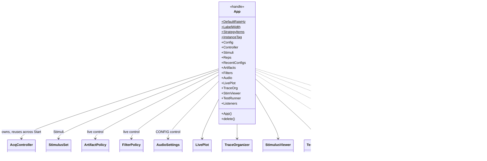
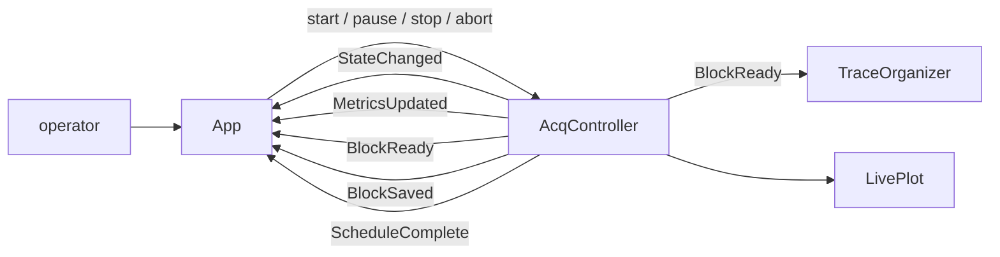
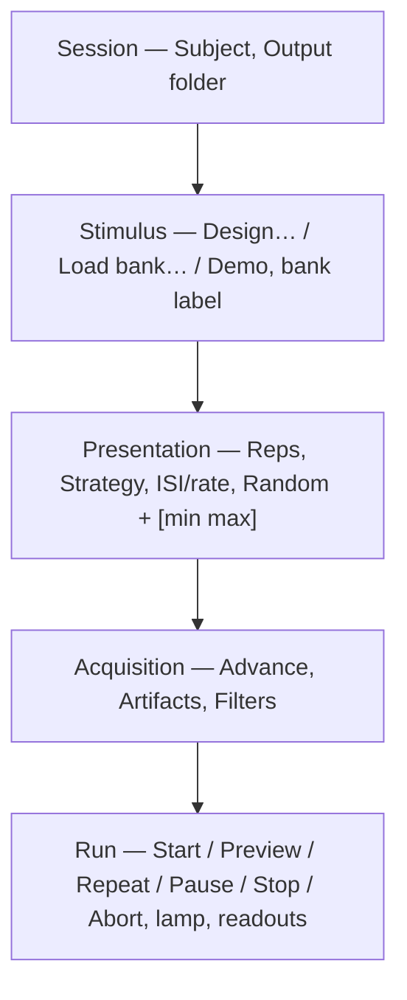
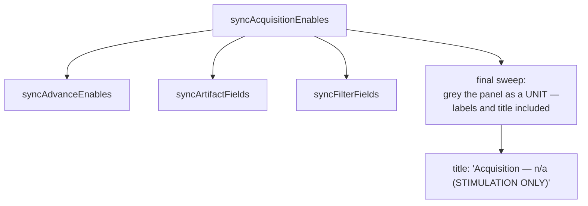

# `mabr.ui.App` Class Reference

Member-by-member reference for the main acquisition window:
[+mabr/+ui/App.m](https://github.com/dstolz/MABR/blob/refactor/%2Bmabr/%2Bui/App.m).

For the operator's walkthrough, read [[Running a Session]].

## Table of contents

- [Class diagram](#class-diagram)
- [The view, and nothing else](#the-view-and-nothing-else)
- [Window layout](#window-layout)
- [Constant properties](#constant-properties)
- [Public properties](#public-properties)
- [Menus](#menus)
- [Toolbar](#toolbar)
- [Live controls vs. config controls](#live-controls-vs-config-controls)
- [Start and Preview are one code path](#start-and-preview-are-one-code-path)
- [Stimulation-only changes what the window is](#stimulation-only-changes-what-the-window-is)
- [Configuration files](#configuration-files)
- [Key private methods](#key-private-methods)
- [Usage](#usage)
- [See also](#see-also)

## Class diagram



Event flow, both directions:



## The view, and nothing else

A programmatic `uifigure` app that replaces `abr.ControlPanel`. It owns a
`mabr.ui.AcqController` and translates button presses into controller actions and
controller events into UI updates. **There is no global state and no busy-wait**: the
controller is entirely event-driven, and this view just listens.

Launch with `MABR` from the command window, or `mabr.ui.App` directly.

> 💡 **Only one window at a time.** A second would fight the first over the same ASIO
> device (the worker holds it open for the run) and over the same MATLAB prefs. The guard
> works by finding the figure via `InstanceTag`, **not** a stored handle — a stale
> reference could otherwise mask a window the user already closed.

The layout code lives in `createComponents` and is treated as generated; the wiring lives
in the callbacks and event handlers.

## Window layout

Five titled panels, all built from one `panelGrid` helper and a shared `LabelWidth`, so the
fields align along one edge down the whole window.



> ⚠️ **Panels carry explicit pixel heights.** `'fit'` does not see through a `uipanel` to
> its nested grid, so adding a row to a panel means bumping its height in `Grid.RowHeight`.

Two rows are worth knowing about:

- **The artifact controls share one threshold field** between the voltage and RMS
  criteria — they are alternatives. `syncArtifactFields` swaps the value and its
  display-format caption on a mode change, so each criterion keeps its own number.
- **The Filters row is a one-line summary plus a button.** Three independent filters need
  eight controls and a response plot to state properly, which is a window
  (`mabr.ui.FilterDialog`), not a panel row — so the row carries the whole setting in text
  and the button is only pressed to change it.

## Constant properties

| Property | Value |
|---|---|
| `DefaultRateHz` | `21.1` Hz |
| `LabelWidth` | `82` px — the shared label-column width |
| `StrategyItems` | Display names for `Schedule.Strategies`, in the same order (the dropdown carries the canonical names as `ItemsData`) |
| `InstanceTag` | `'MABR_App_Instance'` — the single-instance guard |

## Public properties

`SetAccess = private`.

| Property | Type | Role |
|---|---|---|
| `Config` | `mabr.Config` | |
| `Controller` | `mabr.ui.AcqController` | Rebuilt only when `Audio.Testing` changes |
| `Stimuli` | `mabr.stim.StimulusSet` | The loaded bank |
| `Reps` | `(1,:) double` | Per-stimulus repetition counts — **the GUI owns these**, not the stimulus package |
| `RecentConfigs` | `(1,:) cell` | Most-recent-first, capped at 9, persisted as `RecentConfigFiles` |
| `Artifacts` | `mabr.ArtifactPolicy` | Live control |
| `Filters` | `mabr.FilterPolicy` | Live control |
| `Audio` | `mabr.AudioSettings` | **Config** control |
| `LivePlot` / `TraceOrg` / `StimViewer` / `TestRunner` | | The four child windows |
| `Listeners` | | Controller event listeners |

## Menus

| Menu | Items |
|---|---|
| **File** | Save Configuration… · Load Configuration… · Recent Configurations ▸ |
| **Settings** | Audio Device (ASIO)… · Calibration… |
| **Help** | MABR Wiki · Verification Tests… |

**Settings ▸ Calibration…** opens stimgen's own `CalibrationGui` over a
[[mabr.stim.CalibrationAdapter|mabr.stim.CalibrationAdapter-Class-Reference]] rather than
reimplementing it — stimgen owns calibration, MABR owns the rig.

**Help ▸ Verification Tests…** opens
[[mabr.ui.TestRunner|mabr.ui.TestRunner-Class-Reference]]. It is a config control for a
blunt reason: the suite builds its own engine, worker and pool, so it cannot share the rig
with a schedule in flight.

## Toolbar

A `uitoolbar` of pictogram glyphs, all drawn through
[[mabr.ui.Icon|mabr.ui.Icon-Class-Reference]] — the same convention
`TraceOrganizer`'s toolbar uses, so each button reads without its tooltip.

| Glyph | Opens / raises |
|---|---|
| one trace on axes | the live plot |
| a stack of traces | the trace organizer |
| a loudspeaker | the stimulus viewer |
| a question mark | the wiki |

**Nothing but the main window opens at launch** — there is nothing to watch until a
schedule is in flight. The two acquisition viewers open by themselves at Start/Preview
(`openViewers`, which builds only the ones whose window is absent and never raises one
already up), and lay out beside the main window on first run.

Once an organizer exists it keeps itself current through `BlockReady`, so pressing its
button is a **pure raise** — re-running the backfill would discard whatever the user has
arranged or loaded in there. The stimulus viewer is on-demand instead: it inspects what is
about to be played, not what is coming back, and a plain raise deliberately does not
re-push the bank so the user's selection survives.

`AlwaysOnTop` uses the documented `WindowStyle = 'alwaysontop'` (R2021a+, below MABR's own
R2021b floor), so no undocumented Java/CEF trick is involved. It is persisted like the
other per-rig prefs.

## Live controls vs. config controls

| | `liveControls` | `configControls` |
|---|---|---|
| Contains | Artifact mode/threshold/repeat, the Filters button | Bank buttons, Strategy, Reps, ISI group, Advance, Audio Device…, Calibration…, Load Configuration…, Recent Configurations, Verification Tests… |
| While a schedule runs | **stay enabled** | locked |
| Why | Artifact rejection is judged at finalization and display filtering only decides what a plot is drawn from | The worker's device is already open on what Start handed it; a bank or ISI change would replace the plan underneath a running schedule |

**Save Configuration is deliberately not a config control** — capturing a snapshot changes
nothing and is safe at any time, including mid-run.

`transport(running)` re-derives both sets in both directions, because `setBusy` kills
everything on the way in and the live controls have to be revived afterwards, not just at
Idle.

## Start and Preview are one code path

`onStart(preview)`. Preview hands the controller a `Session` with an **empty
`OutputPath`**, which is already `finalize_run`'s record-without-saving route — so blocks
are still acquired, finalized, counted for artifacts, and pushed to the viewers through
`BlockReady` while nothing reaches disk. The output folder does not join the remembered
history either.

Because a preview is otherwise indistinguishable from a real run, the Run panel's title
carries **`PREVIEW (nothing is saved)`** for as long as one is in flight. `Previewing` is
captured at Start and left alone until the next one, so the completion message can still
say the run was not saved.

`buildSchedule` is the **single place** the GUI's settings (and the `Audio` settings)
become a `Schedule`, shared by the plan-summary preview and `onStart` so the two cannot
drift.

## Stimulation-only changes what the window is

A stimulation-only schedule gets the same treatment one notch stronger, and it **takes
precedence over Preview** — `STIMULATION ONLY (no recording)`. A preview acquires
everything and merely declines to write it; this never records at all. `setRunTitle`
decides *which* banner from the `StimOnlyRun` snapshot; the caller only says whether one is
in flight.

In that mode the **entire Acquisition panel is disabled**. `syncAcquisitionEnables` is the
one place that decides it:



The three `sync*` functions speak only for their own **fields**, which would leave every
row label black and the header bold — a panel that reads as live with some dead controls
in it, the opposite of what is true. So a final sweep greys the labels and title too
(against the `AcqPanelFG` captured at build time, since the theme's own title colour is not
the same everywhere), and it runs **last** because it is the one that has to win.

Coming back *out* of the mode it re-derives only the labels, which carry no state of their
own — every interactive control keeps whatever verdict the `sync*` calls just reached, so
an artifact threshold stays dead under `none` and Advance under an intermixed strategy.

> 💡 **The panel's own `Enable` is deliberately unused**: `uipanel` only gained one after
> R2021b, which `mabr.Config` still supports.

Also in that mode: **no viewers open**, the controller is handed an empty `LivePlot`
(there is nothing coming back to plot, and two windows that never fill are worse than
none), and the Run panel's `Sweeps:` / `r =` readouts carry run progress instead —
`Run k/N`, `no recording` — written by `setRunReadout` from `onState`, since no live timer
runs to fire `onMetrics`.

## Configuration files

**File ▸ Save/Load Configuration…** is the direct analogue of the legacy `+abr` ConfigTab,
now covering everything the GUI owns: Subject/Output, the stimulus bank plus per-stimulus
repetitions, Strategy/Advance/ISI, and the `Artifacts`/`Filters`/`Audio` policies — in one
`.mabrcfg` file (a MAT-file holding one `MABRConfig` variable).

> 🔑 **This is a separate concept from each policy's `loadPrefs`/`savePrefs`.** Prefs are
> "last used", per-rig, invisible. A *configuration* is a deliberately named, reloadable
> point — for switching between protocols on one rig.

`captureConfiguration` writes **plain structs, never classdef objects**, so a file saved by
one version keeps loading after a class gains or loses a property.
`applyConfiguration` restores defensively field-by-field — the same rule `loadPrefs`
already follows — and **returns a warning string** rather than calling `setStatus` itself,
because `onLoadConfiguration`'s own final status would otherwise overwrite it the instant
it returns.

Three restore behaviours worth knowing:

- **Banks reload by provenance.** `applyConfigStimuli` uses `StimulusSet.Source.File`. When
  it is empty (a bank built live in the designer and never saved) or has moved, the bank
  already loaded is left alone and the repetitions are not touched either — and that is
  where the warning usually comes from.
- **Repetition counts are matched back by ID, not position**, so a bank that has gained or
  dropped an entry since the configuration was saved still lines counts up correctly.
- **A Strategy that intermixes always wins over a saved Correlation-Threshold Advance
  value.** `syncAdvanceEnables` runs first and its disabled state gates whether the saved
  value is applied at all — early-stop is meaningless for an intermixed run, configuration
  or not.

A file can vanish between sessions; `onLoadRecentConfiguration` drops it from the list and
says so rather than erroring — the same self-healing rule.

## Key private methods

| Method | What it does |
|---|---|
| `ensureController` | Rebuilds the controller whenever `Audio.Testing` differs from the running one's |
| `buildSchedule` | The one place GUI settings become a `Schedule` |
| `adoptStimuli(set)` | Take on a bank and reset repetition counts to what it suggests |
| `warnUncalibratedLevels(set)` | The amber-label warning, **scoped to stimgen banks** |
| `isiSeconds` | `[mn,av]` — the shortest interval that can occur, and the one a duration estimate should use |
| `checkOverlap` | Warn when the longest stimulus does not fit inside the **shortest** interval |
| `syncDesignButton` | One button, two jobs: **Design…** then **Adopt bank** |
| `hideDesignerSessionControls` | Collapse the designer's Reps/ISI/rate/Shuffle/Run widgets out of its layout |
| `chooseCustomAdvance` | Prompt for a `.m`, resolve it, and accept only if it conforms to the contract |
| `configControls` / `liveControls` / `allControls` | The three enable groups |
| `setBusy` / `transport` | Lock everything for pool/worker startup, then settle into running/idle |

### The stimgen designer, non-modally

**Design…** opens `stimgen.StimPlayer` and the same button becomes **Adopt bank**.
`StimPlayer` keeps its figure handle private so there is nothing to `uiwait` on — but
non-modal is the better shape anyway: it lets the user tune, adopt, inspect in the stimulus
viewer, and adjust again without reopening, matching how the viewers already behave.

`hideDesignerSessionControls` then calls stimgen's own
`set_control_visibility(All=false)`. Every widget it collapses duplicates a setting MABR
owns — and the duplicates are **inert**: `fromStimgen` drops ISI and `SelectionType`
outright, the rate is `Config.DACSampleRate` regardless of what the designer shows, and the
designer's Run streams through stimgen's speaker preview rather than the rig the worker
holds open. It is guarded on `ismethod` rather than assumed, since a rig may have the
submodule checked out at an older commit — an unhidden control is a worse designer, not a
broken one. The per-stimulus **Play**/**Play All** buttons are not hideable and stay, which
is right: auditioning a stimulus is the designer's job.

### The uncalibrated-levels warning is scoped

`warnUncalibratedLevels` fires only for **stimgen** banks. An uncalibrated bank from
anywhere else may well vary amplitude with level — `demoStimuli` does, at
`10^((L-80)/20)` — so warning on every uncalibrated bank would be crying wolf at the one
button whose whole job is to be uncalibrated.

## Usage

```matlab
MABR                    % the launcher: genpath + mabr.ui.App
app = mabr.ui.App;      % or directly
```

Everything the window does is reachable programmatically through the objects it owns:

```matlab
app.Controller.Schedule.Strategy = 'shuffled-cycles';
app.Controller.Artifacts = mabr.ArtifactPolicy('rms', 0.02, true);
disp(app.Stimuli.describeSource())
```

## See also

- [[Class-Reference]] — every other class, indexed by package
- [[Running a Session]] — every control in context
- [[mabr.ui.AcqController|mabr.ui.AcqController-Class-Reference]] — what it drives
- [[mabr.AudioSettings|mabr.AudioSettings-Class-Reference]] — the config control it locks
- [[mabr.ui.TraceOrganizer|mabr.ui.TraceOrganizer-Class-Reference]], [[mabr.ui.LivePlot|mabr.ui.LivePlot-Class-Reference]], [[mabr.ui.StimulusViewer|mabr.ui.StimulusViewer-Class-Reference]]
- [[Using stimgen]] — the Design…/Adopt and Calibration… routes
