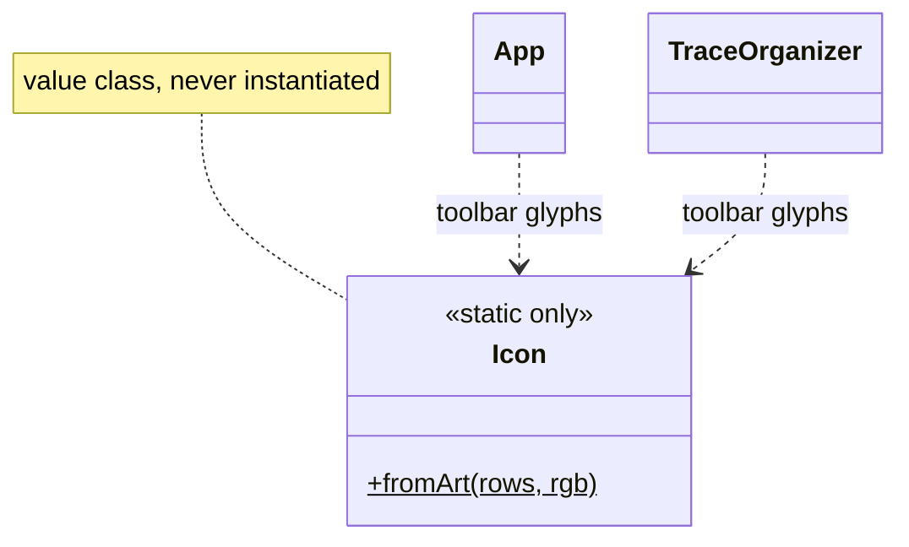
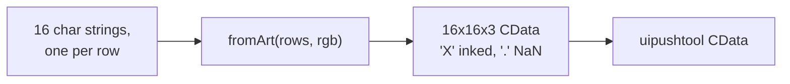

# `mabr.ui.Icon` Class Reference

Member-by-member reference for the toolbar-glyph renderer:
[+mabr/+ui/Icon.m](https://github.com/dstolz/MABR/blob/refactor/%2Bmabr/%2Bui/Icon.m).

## Table of contents

- [Class diagram](#class-diagram)
- [Why ASCII art](#why-ascii-art)
- [Static methods](#static-methods)
- [The art format](#the-art-format)
- [Usage](#usage)
- [See also](#see-also)

## Class diagram

`$` marks a static member.



What it produces:



## Why ASCII art

Toolbar buttons take `CData`, not text. Every glyph in the app is therefore drawn as one
16-character string per row: **`'X'` is inked in the given colour and `'.'` is transparent
(`NaN`)**, leaving the system button background showing through — so the icon looks right
in any MATLAB theme without a second asset.

> 💡 **It is kept as art rather than index math** because the shapes have to be legible at
> 16 px, and that is only checkable by looking at them.

Both toolbars in MABR use it, which is what makes their buttons read as one set:
`mabr.ui.App` (a trace on axes, a stack of traces, a loudspeaker, a question mark) and
`mabr.ui.TraceOrganizer`.

## Static methods

| Method | What it does |
|---|---|
| `fromArt(rows,rgb)` | Render a 16×16 `CData` from a cellstr of 16-character rows and an RGB triple |

Each owner keeps its own `glyph(name)` static that returns the art, so the shapes live
beside the toolbar that draws them.

## The art format

| Character | Meaning |
|---|---|
| `X` | Inked in `rgb` |
| `.` | Transparent (`NaN`) |

16 rows of 16 characters. Anything else is not part of the convention.

## Usage

```matlab
rows = { ...
    '................'
    '................'
    '.....XXXXXX.....'
    '....X......X....'
    '....X......X....'
    '.....XXXXXX.....'
    '................'
    '................'
    '................'
    '................'
    '................'
    '................'
    '................'
    '................'
    '................'
    '................'};

cdata = mabr.ui.Icon.fromArt(rows, [0.16 0.26 0.42]);

tb = uitoolbar(fig);
uipushtool(tb, 'CData', cdata, 'Tooltip', 'Do the thing', ...
    'ClickedCallback', @(~,~) doTheThing());
```

## See also

- [[Class-Reference]] — every other class, indexed by package
- [[mabr.ui.App\|mabr.ui.App-Class-Reference]] — the main toolbar
- [[mabr.ui.TraceOrganizer\|mabr.ui.TraceOrganizer-Class-Reference]] — the other one
