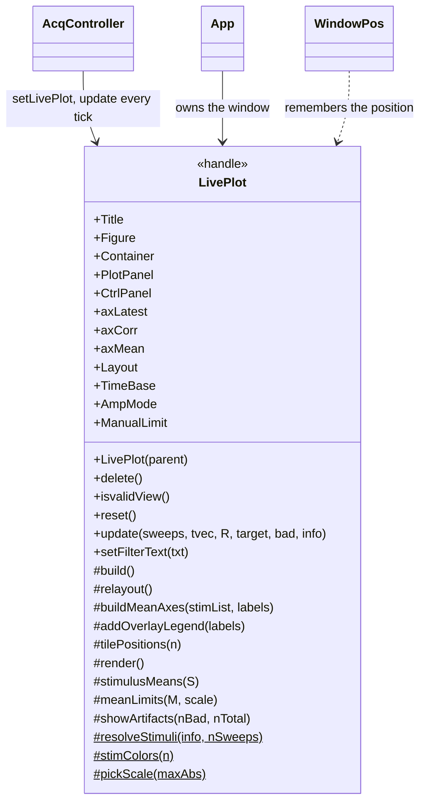
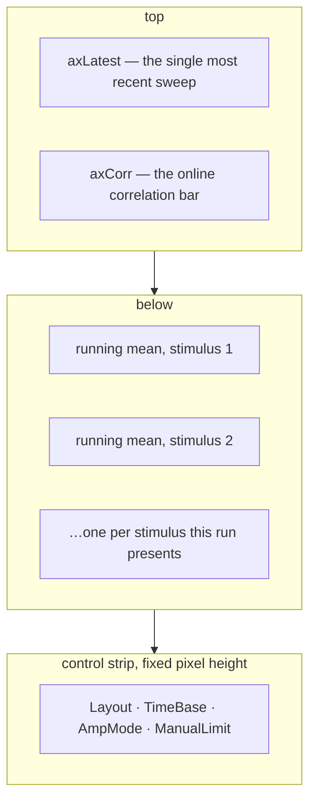

# `mabr.ui.LivePlot` Class Reference

Member-by-member reference for the live acquisition view:
[+mabr/+ui/LivePlot.m](https://github.com/dstolz/MABR/blob/refactor/%2Bmabr/%2Bui/LivePlot.m).

For the viewer in context, read [[Running a Session]].

## Table of contents

- [Class diagram](#class-diagram)
- [Three regions, one window](#three-regions-one-window)
- [Properties](#properties)
- [Methods](#methods)
- [The `info` payload](#the-info-payload)
- [Display controls](#display-controls)
- [Artifacts are excluded, and reported](#artifacts-are-excluded-and-reported)
- [Usage](#usage)
- [See also](#see-also)

## Class diagram

`$` marks a static member, `#` a private one.



## Three regions, one window



The latest sweep keeps **its own axes**. A single sweep is tens of times larger than an
average, so sharing an axis with the means would flatten them.

The lower region is the point of the window during an **intermixed** run: the run
interleaves several conditions, so a single pooled average would mix them and show nothing.
Sweeps are sorted by the stimulus that evoked them — `mabr.stim.Schedule`'s per-onset
stimulus index, handed over by `mabr.ui.AcqController` — and averaged separately.

This is a clean object-oriented rebuild of the legacy `abr_live_plot.m`, which used a
persistent handle struct.

## Properties

### Public and settable

| Property | Default | Meaning |
|---|---|---|
| `Title` | `'MABR Live Plot'` | |
| `Layout` | `'overlay'` | `'overlay'` or `'separate'` — means on one axes, or one each |
| `TimeBase` | `[-2 10]` ms | The negative half is the pre-onset baseline |
| `AmpMode` | `'common'` | `'each'`, `'common'`, or `'manual'` |
| `ManualLimit` | `5e-6` V | The ± limit `AmpMode 'manual'` uses |

Each has a setter that lands in `afterSettingChange`, which keeps the control strip honest
and redraws from the cached sweeps — so a control does something even **between** runs.

### `SetAccess = private`

`Figure`, `Container`, `PlotPanel`, `CtrlPanel`, `axLatest`, `axCorr`, `axMean`.

### Private constants

| Constant | Value | Role |
|---|---|---|
| `RecentColor` | `[0.2 0.6 1]` | Latest sweep, kept |
| `ArtifactColor` | `[0.85 0.15 0.1]` | Latest sweep, rejected |
| `ControlHeight` | `30` px | Reserved for the control strip |
| `TilesPerCol` | `4` | Separate plots stack this deep before columning |
| `MaxLegend` | `12` | Overlaid means beyond this get no legend |
| `TopFrac` | `0.34` | Vertical split of the plot region |

## Methods

| Method | What it does |
|---|---|
| `LivePlot(parent)` | Own figure, or build into a supplied container |
| `isvalidView()` | Is the window still there? |
| `reset()` | Forget the run just finished |
| `update(sweeps,tvec,R,target,bad,info)` | The whole refresh |
| `setFilterText(txt)` | Caption the view with the display filter chain in force |

> 💡 **`reset()` leaves the axes alone.** The next run rebuilds them for its own stimulus
> list on the first `update`, and rebuilding here would flash an empty grid in between.

`setFilterText` rides on the latest axes' **subtitle** — the one caption nothing else
claims (the sweep count owns the title, the artifact readout owns the top-left corner).
The whole point of the filter dialog is that these traces are *not* the raw signal, so the
window says which corners it is showing rather than leaving that to memory.

## The `info` payload

`update`'s arguments:

| Argument | Shape | Meaning |
|---|---|---|
| `sweeps` | `[nSweeps × nSamples]` | |
| `tvec` | `[1 × nSamples]`, **seconds** | Spans the pre-onset baseline *and* the response, so a negative time base has something to show |
| `R` | scalar | The correlation |
| `target` | scalar | Target sweep count |
| `bad` | `[1 × nSweeps]` logical | Sweeps flagged as artifact |
| `info` | struct, optional | See below |

| `info` field | Meaning |
|---|---|
| `.StimIndex` | `[1 × nSweeps]` stimulus behind each sweep |
| `.Stimuli` | `[1 × nStim]` stimuli this run presents, in the order to lay them out |
| `.Labels` | `{1 × nStim}` display label for each |
| `.DetrendPoly`, `.SmoothSpan` | Cosmetic post-processing |

**Omit `info` and every sweep counts as one condition** — the window degenerates gracefully
to the old single-mean view.

The stimulus list is the **run's**, in presentation order, not the whole bank's — worked
out once when the run is prepared rather than on every one of the 20 ticks a second.

## Display controls

The strip along the bottom writes exactly the four public properties.

| `AmpMode` | Use it when |
|---|---|
| `'each'` | Levels differ by 40 dB and every stimulus should autoscale to its own response |
| `'common'` | An amplitude difference *between* conditions is the thing you are looking for — the only mode that shows it |
| `'manual'` | You want the scale to stop moving between refreshes |

> ⚠️ **Overlaid means share one axes and therefore one scale**, so `'each'` collapses to
> `'common'` there rather than silently picking one stimulus to scale by. The latest-sweep
> axes always autoscales, including under `'manual'`.

Two layout details:

- **Tiles stack down a column before adding another column.** Traces are wide and short, so
  height is the scarce dimension.
- **The overlay legend is drawn inside the axes**, small, and dropped entirely past
  `MaxLegend` conditions — at which point Separate plots is the answer and the tile titles
  name them. A legend that eats the axes is worse than none, and drawing it inside keeps
  the manual axes layout authoritative.

`stimColors` switches from `lines()` to a continuous map past seven conditions: two
conditions sharing a colour on one overlaid axes is worse than no colour at all, and a bank
is almost always an ordered series, so the gradient carries the ordering the repeat would
have destroyed.

`setLimits` clamps the requested time base to what was actually recorded — the window can
be widened past the extracted sweep, and an axis showing empty space either side reads as
missing data.

## Artifacts are excluded, and reported

Sweeps flagged in `bad` are **excluded from the running means**. One electrode pop
otherwise smears across the whole average and the view stops reflecting what the block will
contain.

They are reported instead:

- the count and rate appear **in red above the latest trace**;
- the latest sweep is **drawn in red** when it was the one rejected.

So a noisy electrode is visible as it happens rather than at the end of the block.

`showArtifacts` is **silent when nothing has been rejected**: an always-present
"0 rejected" is noise the eye learns to skip, and the point of the readout is that it
appears the moment it matters.

## Usage

```matlab
lp = mabr.ui.LivePlot();
lp.Layout   = 'separate';
lp.TimeBase = [-1 8];
lp.AmpMode  = 'common';

info = struct('StimIndex',stimIdx, 'Stimuli',[1 2 3], ...
              'Labels',{{'8 kHz 60','8 kHz 40','8 kHz 20'}});
lp.update(sweeps, tvec, R, 512, bad, info);

lp.setFilterText('10-3000 Hz, 60 Hz notch');
lp.reset();
```

Attached to a controller, this all happens by itself:

```matlab
controller.setLivePlot(lp);      % the 20 Hz tick drives update()
```

Covered by `tests/verify_live_plot.m` — no hardware.

## See also

- [[Class-Reference]] — every other class, indexed by package
- [[mabr.ui.AcqController|mabr.ui.AcqController-Class-Reference]] — what calls `update`
- [[mabr.FilterPolicy|mabr.FilterPolicy-Class-Reference]] — what `setFilterText` reports
- [[mabr.ArtifactPolicy|mabr.ArtifactPolicy-Class-Reference]] — what fills `bad`
- [[mabr.ui.TraceOrganizer|mabr.ui.TraceOrganizer-Class-Reference]] — the after-the-fact view
- [[Presentation Strategies]] — why an intermixed run needs per-stimulus means
