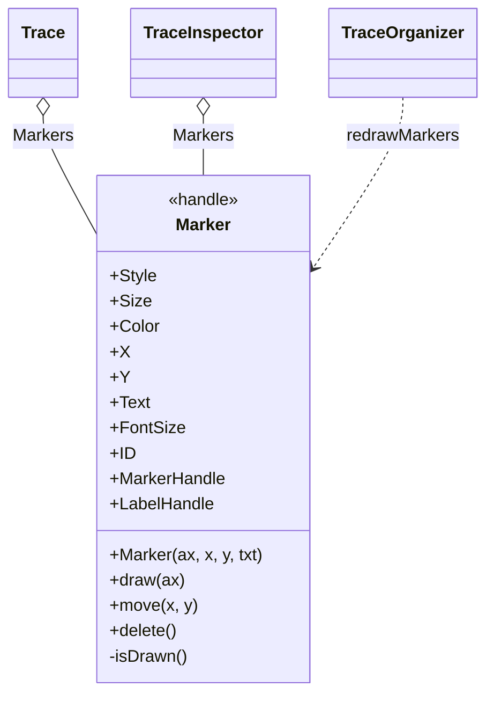
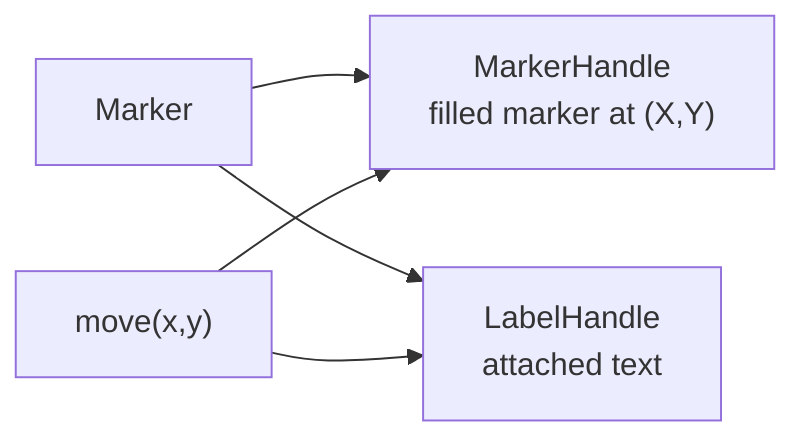

# `mabr.ui.Marker` Class Reference

Member-by-member reference for a peak marker on a trace axes:
[+mabr/+ui/Marker.m](https://github.com/dstolz/MABR/blob/refactor/%2Bmabr/%2Bui/Marker.m).

## Table of contents

- [Class diagram](#class-diagram)
- [What it replaced](#what-it-replaced)
- [Properties](#properties)
- [Methods](#methods)
- [Usage](#usage)
- [See also](#see-also)

## Class diagram



Two graphics objects, kept in sync:



## What it replaced

The legacy `abr.traces.Marker` was broken in three ways:

| Legacy defect | Consequence |
|---|---|
| Constructor named `TraceMarker`, class named `Marker` | The class could not be constructed at all |
| `ID` computed as `fix(rand(1),1e9)` | `fix` takes one argument — an error every time |
| `set.FontSize` was a no-op | The property accepted a value and did nothing |

This version draws a filled marker **and** an attached text label, and keeps the two in
sync.

## Properties

| Property | Type / default | Meaning |
|---|---|---|
| `Style` | `char`, `'v'` | One of `o + * . x d s ^ v > < p h` |
| `Size` | `double`, `36` | Positive, finite |
| `Color` | `(1,3) double`, `[0.85 0.1 0.1]` | |
| `X` / `Y` | `double`, `NaN` | Position in data coordinates |
| `Text` | `(1,:) char`, `''` | The label |
| `FontSize` | `double`, `9` | Positive, finite — and actually applied |

### `SetAccess = private`

| Property | Meaning |
|---|---|
| `ID` | Assigned at construction |

### `SetAccess = private, Transient`

`MarkerHandle`, `LabelHandle` — the two graphics objects. Transient, so nothing here is
carried into a saved `.torg`: `mabr.ui.Trace` stores markers as **sample indices** and
rebuilds them on load.

## Methods

| Method | What it does |
|---|---|
| `Marker(ax,x,y,txt)` | Construct and draw |
| `draw(ax)` | (Re)create both graphics objects on `ax` |
| `move(x,y)` | Reposition the marker **and** its label together |
| `set.Text(str)` / `set.FontSize(n)` | Update the label in place |
| `isDrawn()` (private) | Are both handles still valid? |
| `delete()` | Remove both graphics objects |

Every mutator guards on `isDrawn`, so setting a property on a marker whose axes has been
cleared is a no-op rather than an error — which matters because
`mabr.ui.TraceOrganizer.refresh` clears and redraws freely.

## Usage

```matlab
m = mabr.ui.Marker(ax, 1.8e-3, 0.42e-6, 'I');
m.Color    = [0 0.5 0];
m.FontSize = 11;
m.move(2.1e-3, 0.38e-6);
delete(m);
```

You rarely construct one directly — `mabr.ui.Trace.setMarkers` and
`mabr.ui.TraceInspector` create and place them from sample indices:

```matlab
tr.setMarkers([142 178 214], {'I','II','III'});
tr.redrawMarkers(ax, yscale);
```

## See also

- [[Class-Reference]] — every other class, indexed by package
- [[mabr.ui.Trace|mabr.ui.Trace-Class-Reference]] — the owner, and the sample-index convention
- [[mabr.ui.TraceInspector|mabr.ui.TraceInspector-Class-Reference]] — where markers are placed
- [[mabr.ui.TraceOrganizer|mabr.ui.TraceOrganizer-Class-Reference]] — the stack that redraws them
