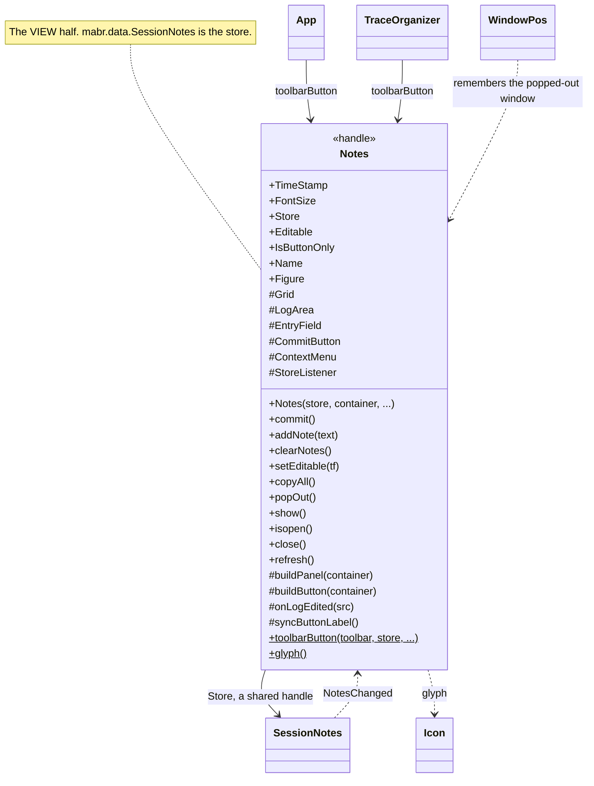
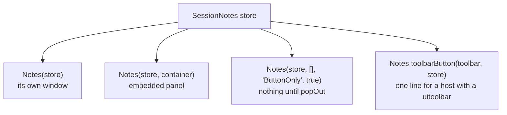
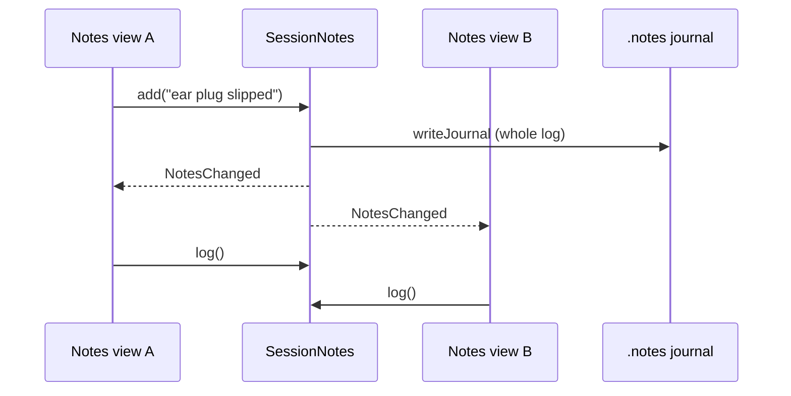

# `mabr.ui.Notes` Class Reference

Member-by-member reference for the rig notebook as a reusable GUI component:
[+mabr/+ui/Notes.m](https://github.com/dstolz/MABR/blob/refactor/%2Bmabr/%2Bui/Notes.m).

The store behind it is
[[mabr.data.SessionNotes|mabr.data.SessionNotes-Class-Reference]].

## Table of contents

- [Class diagram](#class-diagram)
- [Four forms](#four-forms)
- [Properties](#properties)
- [Methods](#methods)
- [Static methods](#static-methods)
- [Many views, one store](#many-views-one-store)
- [The log is read-only by default](#the-log-is-read-only-by-default)
- [Usage](#usage)
- [See also](#see-also)

## Class diagram

`$` marks a static member, `#` a private one.



## Four forms



```matlab
n = mabr.ui.Notes(store);                              % its own window
n = mabr.ui.Notes(store, container);                   % embedded panel
n = mabr.ui.Notes(store, [], 'ButtonOnly', true);      % nothing until popOut
n = mabr.ui.Notes.toolbarButton(obj.Toolbar, store);   % a host with a toolbar
```

`toolbarButton` is how **both** `mabr.ui.App` and `mabr.ui.TraceOrganizer` use it. It works
on a classic figure or a `uifigure`, since `uipushtool` works on both.

> 💡 **The embedded form has no size to set.** It fills whatever row the host's layout gives
> it: a `'1x'` row gets a full-height log, a fixed 90 px row a three-line one. The log takes
> the `'1x'` row inside the component, so there is nothing a host can get wrong.

## Properties

### Public

| Property | Default | Meaning |
|---|---|---|
| `TimeStamp` | `'auto'` | How a note committed from **this view** is stamped: `'auto'` / `'clock'` / `'elapsed'` / `'none'` |
| `FontSize` | `12` | |

> 🔑 **`TimeStamp` is per *view*, not per store.** A notes window and an offline trace
> organizer are asking different questions about "when".

### `SetAccess = private`

| Property | Meaning |
|---|---|
| `Store` | The `mabr.data.SessionNotes` this view is over |
| `Editable` | Is the log unlocked? |
| `IsButtonOnly` | |
| `Name` | Names this view in the prefs (window position, `Editable` state) **and in each note's `Source` field**, so a log can say which window a note was typed into |

`Figure` (transient) is the popped-out window, when there is one.

## Methods

| Method | What it does |
|---|---|
| `commit()` | Commit whatever is in the entry field |
| `addNote(text)` | Add a note programmatically, stamped as this view stamps |
| `clearNotes()` | Discard the whole log — **unconfirmed** |
| `setEditable(tf)` | |
| `copyAll()` | The whole log to the clipboard, for pasting into a lab notebook |
| `popOut()` | Open (or raise) the notes in their own window |
| `show()` / `isopen()` / `close()` | |
| `refresh()` | Redraw the log from the store |

**A blank entry commits nothing** — it is a stray Enter, not an empty note.

`clearNotes` is deliberately unconfirmed: the right-click item confirms before calling it,
and a programmatic caller has already decided.

`popOut` is the **whole UI** of the `ButtonOnly` form, and an overflow for the embedded one.

> ⚠️ **`refresh` must survive being fired at a view whose window has since been closed** —
> which is exactly what happens when one of two open views is shut while the other is still
> committing. It is called on every `NotesChanged`.

Two private details worth knowing:

- `onLogEdited` is only reachable with **Editable** ticked (the area is read-only
  otherwise). It writes the edited text back **through the store**, so every other open view
  — and the journal — follows.
- `syncButtonLabel` puts the note **count** on the button, so a host with no room for a log
  still shows that there *are* notes. An empty-looking button next to a full notebook is the
  one thing that form could get wrong.
- `setPlaceholder` falls back to a tooltip: placeholder text landed on `uieditfield` in
  R2023a, and MABR still supports R2021b.

## Static methods

| Method | What it does |
|---|---|
| `toolbarButton(toolbar,store,...)` | Put a notes button on an existing toolbar and return the view it opens. Takes `Notes`' own options plus `'Color'` and `'Separator'` |
| `glyph()` | A ruled notepad with a spiral binding — 16×16 art for [[mabr.ui.Icon\|mabr.ui.Icon-Class-Reference]] |

## Many views, one store

Any number of views may be open on one store at once — the App's notes window, the trace
organizer's — and they stay in step because **each one listens to the store's
`NotesChanged` event and redraws from the store**. A note typed in one appears in the others
as it is committed.



That is also why **the store, not the view, is the thing a host owns and hands around**.

## The log is read-only by default

Locked is the right default: the log is a *record*, and the common accident is typing into
it instead of into the entry field.

Unlocking is still worth having, because the other common accident is a typo in a note
taken one-handed at the bench, and the only place to fix one is the log the operator can
see. `mabr.data.SessionNotes.setFromLog` keeps each edited line's original stamp and
record.

The state is remembered **per host** (by `Name`).

**Right-click menu:** Editable · Copy All · Clear Notes… · Open in Separate Window
(embedded form only).

## Usage

On a host that already has a toolbar — one line:

```matlab
obj.NotesView = mabr.ui.Notes.toolbarButton(obj.Toolbar, store);
```

Standalone, in its own window:

```matlab
store = mabr.data.SessionNotes();
n = mabr.ui.Notes(store);
n.TimeStamp = 'clock';
n.addNote('starting setup');
n.copyAll();
```

Embedded in a host's layout:

```matlab
g = uigridlayout(fig, [2 1], 'RowHeight', {'1x', 90});
n = mabr.ui.Notes(store, g);      % fills the row it is given
```

## See also

- [[Class-Reference]] — every other class, indexed by package
- [[mabr.data.SessionNotes|mabr.data.SessionNotes-Class-Reference]] — the store, the stamps, and what is saved
- [[mabr.ui.App|mabr.ui.App-Class-Reference]], [[mabr.ui.TraceOrganizer|mabr.ui.TraceOrganizer-Class-Reference]] — the two hosts
- [[mabr.ui.Icon|mabr.ui.Icon-Class-Reference]] — the toolbar glyph
- [[mabr.ui.WindowPos|mabr.ui.WindowPos-Class-Reference]] — the remembered window position
