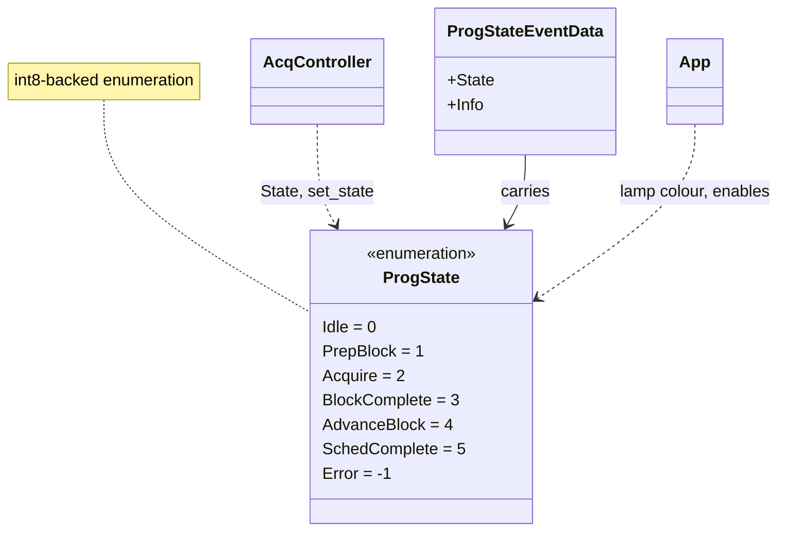
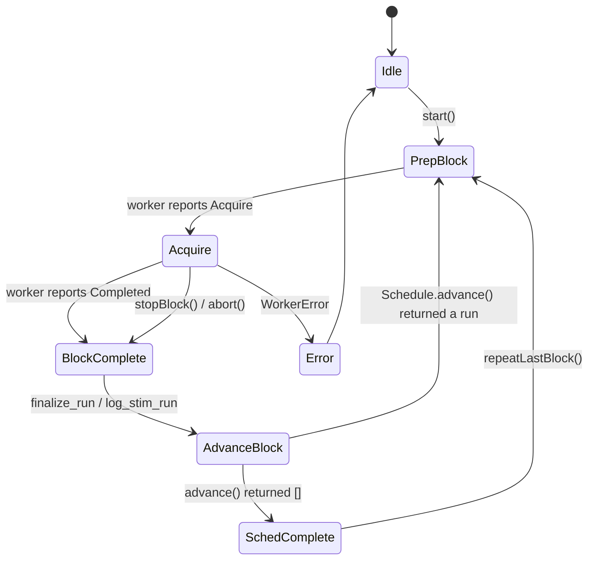

# `mabr.ui.ProgState` Class Reference

Member-by-member reference for the controller's program-flow state:
[+mabr/+ui/ProgState.m](https://github.com/dstolz/MABR/blob/refactor/%2Bmabr/%2Bui/ProgState.m).

## Table of contents

- [Class diagram](#class-diagram)
- [Inheritance](#inheritance)
- [Enumeration members](#enumeration-members)
- [The flow](#the-flow)
- [Terminal states](#terminal-states)
- [Not the same thing as `acq.State`](#not-the-same-thing-as-acqstate)
- [Usage](#usage)
- [See also](#see-also)

## Class diagram



## Inheritance

```matlab
classdef ProgState < int8
```

A single explicit state object that replaces the legacy `abr.stateProgram` global-driven
`StateMachine`. Transitions are driven by engine events and user actions — **event-driven,
not polled from shared memory**.

## Enumeration members

| Member | Value | Meaning |
|---|---|---|
| `Idle` | 0 | Nothing running; waiting for the user to start |
| `PrepBlock` | 1 | Rendering and arming the current block on the worker |
| `Acquire` | 2 | Streaming/recording the current block |
| `BlockComplete` | 3 | Current block finished; finalize and save |
| `AdvanceBlock` | 4 | Choosing the next block in the schedule |
| `SchedComplete` | 5 | The whole schedule finished |
| `Error` | **−1** | An error occurred |

> 💡 **`Error` is −1, not 6.** It is not a later stage of anything — it is off the path
> entirely, and the negative value says so at a glance.

## The flow



## Terminal states

`mabr.ui.App.isTerminal` treats `Idle`, `SchedComplete`, and `Error` as the states a
schedule **rests in** rather than passes through. `App.isRunning` is the complement: a
controller exists and has not settled into one of them.

That distinction drives the whole enable model — `configControls` lock while running and
unlock at rest; `liveControls` stay live throughout.

`App.stateAppearance(state)` maps each member to the Run panel's lamp colour and caption.

## Not the same thing as `acq.State`

Two state machines, two questions:

| | [[mabr.acq.State\|mabr.acq.State-Class-Reference]] | `mabr.ui.ProgState` |
|---|---|---|
| Whose | the **worker's** | the **controller's** |
| Scope | one block | the whole schedule |
| Knows about | the audio device and the play matrix | runs, finalization, advancing, completion |
| Set by | `worker_loop` | `AcqController.set_state` |

`AcqController.on_engine_state` is the one place the first is translated into the second.

## Usage

```matlab
lh = event.listener(controller,'StateChanged', @(~,e) ...
        fprintf('%s\n', string(e.State)));

if controller.State == mabr.ui.ProgState.Acquire
    controller.stopBlock();
end

disp(enumeration('mabr.ui.ProgState'))
```

## See also

- [[Class-Reference]] — every other class, indexed by package
- [[mabr.ui.ProgStateEventData\|mabr.ui.ProgStateEventData-Class-Reference]] — the payload
- [[mabr.ui.AcqController\|mabr.ui.AcqController-Class-Reference]] — the owner
- [[mabr.acq.State\|mabr.acq.State-Class-Reference]] — the other state machine
- [[Running a Session]] — the lamp, and what each state looks like
