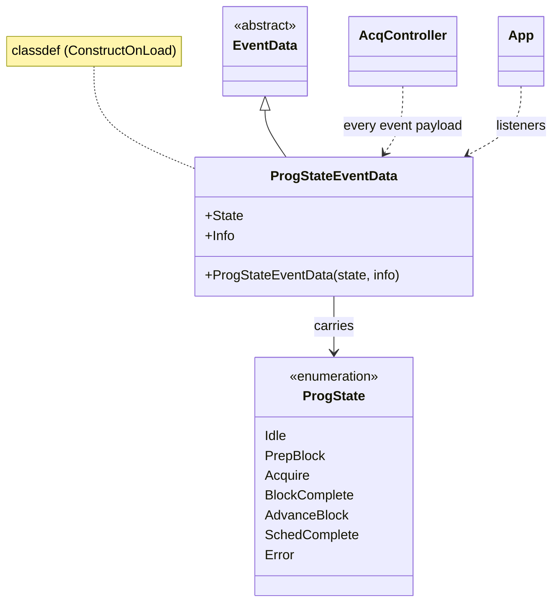

# `mabr.ui.ProgStateEventData` Class Reference

Member-by-member reference for the payload every `mabr.ui.AcqController` event carries:
[+mabr/+ui/ProgStateEventData.m](https://github.com/dstolz/MABR/blob/refactor/%2Bmabr/%2Bui/ProgStateEventData.m).

## Table of contents

- [Class diagram](#class-diagram)
- [Inheritance](#inheritance)
- [Properties](#properties)
- [What `Info` holds, per event](#what-info-holds-per-event)
- [Usage](#usage)
- [See also](#see-also)

## Class diagram



## Inheritance

```matlab
classdef (ConstructOnLoad) ProgStateEventData < event.EventData
```

`ConstructOnLoad` is what MATLAB requires of an `event.EventData` subclass so a listener
can attach to an object later loaded from a MAT-file.

## Properties

| Property | Type | Default | Role |
|---|---|---|---|
| `State` | `mabr.ui.ProgState` | `Idle` | The program state at the moment of the event |
| `Info` | `(1,1) struct` | `struct()` | Free-form payload — see below |

One class serves every controller event, which is why `Info` is a struct rather than a
fixed field list: the events differ in what they have to say, not in how they say it.

## What `Info` holds, per event

| `AcqController` event | `Info` fields |
|---|---|
| `StateChanged` | empty |
| `MetricsUpdated` | the live metrics — `numSweeps`, `numArtifacts`, `numClean`, `corr` |
| `BlockReady` | `.block` — the finalized `mabr.data.Block` |
| `BlockSaved` | `.file` — the full path written |
| `ScheduleComplete` | empty |

> 🔑 **`BlockSaved` means "a file was written" — the extension says which kind.** A
> recorded run emits one `.abr` per condition; a stimulation-only run emits one `.stimlog`
> per run. `mabr.ui.App.onBlockSaved` branches on the extension rather than on a separate
> event.

## Usage

```matlab
lh = [ ...
    event.listener(c,'StateChanged',    @(~,e) app.onState(e)); ...
    event.listener(c,'MetricsUpdated',  @(~,e) app.onMetrics(e)); ...
    event.listener(c,'BlockReady',      @(~,e) org.addBlock(e.Info.block)); ...
    event.listener(c,'BlockSaved',      @(~,e) fprintf('wrote %s\n', e.Info.file)); ...
    event.listener(c,'ScheduleComplete',@(~,~) app.onScheduleComplete())];
```

Constructing one directly is only needed if you are driving the pattern yourself:

```matlab
d = mabr.ui.ProgStateEventData(mabr.ui.ProgState.BlockComplete, ...
        struct('block',blk));
```

## See also

- [[Class-Reference]] — every other class, indexed by package
- [[mabr.ui.ProgState\|mabr.ui.ProgState-Class-Reference]] — the enumeration it carries
- [[mabr.ui.AcqController\|mabr.ui.AcqController-Class-Reference]] — the only notifier
- [[mabr.acq.StateEventData\|mabr.acq.StateEventData-Class-Reference]] — the same pattern one layer down
