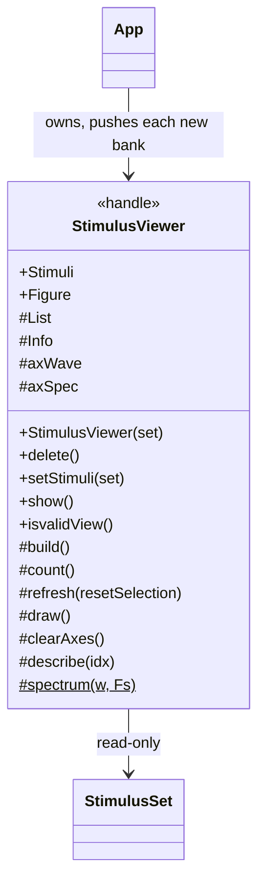
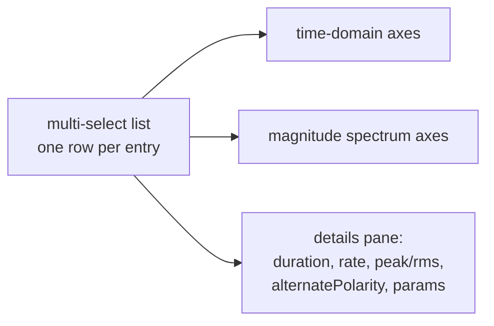
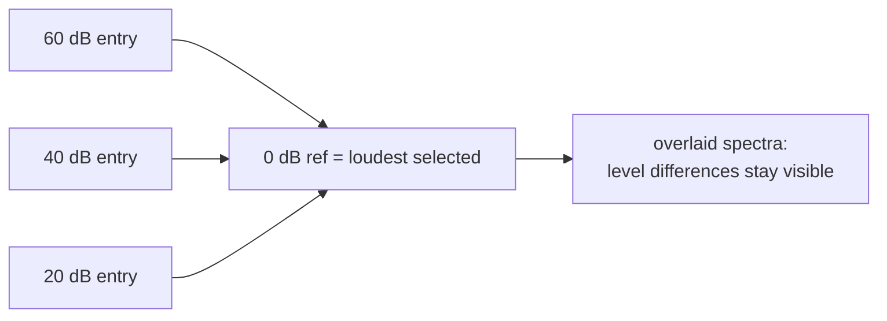

# `mabr.ui.StimulusViewer` Class Reference

Member-by-member reference for the read-only bank inspector:
[+mabr/+ui/StimulusViewer.m](https://github.com/dstolz/MABR/blob/refactor/%2Bmabr/%2Bui/StimulusViewer.m).

## Table of contents

- [Class diagram](#class-diagram)
- [The "sight" in "sight unseen"](#the-sight-in-sight-unseen)
- [Properties](#properties)
- [Methods](#methods)
- [One shared 0 dB reference](#one-shared-0-db-reference)
- [Usage](#usage)
- [See also](#see-also)

## Class diagram

`$` marks a static member, `#` a private one.



Window layout:



## The "sight" in "sight unseen"

MABR plays whatever the external stimulus package hands it, sight unseen. This viewer is
the sight: it lists every entry in a
[[mabr.stim.StimulusSet|mabr.stim.StimulusSet-Class-Reference]] and plots the selected
waveform(s) in time and in frequency, so an operator can **confirm the bank is the one
they meant to load before committing a subject to it**.

It is read-only and holds no state of its own beyond the selection. It never modifies the
bank; `mabr.ui.App` simply pushes a new set into it whenever one is loaded.

> 💡 **It opens on demand, not at Start.** Unlike the two acquisition viewers, this one
> inspects what is *about to be played* rather than what is coming back — so
> `mabr.ui.App` builds it on the first press of the loudspeaker toolbar button, and a
> plain raise deliberately does **not** re-push the bank, so your selection survives.
> `App.onStimViewer` asks whether the window is new *before* building, because the
> constructor opens the window itself and checking afterwards would always say "not new".

## Properties

### `SetAccess = private`

| Property | Type | Notes |
|---|---|---|
| `Stimuli` | `mabr.stim.StimulusSet` | The bank being viewed |
| `Figure` | | Readable so callers can export it |

### Private

`List`, `Info`, `axWave`, `axSpec`.

## Methods

| Method | What it does |
|---|---|
| `StimulusViewer(set)` | Own figure, first entry shown |
| `setStimuli(set)` | Adopt a new bank |
| `show()` | Raise the window, **building it first if it was closed** |
| `isvalidView()` | Is the window still there? |
| `refresh(resetSelection)` (private) | Rebuild the list from the bank, then redraw |
| `describe(idx)` (private) | The details pane: everything about one entry, or a roll-call of many |
| `spectrum(w,Fs)` (private, static) | Single-sided magnitude spectrum of one presentation |

`setStimuli` **resets the selection to the first entry**: a selection cannot survive a
different bank. `refresh` keeps the current selection where the new bank is long enough to
hold it.

`spectrum` windows the waveform — a gated pip ends abruptly — and zero-pads to a floor, so
a very short stimulus still resolves something to look at.

## One shared 0 dB reference

Select several entries to overlay them. **The spectra of an overlay share one 0 dB
reference — the loudest of the selection.**



Normalizing each curve to its own peak would flatten exactly the thing a level series is
for. Sharing one reference keeps a 20 dB step looking like a 20 dB step.

## Usage

```matlab
sv = mabr.ui.StimulusViewer(set);   % own figure, first entry shown
sv.setStimuli(otherSet);            % swap the bank being viewed
sv.show();                          % raise (rebuilds a closed figure)

if ~sv.isvalidView(), sv.show(); end
```

From the app, it is the loudspeaker button on the toolbar.

## See also

- [[Class-Reference]] — every other class, indexed by package
- [[mabr.stim.StimulusSet|mabr.stim.StimulusSet-Class-Reference]] — what it inspects
- [[Stimulus Package Contract]] — what the entries must satisfy
- [[Using stimgen]] — designing a bank, then looking at it here
- [[mabr.ui.App|mabr.ui.App-Class-Reference]] — the owner
