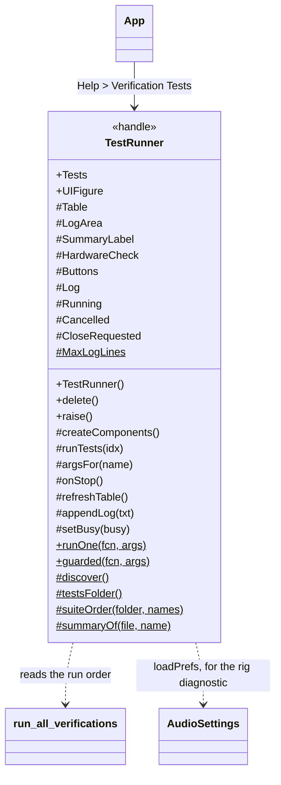
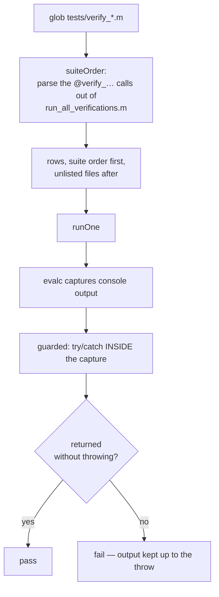
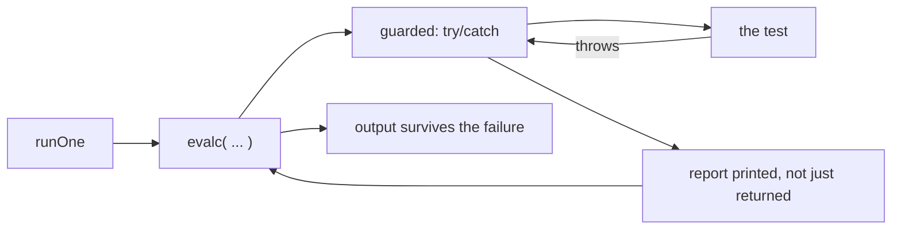

# `mabr.ui.TestRunner` Class Reference

Member-by-member reference for the verification suite as a window:
[+mabr/+ui/TestRunner.m](https://github.com/dstolz/MABR/blob/refactor/%2Bmabr/%2Bui/TestRunner.m).

For the suite itself, read [[Verification and Testing]].

## Table of contents

- [Class diagram](#class-diagram)
- [The list is discovered, not declared](#the-list-is-discovered-not-declared)
- [Properties](#properties)
- [Methods](#methods)
- [What "pass" means](#what-pass-means)
- [The one hardware opt-in](#the-one-hardware-opt-in)
- [Stopping and closing](#stopping-and-closing)
- [Usage](#usage)
- [See also](#see-also)

## Class diagram

`$` marks a static member, `#` a private one.



How a row gets there, and what happens when it runs:



## The list is discovered, not declared

Every `verify_*.m` in `tests/` becomes a row. Nothing is hard-coded.

The **order** comes from parsing the `@verify_…` calls out of `run_all_verifications.m`,
rather than repeating that list here — so the two can never disagree about what the suite
runs or in what order. Files that file does not mention keep their alphabetical place at
the **end**: visible, but after the ones the suite vouches for.

> 🔑 **A test that exists is a test the window offers**, whether or not it has been wired
> into the suite yet. That is the whole point of discovering rather than declaring.

`testsFolder` prefers wherever the suite actually is on the path, falling back to the
repository layout — so the window still works before `MABR.m` has ever run.

`summaryOf` takes each file's H1 line, minus the function name it repeats.

## Properties

### `SetAccess = private`

| Property | Meaning |
|---|---|
| `Tests` | One entry per discovered test: `Name`, `File`, `Summary` describe it; `Selected`, `Status`, `Time`, `Message` are what the last run made of it |
| `UIFigure` | **Public on purpose** — see below |

> 💡 **`UIFigure` is public so `verify_test_runner` can reach *this* window's controls**
> rather than whichever one `findall` happens to return. A run launched from the App's menu
> has two of these open at once.

### Private

`Table`, `LogArea`, `SummaryLabel`, `HardwareCheck`, the four buttons plus `Buttons`
(everything disabled for the duration of a run), `Log`, `Running`, `Cancelled`,
`CloseRequested`, `SelectedRow`.

### Private constants

| Constant | Value | Role |
|---|---|---|
| `MaxLogLines` | `4000` | Keeps the text area from growing without bound |
| `PassColor` / `FailColor` / `BusyColor` | | Row styling |

## Methods

| Method | What it does |
|---|---|
| `TestRunner()` | Build and show the window |
| `raise()` | Bring it forward — what the App's menu item does when one is already open, rather than building a second |
| `runTests(idx)` (private) | Run the given rows |
| `argsFor(name)` (private) | The arguments for one test — see [below](#the-one-hardware-opt-in) |
| `runOne(fcn,args)` (static) | Run one verification with its console output captured |
| `guarded(fcn,args)` (static) | The pass/fail contract |

## What "pass" means

**A test passes if it returns without throwing** — the same contract
`run_all_verifications` already relies on, since every check inside these files is an
`assert`.

Console output is captured per test with `evalc`, and the `try`/`catch` sits **inside** the
captured region (`runOne` → `guarded`):



That nesting is the point: **a failure keeps everything the test printed before it threw**,
which is the part that says how far it got. The report is printed rather than only
returned, so the stack lands in the log next to the output that preceded it. `evalc` itself
is wrapped only so a capture failure cannot take the window with it.

## The one hardware opt-in

Everything here runs with **no audio hardware**, with exactly one deliberate exception.

**"Use the rig for the timing loop-back"** re-runs `verify_timing_loopback` with
`'Testing',false` and the device and channel mapping currently saved in prefs
(`mabr.AudioSettings.loadPrefs`) — which is the rig diagnostic that file's own help
describes. A diagnostic run against defaults would be measuring the wrong wiring, which is
why `argsFor` reaches for the saved settings rather than passing nothing.

That diagnostic reports pulse recovery, latency, jitter, clock drift, and amplitude margin
against the hard-coded 0.1 detection threshold; sweeping `'PulseRate'` finds where a device
starts dropping pulses, and its `'Corrupt'` option confirms the measurements actually
respond to a known defect.

> ⚠️ **Tests that build an acquisition engine start a parallel pool**, so the first run of
> a session can take a minute before anything appears.

This is also why the menu item is a **config control** in `mabr.ui.App`: the suite builds
its own engine, worker and pool, so it cannot share the rig with a schedule in flight.

## Stopping and closing

**Stop is cooperative.** MATLAB is inside the test when you press it, so it takes effect
*between* tests, not during one.

**Closing mid-run defers the teardown** rather than pulling the window out from under a
running test: `CloseRequested` is set, the run is cancelled, and the figure is torn down
once the current test returns.

## Usage

```matlab
tr = mabr.ui.TestRunner;      % standalone
tr.raise();
```

Or **Help ▸ Verification Tests…** in the acquisition GUI.

From the command line, the same suite without a window:

```matlab
run_all_verifications
verify_filters
verify_timing_loopback('Testing',false, 'Device','ASIO Fireface')   % rig diagnostic
```

The window is itself covered by `tests/verify_test_runner.m`, which drives it the way a
user does — and is discovered by it. The nesting is bounded because the run it drives is
`verify_filters`.

## See also

- [[Class-Reference]] — every other class, indexed by package
- [[Verification and Testing]] — every test, and what it covers
- [[mabr.AudioSettings|mabr.AudioSettings-Class-Reference]] — where the rig diagnostic gets its wiring
- [[mabr.ui.App|mabr.ui.App-Class-Reference]] — the menu item, and why it locks
- [[Troubleshooting]] — the loop-back cable, the most common rig problem
