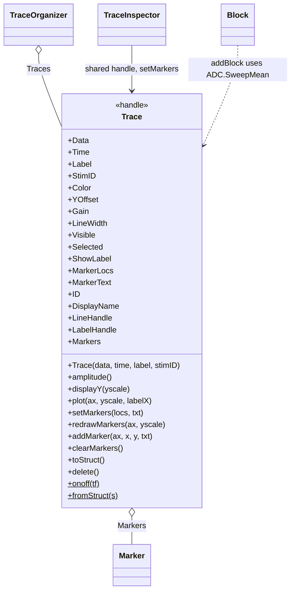

# `mabr.ui.Trace` Class Reference

Member-by-member reference for one waveform in the stacked view:
[+mabr/+ui/Trace.m](https://github.com/dstolz/MABR/blob/refactor/%2Bmabr/%2Bui/Trace.m).

## Table of contents

- [Class diagram](#class-diagram)
- [The display equation](#the-display-equation)
- [Properties](#properties)
- [Dependent properties](#dependent-properties)
- [Methods](#methods)
- [Markers are sample indices](#markers-are-sample-indices)
- [Usage](#usage)
- [See also](#see-also)

## Class diagram

`$` marks a static member.



A clean rebuild of the legacy `abr.traces.Trace`, without the `abr.ABR` / `abr.Buffer`
coupling that made it inseparable from an acquisition object.

## The display equation

```
display y = Data * yscale * Gain + YOffset
```

| Term | Owned by | Role |
|---|---|---|
| `yscale` | `TraceOrganizer.yscale()` | The **common** normalization, computed from the spacing and `YScaling` |
| `Gain` | this trace | The per-trace deviation from it |
| `YOffset` | this trace | Where it sits in the stack |

> 🔑 **That split is the point.** "Make *this one* bigger" changes `Gain` and never
> perturbs the shared scale — so relative amplitudes across the rest of the series stay
> comparable.

In per-trace normalization mode (`TraceOrganizer.NormalizeEach`) each trace is instead
scaled to its own peak, and `amplitude()` is what supplies that peak.

## Properties

| Property | Type / default | Meaning |
|---|---|---|
| `Data` | `(:,1) double` | The display waveform — normally a mean sweep |
| `Time` | `(:,1) double` | Seconds |
| `Label` | `(1,:) char` | Descriptive label, e.g. the informative params |
| `StimID` | `(1,:) char` | Stimulus ID from the stimulus package |
| `Color` | `(1,3) double` | |
| `YOffset` | `double`, `0` | Vertical position in the stack |
| `Gain` | `double`, `1` | Per-trace amplitude, positive and finite |
| `LineWidth` | `double`, `1` | |
| `Visible` | `logical`, `true` | |
| `Selected` | `logical`, `false` | |
| `ShowLabel` | `logical`, `true` | |
| `MarkerLocs` | `(1,:) double` | **Sample indices into `Data`** |
| `MarkerText` | `(1,:) cell` | |
| `ID` | `double`, `0` | |

### `SetAccess = private, Transient`

`LineHandle`, `LabelHandle`, and `Markers` (`(1,:) mabr.ui.Marker`). Transient because
graphics handles have no business in a saved `.torg` file — `toStruct`/`fromStruct` carry
the state, not the objects.

## Dependent properties

| Property | Meaning |
|---|---|
| `DisplayName` | What the on-plot label reads |

## Methods

| Method | What it does |
|---|---|
| `Trace(data,time,label,stimID)` | Construct |
| `amplitude()` | Peak absolute amplitude — **or `1`** for an empty/degenerate trace, so callers can divide by it safely |
| `displayY(yscale)` | The display equation above |
| `plot(ax,yscale,labelX)` | Draw the line and its label |
| `setMarkers(locs,txt)` | Define markers by **sample index**. `txt` optional, defaults to sequential numbering (wave I, II, …) |
| `redrawMarkers(ax,yscale)` | Reposition after a rescale |
| `addMarker(ax,x,y,txt)` | Backwards-compatible entry point: `x` is time in **ms**, snapped to the nearest sample |
| `clearMarkers()` | |
| `toStruct()` / `fromStruct(s)` | Round-trip the complete display state |
| `onoff(tf)` (static) | Plain `'on'`/`'off'` |

> 💡 **`onoff` returns plain char rather than `matlab.lang.OnOffSwitchState`**, which is
> newer than the R2018b floor the class was written against.

## Markers are sample indices

`MarkerLocs` holds **indices into `Data`**, not plotted coordinates. That single choice is
what lets a marker follow its trace through:

- rescaling (`Gain`, `YScaling`, `NormalizeEach`),
- restacking (`YOffset` changes),
- and a `.torg` save/load round-trip.

`addMarker` exists for callers that only have a time in milliseconds; it snaps to the
nearest sample so the marker still tracks later rescaling.

`mabr.ui.TraceInspector` writes here on **Apply & Close**, in temporal order, so the
markers a trace carries read left to right whatever order the inspector's table was in.

## Usage

```matlab
tr = mabr.ui.Trace(y, t, '8 kHz, 60 dB', 'pip_8k_60');
tr.Color = [0.2 0.4 0.8];
tr.Gain  = 1.5;

tr.setMarkers([142 178 214], {'I','II','III'});

s  = tr.toStruct();               % what a .torg holds
tr2 = mabr.ui.Trace.fromStruct(s);
```

Normally the organizer builds them for you:

```matlab
tr = org.addTrace(y, t, label, stimID);
org.addBlock(blk);                 % from a finalized Block's SweepMean
```

## See also

- [[Class-Reference]] — every other class, indexed by package
- [[mabr.ui.TraceOrganizer|mabr.ui.TraceOrganizer-Class-Reference]] — the stack, and `yscale`
- [[mabr.ui.TraceInspector|mabr.ui.TraceInspector-Class-Reference]] — what writes `setMarkers`
- [[mabr.ui.Marker|mabr.ui.Marker-Class-Reference]] — what `Markers` holds
- [[mabr.data.Block|mabr.data.Block-Class-Reference]] — where `Data` usually comes from
