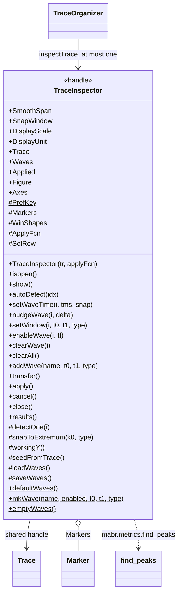
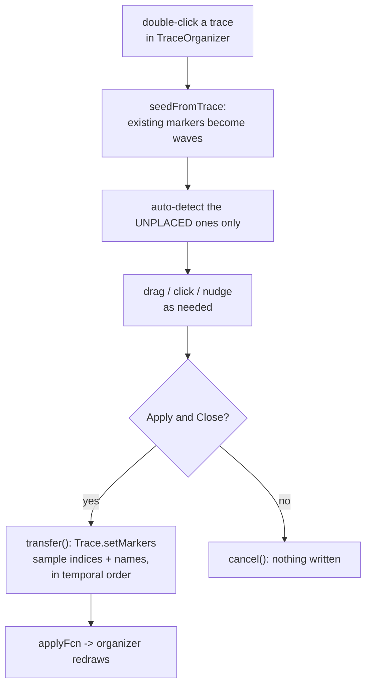

# `mabr.ui.TraceInspector` Class Reference

Member-by-member reference for the peak-picking window:
[+mabr/+ui/TraceInspector.m](https://github.com/dstolz/MABR/blob/refactor/%2Bmabr/%2Bui/TraceInspector.m).

## Table of contents

- [Class diagram](#class-diagram)
- [Why it exists at all](#why-it-exists-at-all)
- [Properties](#properties)
- [Methods](#methods)
- [The wave table](#the-wave-table)
- [Auto-detect, and when it runs by itself](#auto-detect-and-when-it-runs-by-itself)
- [Placing a marker by hand](#placing-a-marker-by-hand)
- [Nothing is written until Apply](#nothing-is-written-until-apply)
- [Keyboard](#keyboard)
- [Usage](#usage)
- [See also](#see-also)

## Class diagram

`$` marks a static member, `#` a private one.



The measurement cycle:



## Why it exists at all

`mabr.ui.TraceOrganizer` stacks many traces at **one shared normalization**. That is what
makes a level series legible — and what makes any single waveform too small to measure.

The inspector shows **one** trace at full size in its own units, with the organizer's
normalization, gain, and offset all out of the way. Volts are scaled to µV for display
(`DisplayScale` / `DisplayUnit`).

## Properties

### Public

| Property | Default | Meaning |
|---|---|---|
| `SmoothSpan` | `0` samples | `0` = off. Smooths the **view and the detection together** |
| `SnapWindow` | `0.25` ms | How far a click is pulled to the nearest local extremum |
| `DisplayScale` | `1e6` | V → µV |
| `DisplayUnit` | `'µV'` | |

> ⚠️ **Smoothing is display-and-detection only.** Picking a peak off one signal while
> showing another is the kind of disagreement nobody catches until the numbers are wrong —
> so `workingY()` is what both the plot and `detectOne` use, with the raw trace still drawn
> underneath. Markers are stored as indices into the trace's **own** samples, so nothing
> smoothed is ever transferred.

### `SetAccess = private`

| Property | Meaning |
|---|---|
| `Trace` | The `mabr.ui.Trace` being inspected — a **shared handle** |
| `Waves` | `(1,:) struct`: `Name`, `Enabled`, `TMin`, `TMax`, `Type`, `Loc` |
| `Applied` | Did the user transfer the peaks? |
| `Figure`, `Axes` | Transient; readable so callers can export the view |

> 💡 The `Waves` default is spelled out rather than calling `emptyWaves()`, because a
> property default that calls a static method of its own class is evaluated during that
> class's initialization.

### Private constants

`PrefKey` is `'TraceInspectorWaves'`; `WinColor` and `SelColor` are the window and
selection colours; `PanelW` is `368` px — what the wave table needs.

## Methods

| Method | What it does |
|---|---|
| `TraceInspector(tr,applyFcn)` | Open on a trace, optionally notifying a caller on apply |
| `isopen()` / `show()` | `show` rebuilds a closed figure — the wave table outlives it, so reopening resumes where the last pass left off |
| `autoDetect(idx)` | Fill each enabled wave with the most prominent extremum inside its window |
| `setWaveTime(i,tms,snap)` | Place wave *i* at time `tms` (ms) |
| `nudgeWave(i,delta)` | Move by samples |
| `setWindow(i,t0,t1,type)` | Redefine the search window; returns `false` for one that runs backwards |
| `enableWave(i,tf)` | A disabled row **keeps its window and its pick** but takes no part in auto-detect, the plot, or the transfer |
| `clearWave(i)` / `clearAll()` | |
| `addWave(name,t0,t1,type)` | Add a row beyond the default I–V |
| `transfer()` | Write the placed waves onto the Trace. The **only** thing here that touches it |
| `apply()` / `cancel()` / `close()` | |
| `results()` | A `table`: Name, Latency (ms), Amplitude (in `DisplayUnit`), Type |

`results()` is a table so it can go straight to a file; `copyTable` puts the same thing on
the clipboard.

### Static

| Method | What it does |
|---|---|
| `defaultWaves()` | ABR waves I–V with starting search windows (ms re onset) |
| `mkWave(name,enabled,t0,t1,type)` | The **one** place a wave row is built, so every path produces the same fields in the same order and struct arrays concatenate |
| `emptyWaves()` | |

`defaultWaves` is a **rodent-rig starting point, not a claim about anyone's
preparation** — edit them once and Apply persists them.

## The wave table

Waves are rows: a name, a search window in **ms re stimulus onset**, and whether the
feature wanted there is a Peak or a Trough.

> 🔑 **"re onset" needs no offset.** A `Recording`'s `TimeVector` starts at the onset, so
> the trace's own time base is already the right one.

Search windows — never the picks — persist in the same `MABR` pref group on Apply. A lab
that works at one species and one rate sets its windows once.

## Auto-detect, and when it runs by itself

`detectOne` ranks `mabr.metrics.find_peaks` by **prominence** rather than taking the first
extremum in the window.

A window holding no turning point at all — a monotonic flank, a peak sitting on the window
edge — falls back to the **segment extremum**. The latency it then reports is what tells
you the window is wrong, which is more use than a silent blank.

Two different triggers, deliberately:

| Trigger | Scope |
|---|---|
| **Opening the inspector** | Only waves still **unplaced**: `find([Waves.Enabled] & isnan([Waves.Loc]))` |
| **Auto-detect button / <kbd>a</kbd>** | **Every** enabled wave, placed or not |

So a trace with nothing marked yet shows peaks with no button press — but a pick already
there, seeded from the trace or left from an earlier pass, is never recomputed out from
under you. The manual button has no such restriction, which is how a wave gets re-found
after its window is widened.

## Placing a marker by hand

| Action | Behaviour |
|---|---|
| Click on the trace | Places the selected wave, **snapping** to the nearest local extremum of the right sign within `SnapWindow` ms — clicking "near enough" is how a peak is actually picked by hand |
| Drag a marker | Moves it freely, sample by sample |
| <kbd>←</kbd>/<kbd>→</kbd> | Nudges one sample (<kbd>Shift</kbd>: 10) |
| Scroll wheel | Zooms time about the cursor — the whole job is reading latencies off a few milliseconds of a ten-millisecond sweep |

> 💡 **A placed marker may leave its window.** The window is a search hint, not a cage: a
> latency that fell outside the window you guessed is a measurement, not an error.

## Nothing is written until Apply

**Apply & Close** calls `Trace.setMarkers` with the placed waves in **temporal order**,
plus their names, and then fires the apply callback so the organizer redraws. **Cancel
writes nothing.**

Reopening on a marked trace **seeds the table from those markers**, matching by name, so a
second pass edits the first rather than starting over.

`apply()` is defensive: the trace can have been removed from the organizer while this
window sat open, and `transfer()` says so by writing nothing.

## Keyboard

Press <kbd>F1</kbd> for this list.

| Key | Action |
|---|---|
| <kbd>a</kbd> | Auto-detect — fill every enabled wave from its window |
| click | Place the selected wave (snaps within `SnapWindow`) |
| drag | Move a marker freely |
| <kbd>←</kbd> / <kbd>→</kbd> | Nudge 1 sample (<kbd>Shift</kbd>: 10) |
| <kbd>Delete</kbd> | Clear the selected wave |
| <kbd>c</kbd> / <kbd>f</kbd> | Clear all / fit the view |
| <kbd>Enter</kbd> / <kbd>Esc</kbd> | Apply & close / cancel |
| <kbd>F1</kbd> | This list |

## Usage

Normally opened by the organizer:

```matlab
insp = org.inspectTrace(1);          % or double-click the trace
```

Standalone, with a callback:

```matlab
insp = mabr.ui.TraceInspector(tr, @() org.refresh());

insp.SmoothSpan = 5;
insp.setWindow(1, 1.0, 2.0, 'peak');   % wave I
insp.autoDetect();
insp.setWaveTime(2, 2.35, true);       % place wave II, snapped
insp.nudgeWave(2, -1);

T = insp.results();
insp.apply();
```

Covered by `tests/verify_trace_inspector.m` — no hardware.

## See also

- [[Class-Reference]] — every other class, indexed by package
- [[mabr.ui.TraceOrganizer|mabr.ui.TraceOrganizer-Class-Reference]] — where it is opened from
- [[mabr.ui.Trace|mabr.ui.Trace-Class-Reference]] — `setMarkers`, and the sample-index convention
- [[mabr.ui.Marker|mabr.ui.Marker-Class-Reference]] — what is drawn
- `mabr.metrics.find_peaks` — [source](https://github.com/dstolz/MABR/blob/refactor/%2Bmabr/%2Bmetrics/find_peaks.m)
- [[mabr.data.Recording|mabr.data.Recording-Class-Reference]] — why `TimeVector` starts at the onset
