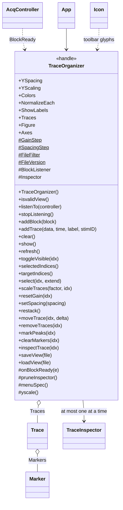
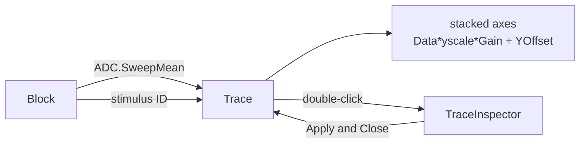

# `mabr.ui.TraceOrganizer` Class Reference

Member-by-member reference for the stacked-waveform viewer:
[+mabr/+ui/TraceOrganizer.m](https://github.com/dstolz/MABR/blob/refactor/%2Bmabr/%2Bui/TraceOrganizer.m).

For the viewer in context, read [[Running a Session]].

## Table of contents

- [Class diagram](#class-diagram)
- [What it replaced](#what-it-replaced)
- [Properties](#properties)
- [Methods](#methods)
- [Three routes to every command](#three-routes-to-every-command)
- [Keyboard](#keyboard)
- [Live during a run](#live-during-a-run)
- [Double-click to measure](#double-click-to-measure)
- [Saving a view](#saving-a-view)
- [Usage](#usage)
- [See also](#see-also)

## Class diagram

`$` marks a static member, `#` a private one.



How a block becomes a trace:



## What it replaced

A rebuilt, self-contained version of the legacy `abr.traces.Organizer`. Gone with it: the
broken legacy `Group`/`Marker` classes and the **`user32.dll` mouse hook**. Interaction now
uses standard figure callbacks and the fixed
[[mabr.ui.Marker|mabr.ui.Marker-Class-Reference]].

## Properties

### Public

| Property | Default | Meaning |
|---|---|---|
| `YSpacing` | `1` | Vertical spacing between traces |
| `YScaling` | `0.8` | Shared amplitude normalization |
| `Colors` | `lines(7)` | Trace colour cycle |
| `NormalizeEach` | `false` | Scale each trace to its own peak, instead of one common factor |
| `ShowLabels` | `true` | Stimulus ID labels beside each trace |

### `SetAccess = private`

| Property | Type |
|---|---|
| `Traces` | `(1,:) mabr.ui.Trace` |
| `Figure`, `Axes` | Transient; readable so callers can export or annotate the view |

### Private constants

`GainStep` and `SpacingStep` are both `1.25` (multiplicative); `FileFilter` is
`*.torg`; `FileVersion` is `2`.

## Methods

| Method | What it does |
|---|---|
| `listenTo(controller)` | Subscribe to an `AcqController`'s `BlockReady` |
| `stopListening()` | Unsubscribe |
| `addBlock(block)` | Add a finalized `mabr.data.Block`'s mean sweep |
| `addTrace(data,time,label,stimID)` | Add a raw waveform |
| `clear()` / `show()` / `refresh()` | |
| `select(idx,extend)` / `selectedIndices()` / `targetIndices()` | Selection |
| `scaleTraces(factor,idx)` / `resetGain(idx)` | Amplitude |
| `setSpacing(spacing)` / `restack()` | Layout |
| `moveTrace(idx,delta)` / `removeTraces(idx)` / `toggleVisible(idx)` | Order and visibility |
| `markPeaks(idx)` / `clearMarkers(idx)` | Quick marking |
| `inspectTrace(idx)` | Open one trace in the inspector |
| `saveView(file)` / `loadView(file)` | `.torg` round-trip |

> 💡 **`targetIndices()` is the selection, or *everything* when nothing is selected.** So
> "make them bigger" works before you have picked anything — which is what you actually
> want from a stack of traces you have just opened.

`addBlock` uses `Block.ADC.SweepMean`, which averages **only the sweeps that survived
artifact rejection** — so a trace here never carries a sweep the acquisition threw out.

## Three routes to every command

The menu bar, the right-click context menu, and the keyboard. All three are built from
**one `menuSpec`**, so they cannot drift apart, and nothing is discoverable only by
memorization.

The toolbar is a fourth route but never the *only* one: every action on it is also in the
menu bar. Each button draws the glyph named in `obj.glyph` (through
[[mabr.ui.Icon|mabr.ui.Icon-Class-Reference]]) so its meaning is readable without hovering.

> 💡 **Menus use `'Label'`/`'Callback'`, not the newer `'Text'`/`'MenuSelectedFcn'`.** Both
> work everywhere; these also work on the older floor.

## Keyboard

Press **F1** in the figure for this list.

| Key | Action |
|---|---|
| <kbd>↑</kbd> / <kbd>↓</kbd> | Amplitude larger / smaller |
| <kbd>Shift</kbd>+<kbd>↑</kbd>/<kbd>↓</kbd> | Spacing wider / narrower |
| <kbd>Ctrl</kbd>+<kbd>↑</kbd>/<kbd>↓</kbd> | Move selected trace up / down the stack |
| <kbd>0</kbd> | Reset amplitude to 1× |
| <kbd>n</kbd> | Toggle per-trace vs. common normalization |
| <kbd>r</kbd> | Restack evenly in current visual order |
| <kbd>a</kbd> / <kbd>Esc</kbd> | Select all / none |
| <kbd>l</kbd> | Toggle stimulus ID labels |
| <kbd>p</kbd> / <kbd>c</kbd> | Mark peaks / clear markers |
| <kbd>i</kbd> | Inspect the selected trace |
| <kbd>h</kbd> / <kbd>Delete</kbd> | Hide / remove selected traces |
| <kbd>Ctrl</kbd>+<kbd>S</kbd> / <kbd>Ctrl</kbd>+<kbd>O</kbd> | Save / load the view |

Amplitude commands act on the selection, or on every trace when nothing is selected. Click
a trace (or its label) to select it; shift- or ctrl-click to extend.

## Live during a run

`listenTo(controller)` subscribes to `BlockReady`, so a view left open during a run **gains
a trace as each block is finalized** instead of only when the organizer is reopened.

> 🔑 **Only one controller is tracked at a time.** Calling `listenTo` again re-points the
> listener rather than stacking a second one, so re-opening the organizer — or rebuilding
> the controller — cannot duplicate traces. That is also why `mabr.ui.App`'s toolbar button
> is a **pure raise** once the organizer exists: it backfills from the `Session` only when
> building one from scratch, so pressing it cannot discard a loaded `.torg` view.

`onBlockReady` is wrapped in a `try`: it fires on the acquisition path, and a plotting
error must never propagate back into the controller mid-schedule.

## Double-click to measure

Double-clicking a trace (or <kbd>i</kbd>, or **Peaks ▸ Inspect trace…**) opens it in
[[mabr.ui.TraceInspector|mabr.ui.TraceInspector-Class-Reference]].

The reason is a genuine conflict: the stack normalizes every trace to **one shared scale**,
which is exactly what a level series needs and exactly what a measurement cannot use. So
latencies are picked over there and come back through `Trace.setMarkers`.

Two details:

- **`onTraceClick` branches on `SelectionType == 'open'` and disarms the drag** the first
  click of the pair armed — otherwise the trace follows the mouse while the inspector
  opens.
- **One inspector at a time.** Re-opening on the same trace raises the window rather than
  discarding the peaks placed in it, and `pruneInspector` closes it when the trace it was
  editing is removed — otherwise the window sits there editing a deleted handle.

## Saving a view

`saveView` writes a `.torg` file holding the waveforms **plus the complete display
state** — gains, offsets, order, colours, markers, spacing, normalization mode, and axis
limits — so `loadView` reproduces the view exactly as it was saved.

Markers are stored as **sample indices**, so they survive rescaling, restacking, and the
round-trip. Same MAT-file-with-a-distinctive-extension convention as `.abr` / `.stimlog` /
`.mabrcfg` (see [[Data Format]]).

## Usage

```matlab
org = mabr.ui.TraceOrganizer();
org.listenTo(controller);        % traces appear as blocks complete
org.show();

org.addBlock(blk);               % or add one by hand
tr = org.addTrace(y, t, '8 kHz 60 dB', 'pip_8k_60');

org.NormalizeEach = false;
org.setSpacing(1.5);
org.restack();

org.select([1 3], true);
org.scaleTraces(2);

insp = org.inspectTrace(1);      % measure wave latencies
org.saveView('D:\data\M42\overview.torg');
```

Covered by `tests/verify_trace_organizer.m` — no hardware.

## See also

- [[Class-Reference]] — every other class, indexed by package
- [[mabr.ui.Trace|mabr.ui.Trace-Class-Reference]] — one waveform in the stack
- [[mabr.ui.TraceInspector|mabr.ui.TraceInspector-Class-Reference]] — where latencies are actually picked
- [[mabr.ui.Marker|mabr.ui.Marker-Class-Reference]] — the marker it draws
- [[mabr.ui.AcqController|mabr.ui.AcqController-Class-Reference]] — the `BlockReady` source
- [[Data Format]] — the `.torg` file
