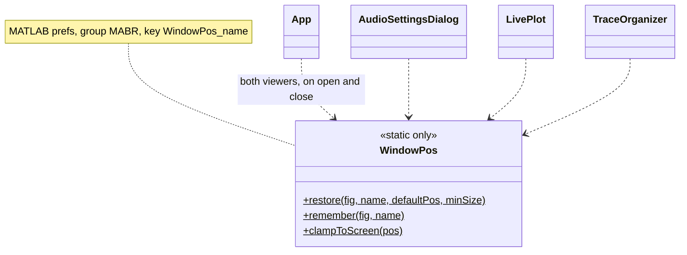
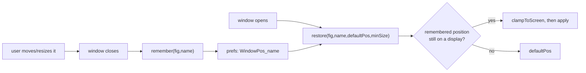
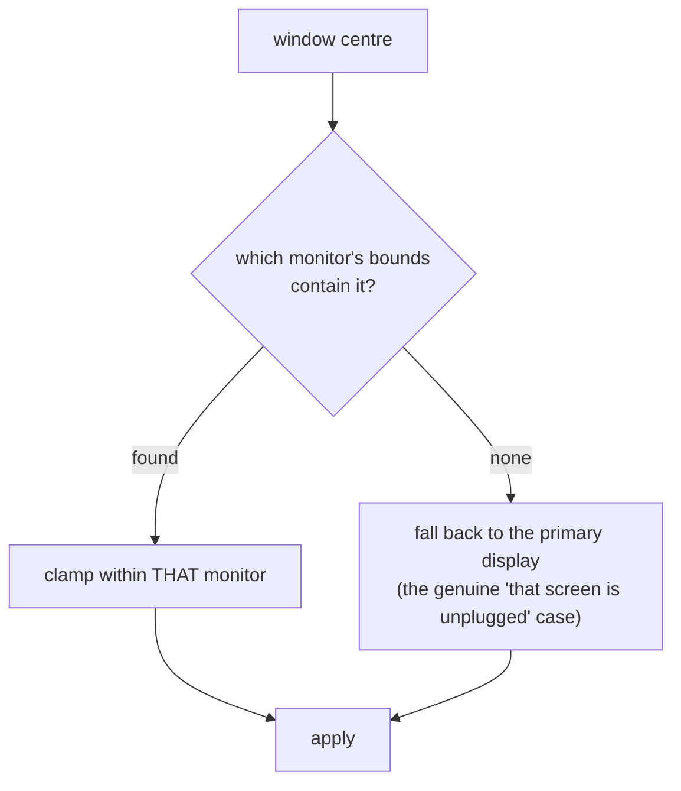

# `mabr.ui.WindowPos` Class Reference

Member-by-member reference for cross-session window placement:
[+mabr/+ui/WindowPos.m](https://github.com/dstolz/MABR/blob/refactor/%2Bmabr/%2Bui/WindowPos.m).

## Table of contents

- [Class diagram](#class-diagram)
- [Why it exists](#why-it-exists)
- [Static methods](#static-methods)
- [The multi-monitor problem](#the-multi-monitor-problem)
- [Usage](#usage)
- [See also](#see-also)

## Class diagram

`$` marks a static member.



The round trip:



## Why it exists

The acquisition GUI opens its viewers automatically, so **where they land matters**: a
layout the user arranges once should survive quitting MATLAB.

Positions are stored per-name in MATLAB prefs alongside the App's other history — group
`MABR`, key `WindowPos_<name>`.

## Static methods

| Method | What it does |
|---|---|
| `restore(fig,name,defaultPos,minSize)` | Place `fig` at its remembered position, or at `defaultPos` if there is none, or if the remembered one is off-screen or malformed |
| `remember(fig,name)` | Store the window's current position |
| `clampToScreen(pos)` | Nudge a window fully onto whichever display it actually belongs to |

`minSize` (optional, `[w h]` in pixels) exists because **a window remembered from a version
that needed less room reopens too small to use** — so it is grown to fit rather than
discarding the spot the user chose. A window with `Resize` `'off'` needs no `minSize`: its
size always comes from `defaultPos`.

`remember` is a **silent no-op for a window that has already been destroyed**, since
callers invoke it from close paths where the figure may or may not still be there.

## The multi-monitor problem

`get(0,'ScreenSize')` always reports the **primary monitor only**, no matter how many are
attached.

Clamping against it unconditionally would therefore drag every window on a second monitor
back onto the first on every restore — the exact opposite of what a multi-monitor rig
needs.



The window is only shrunk if it is genuinely larger than the display it belongs to.

## Usage

```matlab
mabr.ui.WindowPos.restore(fig, 'LivePlot', defaultPos);            % on open
mabr.ui.WindowPos.restore(fig, 'TraceOrg', defaultPos, [900 600]); % with a floor
mabr.ui.WindowPos.remember(fig, 'LivePlot');                       % on close

pos = mabr.ui.WindowPos.clampToScreen([-2000 100 800 600]);        % rescue a stray
```

`mabr.ui.App` applies it to both viewer windows, saving on viewer close **and** on app
close — whatever layout the user ended up with is the one they want back next session, so
it is captured before anything is torn down.

## See also

- [[Class-Reference]] — every other class, indexed by package
- [[mabr.ui.App\|mabr.ui.App-Class-Reference]] — `defaultViewerPos`, `rememberViewerPositions`
- [[mabr.ui.LivePlot\|mabr.ui.LivePlot-Class-Reference]], [[mabr.ui.TraceOrganizer\|mabr.ui.TraceOrganizer-Class-Reference]]
